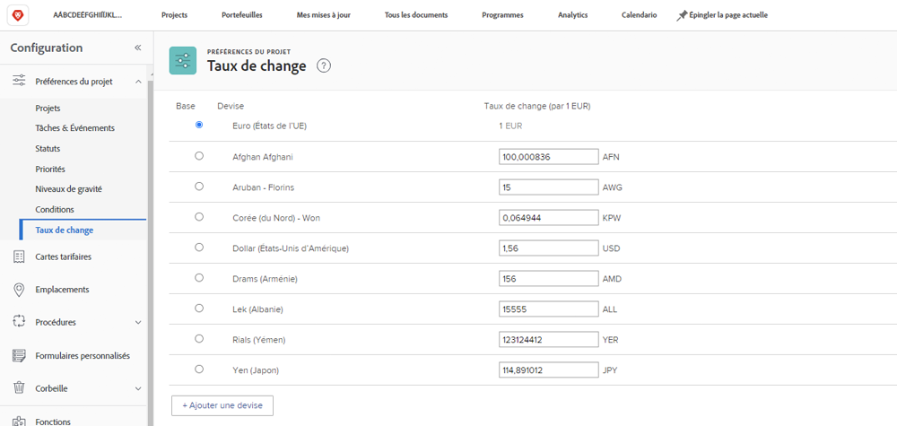
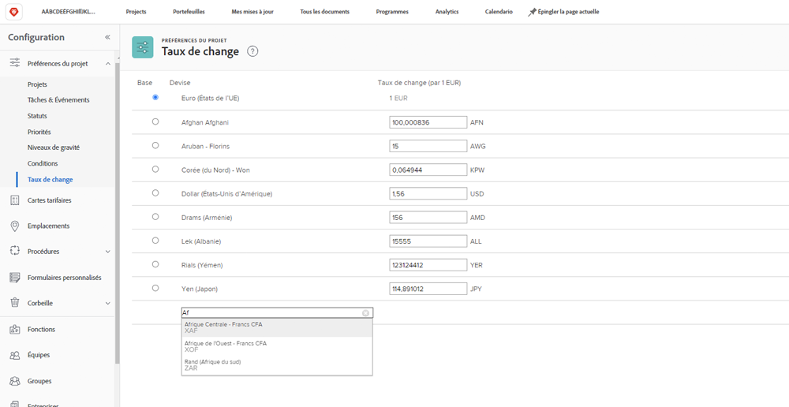

# Configurer les taux de change

[!DNL Workfront] prend en charge différentes devises pour les organisations clientes qui sont des entreprises multinationales. Les taux de change peuvent être utilisés sur des projets et des rapports afin de refléter les informations financières dans différentes devises du monde entier.

Les taux de change sont gérés par les administrateurs système. D’autres devises peuvent être configurées selon les besoins de votre entreprise.

[!DNL Workfront]La devise de base (par défaut) de est le dollar des États-Unis. Il s’agit de la devise dans laquelle les informations financières seront calculées par défaut, sauf si une autre devise est spécifiée dans un projet individuel.

## Configurer les devises et les taux de change

**Sélectionner [!UICONTROL Configuration] dans le menu principal.**

1. Développer **[!UICONTROL Préférences du projet]** dans le panneau du menu de gauche.
1. Cliquez sur **[!UICONTROL Taux de change]**.
1. Cliquez sur le bouton **[!UICONTROL Ajouter une devise]** bouton .
1. Sélectionnez la devise du pays dans la liste déroulante.
1. Saisissez le taux de change souhaité pour la devise.
1. Si une devise autre que le dollar américain doit être la valeur [!DNL Workfront] devise de base (par défaut) du système, cliquez sur le bouton en regard du nom de la devise.
1. Cliquez sur **[!UICONTROL Enregistrer]** lorsque toutes les devises ont été ajoutées.

>[!NOTE]
>
>Workfront ne met pas à jour ni ne suit les valeurs actuelles du marché pour les taux de change. Si nécessaire, les mises à jour doivent être effectuées manuellement.
