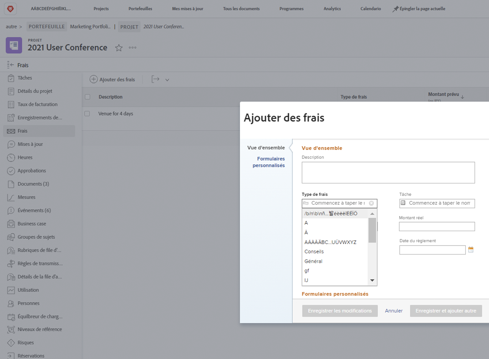

# Configurer les types de dépenses

Les dépenses dans [!DNL Workfront] représentent les coûts non liés à la main d’œuvre associés aux projets et autres tâches. Il peut s’agir, par exemple, de frais de déplacement pour rendre visite à un client ou une cliente ou de l’achat de fournitures nécessaires à la réalisation d’une séance photo. Ces dépenses doivent être consignées dans le projet, de sorte que les coûts prévus et les coûts réels puissent être calculés et signalés pour n’importe quel projet.

[!DNL Workfront] dispose de types de dépenses préconfigurés qui peuvent être utilisés lors de la saisie des dépenses. Les valeurs par défaut ne peuvent être ni supprimées ni modifiées, mais de nouvelles valeurs peuvent être ajoutées.

* Publicité
* Conseils
* Loisirs
* Général
* Matériaux
* Impression
* Expédition
* Voyage

Un administrateur ou une administratrice système peut ajouter les types de dépenses nécessaires à son organisation. Ces types de dépenses supplémentaires peuvent être modifiés, masqués ou supprimés afin de prendre en charge les rapports financiers nécessaires à votre organisation.

Les chefs de projet, les cadres et d’autres personnes peuvent générer des rapports de dépenses en regroupant les dépenses individuelles par type, si nécessaire, pour des tâches, des projets, des programmes ou des portefeuilles dans [!DNL Workfront]. Les données financières du projet deviennent beaucoup plus gérables à l’aide des types de dépenses.

## Créer un type de dépense

**Sélectionnez [!UICONTROL Configuration] dans le menu principal.**

1. Cliquez sur **[!UICONTROL Types de dépenses]** dans le menu du panneau de gauche.
1. Cliquez sur le bouton **[!UICONTROL Nouveau type de dépense]**.
1. Nommez le type de dépense.
1. Ajoutez une description, si nécessaire.
1. Cliquez sur le bouton **[!UICONTROL Enregistrer]**.

![Image de la création d’un [!UICONTROL type de dépense]](assets/setting-up-finances-6.png)

## Utiliser les types de dépenses

Les options de dépenses apparaissent dans le menu déroulant **[!UICONTROL Type de dépense]** lorsque les utilisateurs et les utilisatrices créent une dépense sur un projet ou une tâche dans [!DNL Workfront].

