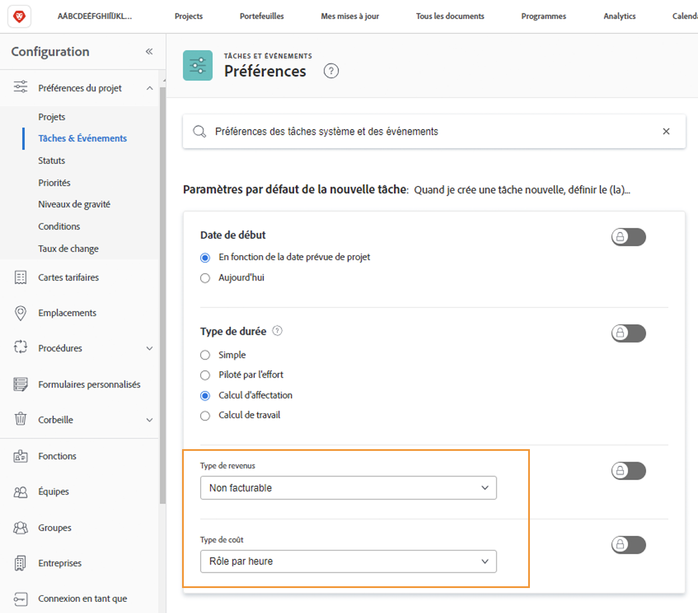

# Configuration des valeurs par défaut des recettes et des coûts de la tâche

Le type de chiffre d’affaires et le type de coût sont utilisés pour calculer les informations financières prévues et réelles pour une tâche. Les informations par défaut de chacune d’elles peuvent être définies à l’échelle du système, de sorte qu’elles s’appliquent à chaque nouvelle tâche créée. Les informations peuvent être modifiées sur des projets individuels ou définies sur des modèles de projet.

**Cinq types de recettes par défaut sont disponibles :**

* Non facturable
* Utilisateur, par heure
* Rôle par heure
* Fixe par heure
* Revenus fixes

**Quatre types de coûts par défaut sont également disponibles :**

* Aucun coût
* Fixe par heure
* Utilisateur, par heure
* Rôle par heure

>[!NOTE]
>
>Lorsque les types de recettes ou de coûts sont définis sur Non facturable ou Aucun coût, les estimations de recettes et de coûts ne sont pas générées pour la tâche. Par conséquent, le travail sur la tâche ne contribue pas aux recettes ou aux coûts au niveau du projet.

## Définition des valeurs par défaut des recettes et des coûts

Sélectionner **[!UICONTROL Configuration]** dans le menu principal.

1. Cliquez sur **[!UICONTROL Préférences du projet]** dans le menu du panneau de gauche.
1. Cliquez ensuite sur **[!UICONTROL Tâches et problèmes]**.
1. Dans le [!UICONTROL Nouvelle tâche par défaut] , sélectionnez la section souhaitée. [!UICONTROL Type de revenu] et [!UICONTROL Type de coût].
1. Lorsque vous avez terminé, cliquez sur Enregistrer .

