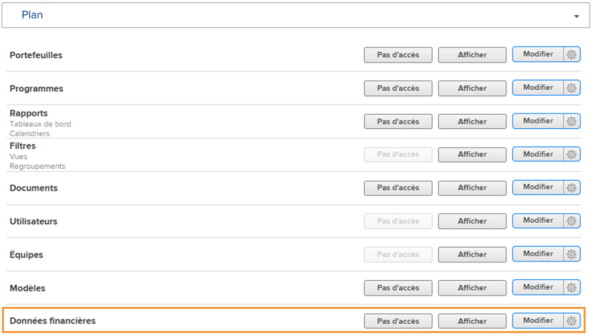
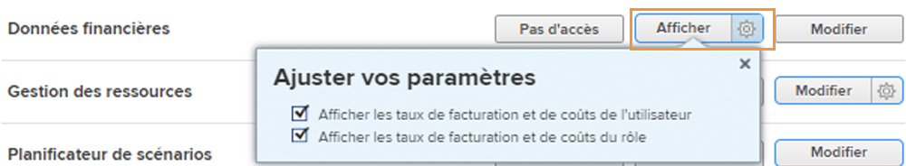
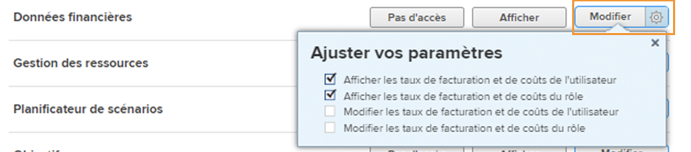

# Présentation de l’accès financier

Si votre entreprise capture des données financières avec [!DNL Workfront], en tant qu’administrateur système, il vous incombe de protéger et de gérer les personnes ayant accès à l’affichage et à la modification de ces informations.

Deux éléments sont nécessaires pour qu’un utilisateur puisse afficher ou modifier des informations financières :

1. Les droits d’accès doivent être activés dans la variable [!UICONTROL Niveau d’accès].
2. La permission d&#39;utiliser ces droits d&#39;accès doit être accordée objet par objet.

Par exemple, un utilisateur peut se voir accorder des droits pour afficher les données financières à son niveau d’accès, mais il peut uniquement afficher les données financières sur une tâche qui est à la fois partagée avec lui et l’affichage financier est activé dans le partage de cette tâche.

Il est donc possible pour un utilisateur avec [!UICONTROL Niveau d’accès] droits d’affichage des données financières pour pouvoir afficher les données financières sur certains objets et non sur d’autres, selon les options de partage individuelles de ces objets. Cependant, aucun utilisateur ne peut consulter les données financières sur un objet à moins que le droit leur soit accordé dans son [!UICONTROL Niveau d’accès].

## [!UICONTROL Niveau d’accès] paramètres

L&#39;accès global aux données financières est accordé en premier lieu par [!DNL Workfront] type de licence.

**[!UICONTROL Plan] Les licences peuvent :**

* Gestion des enregistrements de facturation
* Gérer et afficher la facturation des rôles et les taux de coûts
* Gérer et afficher la facturation et les coûts des utilisateurs
* Gérer les dépenses
* Afficher et modifier les finances

**[!UICONTROL Travail] Les licences peuvent :**

* Gérer les dépenses
* Afficher les finances

**[!UICONTROL Réviser] Les licences peuvent :**

* Afficher les finances

**Les autorisations peuvent être modifiées par la variable [!UICONTROL Niveau d’accès]. Les trois options d&#39;accès aux données financières sont les suivantes :**

* [!UICONTROL Accès interdit] — L’utilisateur ne pourra pas consulter les informations financières.
* [!UICONTROL Affichage] — L’utilisateur peut consulter et partager les informations.
* [!UICONTROL Modifier] — L’utilisateur peut créer, modifier, supprimer et partager les informations. (Disponible uniquement pour une licence Plan.)

Il est important de noter que la variable [!UICONTROL Affichage] et [!UICONTROL Modifier] Les options comportent des paramètres supplémentaires pour un [!UICONTROL Plan] licence. Cliquez sur l’engrenage sur la [!UICONTROL Affichage] pour ces options :

**[!UICONTROL Afficher]**

* Afficher les taux de facturation et de coûts du rôle
* Afficher les taux de facturation et de coûts de l&#39;utilisateur

**[!UICONTROL Modifier]**

Ces deux options sont disponibles sous la variable [!UICONTROL Modifier] , ainsi que :

* Modifier les taux de facturation et de coûts du rôle
* Modifier les taux de facturation et de coûts de l&#39;utilisateur

>[!NOTE]
>
>Un utilisateur ayant accès à l&#39;ajout de dépenses peut également visualiser les dépenses qu&#39;il ajoute, ainsi que les dépenses ajoutées au moyen de ses rapports directs.
