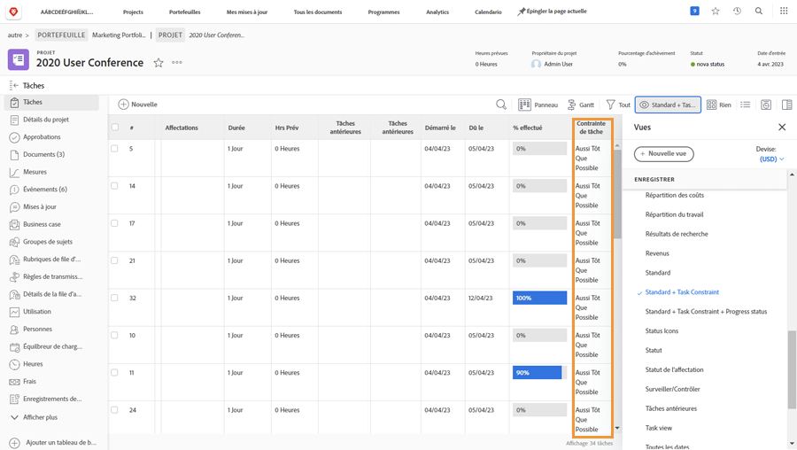

# Suivre la progression à partir du calendrier du projet

Assurez-vous que les tâches progressent comme il se doit pour respecter les délais du projet. Lorsque vous analysez la liste des [!UICONTROL Tâches], il existe plusieurs fonctionnalités dans [!DNL  Workfront] qui vous permettent de surveiller la progression et le statut du travail.

## Pourcentage d’achèvement

Le pourcentage terminé de chaque tâche de travail est parfois utilisé pour évaluer la progression du travail. Il est important de noter que ce champ doit être ajusté manuellement, car il s’agit de l’estimation par la personne assignée du statut de la progression du projet.

>[!TIP]
>
>Bien que le pourcentage terminé des tâches de travail doive être mis à jour manuellement, le pourcentage terminé d’une tâche parent est calculé par Workfront sur la base du pourcentage terminé et de la durée ou du nombre d’heures prévues de chaque tâche enfant. Cela signifie que vous obtiendrez une meilleure précision en pourcentage si vous divisez les tâches importantes en sous-tâches plus petites.

![Liste des tâches du projet présentant une colonne [!UICONTROL Pourcentage terminé].](assets/planner-fund-task-percent-complete.png)

Il y a trois moments où le pourcentage terminé change automatiquement :

* Lorsque le [!UICONTROL Statut] de la tâche est défini sur Terminé, le pourcentage terminé passe à 100.
* Si le [!UICONTROL Statut] de la tâche revient à Nouveau, le pourcentage terminé est réinitialisé à 0.
* Dans une tâche parent, lorsque le pourcentage terminé d’une tâche enfant change.

## Statut

Incluez la colonne [!UICONTROL Statut] dans une [!UICONTROL Vue] pour afficher rapidement quelles tâches ont été lancées, lesquelles sont en cours et lesquelles sont terminées. Vous pouvez même configurer une mise en forme conditionnelle dans une [!UICONTROL Vue] pour coder chaque statut, ce qui facilite le déchiffrage des informations.

## Affectations de tâche

Lors de l’examen du projet, passez en revue les tâches assignées. Le travail a peut-être pris du retard parce que personne n’a été affecté à une tâche. Ou peut-être que la personne assignée n’avait pas les compétences nécessaires pour mener à bien le travail. Ajoutez plus de personnes à une tâche ou réaffectez-lui des tâches pour vous assurer que le travail est terminé.

## Contrainte de tâche

Il arrive que les contraintes des tâches soient modifiées sans que l’on s’en rende compte. Les contraintes peuvent influer sur le comportement du calendrier, il convient donc de s’assurer qu’elles sont définies comme vous le souhaitez.

Créez une vue personnalisée qui inclut la colonne [!UICONTROL Contrainte de tâche] pour voir ces informations sur votre liste de tâches. Si vous avez planifié le projet à partir d’une date de début, vous souhaitez que vos tâches comportent la contrainte [!UICONTROL Dès que possible] ([!UICONTROL ASAP]).

Pour plus de détails sur les contraintes de tâche, voir [Comprendre et gérer les types de durée et les contraintes de tâche](https://experienceleague.adobe.com/docs/workfront-learn/tutorials-workfront/manage-work/intermediate-projects/understand-and-manage-duration-types-and-task-constraints.html?lang=fr).
