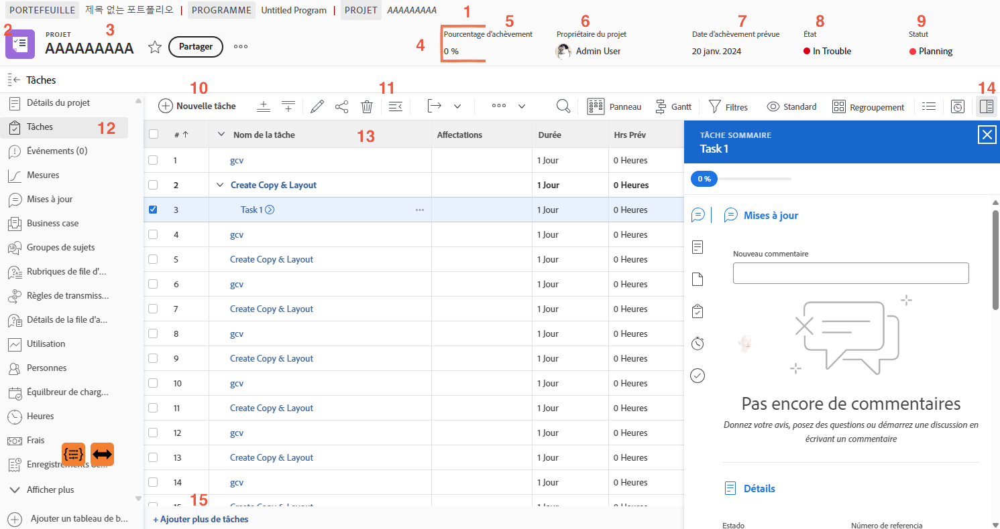

# Parcourir la page du projet

Dans cette vidéo, vous apprendrez :

* Affichage des détails du projet
* Quelles informations s’affichent dans la liste des tâches
* L’endroit où charger les documents
* Consultation de l’historique des mises à jour

>[!VIDEO](https://video.tv.adobe.com/v/335085/?quality=12&learn=on&enablevpops)

## Principaux éléments de la page du projet

[Cliquez ici](/help/assets/key-parts-of-the-project-page.pdf) pour télécharger un fichier PDF de cette page.

La page du projet comporte de nombreuses fonctionnalités qui vous aideront à gérer votre travail. Contactez votre administrateur ou administratrice système si vous avez besoin d’une option que vous ne voyez pas dans votre instance de [!DNL Workfront]. Voici quelques-unes des principales fonctionnalités de la page du projet à noter.

1. **Cheminement de navigation :** naviguez dans la hiérarchie du programme et du portefeuille derrière le projet.
2. **Type d’objet :** afficher le type d’objet sur la page de destination permet d’identifier ce que vous consultez dans [!DNL Workfront]. Le terme « projet » peut être personnalisé par votre administrateur ou votre administratrice système [!DNL Workfront].
3. **Nom du projet :** nom du projet que vous consultez. Cliquez sur le nom pour le modifier.
4. **En-tête du projet :** informations standard disponibles sur toutes les pages du projet.
5. **[!UICONTROL Pourcentage terminé] :** ces données sont automatiquement mises à jour en fonction des tâches accomplies dans le cadre du projet.
6. **[!UICONTROL Propriétaire du projet] :** dans la plupart des organisations, il s’agit du chef de projet. Il s’agit de la personne responsable de la gestion du projet dans [!DNL Workfront] et qui doit s’assurer qu’il est terminé.
7. **[!UICONTROL Date d’achèvement prévue] :** la date fixée par le ou la chef de projet dans le cadre du calendrier du projet.
8. **[!UICONTROL Condition] :** une représentation visuelle de l’avancement du projet. [!DNL Workfront] peut configurer automatiquement la [!UICONTROL condition] en fonction du statut de la progression des tâches du projet. Par ailleurs, la [!UICONTROL condition] peut être définie manuellement dans les détails du projet.
9. **[!UICONTROL Statut] :** le [!UICONTROL statut] indique le stade du processus auquel se trouve le projet : le projet est-il encore en cours de planification, est-il en cours de réalisation ou est-il terminé ?
10. **[!UICONTROL Nouvelle tâche] :** cliquez sur ce bouton pour créer une tâche dans le projet. La tâche est générée en bas de la liste.
11. **[!UICONTROL Exporter] :** permet d’exporter la liste de tâches ou des tâches sélectionnées vers un fichier PDF, une feuille de calcul ou un fichier délimité par des tabulations.
12. **Menu du panneau gauche :** permet d’accéder à différentes informations sur le projet. Cliquez sur l’icône de tâche en haut pour réduire le panneau si vous avez besoin d’un peu plus d’espace sur votre écran. Faites glisser les icônes dans un ordre qui vous aidera à travailler efficacement. Les options que vous voyez sont définies par votre administrateur ou administratrice système [!DNL Workfront].
13. **Liste des tâches :** présente toutes les tâches qui composent votre plan de projet. Les informations visibles à propos de chaque tâche sont déterminées par la vue sélectionnée.
14. **Panneau Résumé :** le panneau de résumé donne un aperçu rapide des informations sur la tâche sélectionnée. Cliquez sur l’icône du panneau Résumé pour ouvrir ou fermer.
15. **Ajouter des tâches** Cliquez ici pour ajouter une autre tâche au bas de la liste des tâches à l’aide de l’édition intégrée.

## Tutoriels recommandés sur cette rubrique

* [Comprendre les bases de la création de projets](/help/manage-work/projects/understand-basic-project-creation.md)
* [Découvrir quatre façons de créer un projet](/help/manage-work/projects/understand-other-ways-to-create-projects.md)
* [Renseigner les détails du projet](/help/manage-work/projects/fill-in-the-project-details.md)

