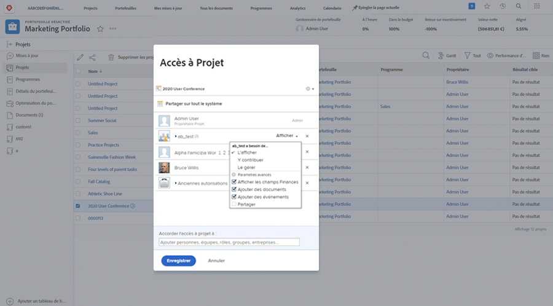

# Partage d’un projet

La mise à disposition d’une visibilité pour les intervenants et les collaborateurs dans le projet est une partie importante de la gestion d’un projet.

Assurez-vous que tout le monde peut voir les informations dont il a besoin en partageant le projet. Dans Workfront, cela se fait avec la méthode [!UICONTROL Partager] . Vous pouvez effectuer cette opération à partir du projet individuel, à partir de la [!UICONTROL Plus] dans l’en-tête.

Vous pouvez également partager plusieurs projets à la fois à partir de la liste des projets du [!UICONTROL Projets] en sélectionnant les projets et en cliquant sur l’icône [!UICONTROL Partager] bouton .

Le partage du projet permet à toutes les personnes impliquées de voir les informations du projet lorsqu’elles en ont besoin.

<!---
Learn More Icon
Share permissions on objects
Share a project
--->
