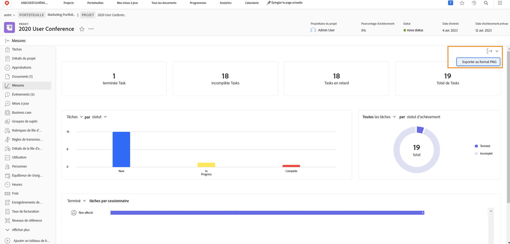

# Suivre la progression du travail avec les mesures de projet

Dans cette vidéo, vous apprendrez à :

* Accéder aux graphiques de mesures du projet
* Personnaliser les informations dans les graphiques

>[!VIDEO](https://video.tv.adobe.com/v/336667/?quality=12&learn=on)

Vous pouvez exporter l’ensemble du tableau de bord des mesures du projet sous forme de fichier .png à l’aide du bouton [!UICONTROL Exporter]. Cela permet de partager facilement les données avec d’autres personnes par le biais d’e-mails ou de présentations.

## Tutoriels recommandés sur cette rubrique

* [Prise en main de la gestion d’un projet](https://experienceleague.adobe.com/en/docs/workfront-learn/tutorials-workfront/manage-work/projects/getting-started-manage-a-project.md)
* [Suivi de la progression globale du projet](https://experienceleague.adobe.com/en/docs/workfront-learn/tutorials-workfront/manage-work/projects/track-overall-project-progress.md)
* [Suivi de la progression du travail avec les mesures de projet](https://experienceleague.adobe.com/en/docs/workfront-learn/tutorials-workfront/manage-work/projects/track-work-progress-with-project-metrics.md)
* [Comprendre le [!UICONTROL Gantt] view](https://experienceleague.adobe.com/en/docs/workfront-learn/tutorials-workfront/manage-work/projects/understand-the-gantt-view.md)
* [Comprendre le [!UICONTROL board] view](https://experienceleague.adobe.com/en/docs/workfront-learn/tutorials-workfront/manage-work/projects/understand-the-board-view.md)
