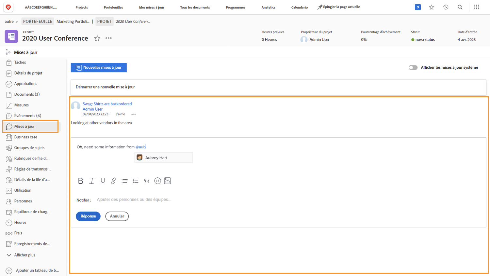

# Présentation de la communication du projet

Comme le dit le proverbe, 90% de la gestion d&#39;un projet c&#39;est la communication. Communiquez avec l’équipe du projet, vos gestionnaires et les parties prenantes du projet.

Mais lorsque les équipes de projet utilisent l&#39;email, la messagerie instantanée, les réunions et les post-it pour la communication du projet, l&#39;information est éparpillée... ou pire, oubliée. Maintenir la communication sur le travail du projet dans [!DNL Workfront] à l’aide de mises à jour.

Lorsque les membres de l’équipe de projet travaillent sur des affectations, ils peuvent effectuer des mises à jour depuis [!DNL Workfront] [!UICONTROL Accueil] sur les tâches qui leur sont affectées.

Mises à jour des tâches, problèmes et documents cumulées au niveau du projet [!UICONTROL Mises à jour] , ce qui permet d’afficher rapidement et facilement les informations.

Vous pouvez ensuite répondre aux mises à jour en cliquant simplement sur le bouton . Cela permet de conserver toutes les conversations au même endroit et d’y revenir ultérieurement.

<!---
learn more urls
Communicate about work in Home
Subscribe to items in Workfront
Update work
--->
