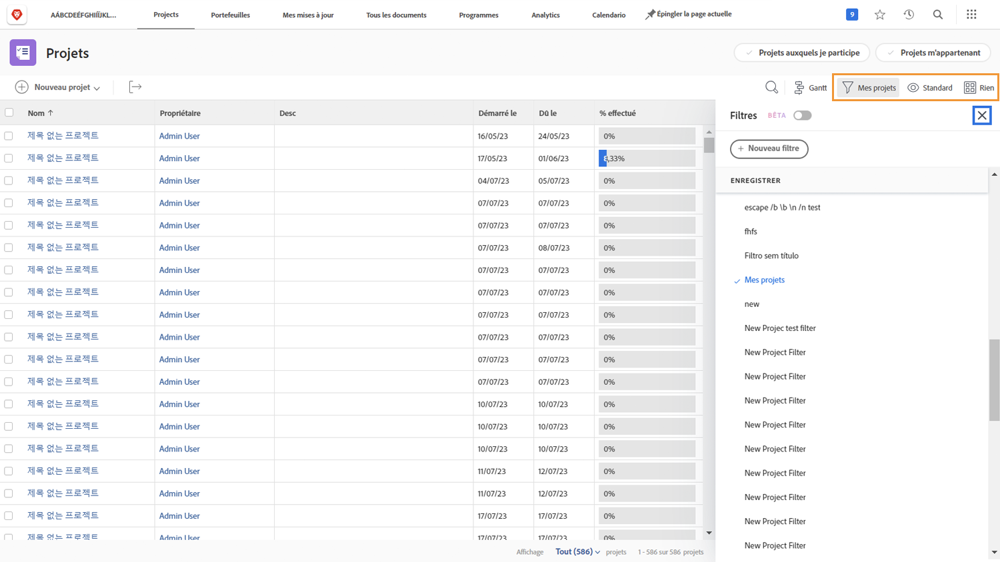

# Afficher les informations sur le projet

Que vous regardiez la page principale [!UICONTROL Projets] ou un projet individuel, affinez votre liste pour voir les informations dont vous avez besoin avec [!UICONTROL Filtres], [!UICONTROL Vues] et [!UICONTROL Regroupements].

Vous pouvez obtenir une vue d’ensemble de l’avancement de tous vos projets sur la page [!UICONTROL Projets].

Utilisez les [!UICONTROL filtres] pour réduire la liste en fonction de certains critères. Sélectionnez ensuite une [!UICONTROL Vue] pour afficher les colonnes d’informations pertinentes pour vos projets. Enfin, sélectionnez un [!UICONTROL regroupement] pour organiser les projets de la manière qui vous convient le mieux.

Lorsque vous êtes dans la section [!UICONTROL Tâches] d’un projet, utilisez à nouveau [!UICONTROL Filtres], [!UICONTROL Vues], et [!UICONTROL Regroupements] pour vous aider à contrôler le travail effectué. Le fait de considérer des tâches plutôt que des projets vous offre un éventail de choix totalement différent.

Un grand nombre de clientes et clients de [!DNL Workfront] créent des vues personnalisées qui exposent les informations des formulaires personnalisés et d’autres champs pertinents pour le travail effectué.

## Découvez comment créer des filtres, des vues et des regroupements personnalisés

[Créer un filtre de base](https://experienceleague.adobe.com/docs/workfront-learn/tutorials-workfront/reporting/basic-reporting/create-a-basic-filter.html?lang=fr)

[Créer une vue de base](https://experienceleague.adobe.com/docs/workfront-learn/tutorials-workfront/reporting/basic-reporting/create-a-basic-view.html?lang=fr)

[Créer un regroupement de base](https://experienceleague.adobe.com/docs/workfront-learn/tutorials-workfront/reporting/basic-reporting/create-a-basic-grouping.html?lang=fr)
