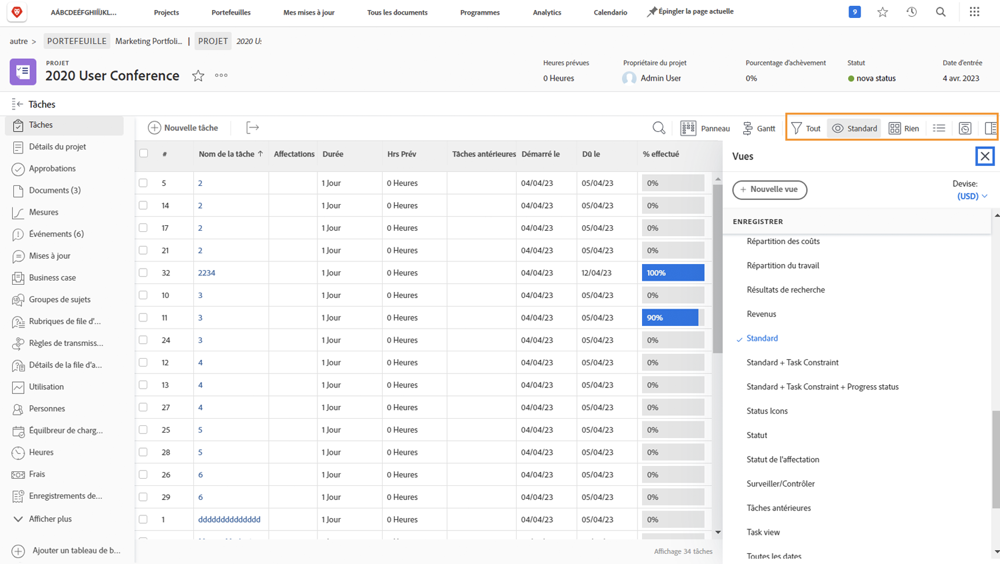

# Affichage des informations sur le projet

Si vous regardez la page principale [!UICONTROL Projets] ou dans un projet individuel, affinez votre liste pour afficher les informations dont vous avez besoin avec [!UICONTROL Filtres], [!UICONTROL Vues], et [!UICONTROL Groupements].

Découvrez de manière approfondie l’avancement de tous vos projets sur la [!UICONTROL Projets] page.

Utilisez la variable [!UICONTROL Filtres] pour réduire la liste en fonction de certains critères. Sélectionnez ensuite un [!UICONTROL Affichage] pour afficher les colonnes d’informations pertinentes pour vos projets. Enfin, sélectionnez une [!UICONTROL Regroupement] pour organiser les projets de manière à vous donner un sens.

Lorsque vous utilisez la variable [!UICONTROL Tâches] d’un projet, utilisez [!UICONTROL Filtres], [!UICONTROL Vues], et [!UICONTROL Groupements] encore une fois pour vous aider à surveiller le travail en cours. Parce que vous vous intéressez aux tâches plutôt qu’aux projets, vous avez tout un ensemble de choix différents.

Beaucoup [!DNL Workfront] les clients créent des vues personnalisées qui exposent des informations de formulaire personnalisées et d’autres champs pertinents pour le travail en cours.
