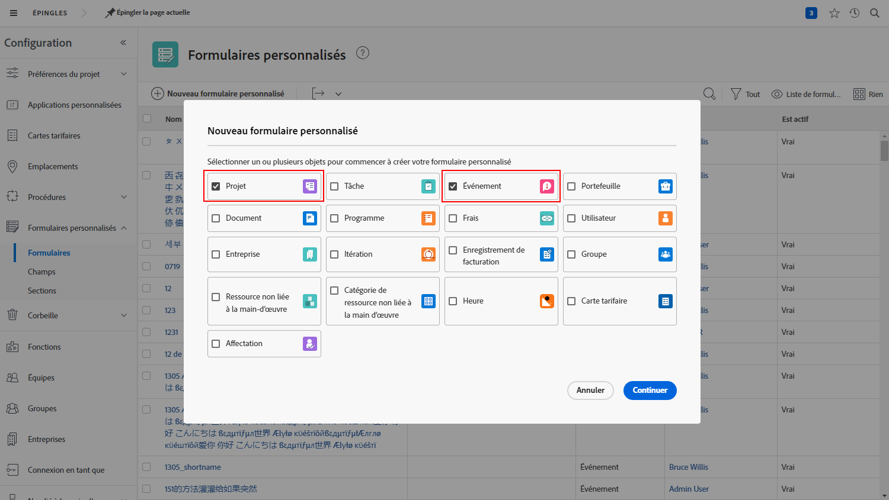
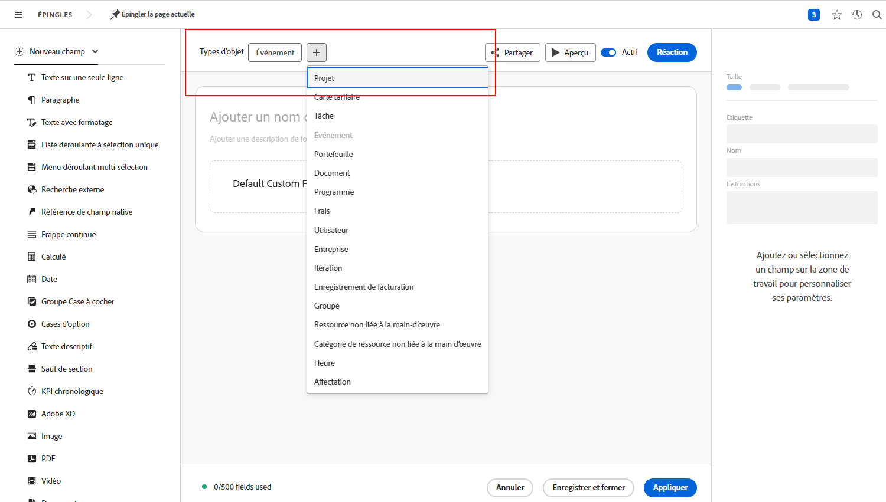

# Réponses aux questions courantes sur les files d’attente de demandes

**Pourquoi puis-je voir une file d’attente des demandes, mais pas mon utilisateur ou utilisatrice ?**

Dans l’onglet [!UICONTROL Détails de la file d’attente] de votre file d’attente des demandes/projet, assurez-vous que votre utilisateur ou utilisatrice répond aux critères du champ « Qui peut ajouter des demandes à cette file d’attente ? ».  

Pour plus d’informations, visionnez cette vidéo :

>[!VIDEO](https://video.tv.adobe.com/v/3434156/?quality=12&learn=on)

**J’ai donné aux utilisateurs et aux utilisatrices l’accès à la file d’attente, mais maintenant ils peuvent aussi voir le projet de file d’attente des demandes. Pourquoi ?**

Dans la liste « Qui peut ajouter des demandes à cette file d’attente ? », si vous sélectionnez « Personnes ayant accès à ce projet », alors toute personne à qui vous accordez des droits d’affichage pour utiliser la file d’attente des demandes pourra également afficher la file d’attente des demandes dans une liste de projets. Pour éviter cela, utilisez l’option « Personnes dans la société de ce projet » ou « Personnes dans le groupe de ce projet ».

**Puis-je transformer une demande en projet ?**

Oui. Vous pouvez convertir des problèmes en tâches ou en projets en fonction des besoins.

Ces tutoriels vous montrent comment :

* [Convertir un problème/une demande en projet](/help/manage-work/issues-requests/create-a-project-from-a-request.md)

* [Convertir un problème/une requête en une tâche.](/help/manage-work/issues-requests/convert-issues-to-other-work-items.md)

**Où puis-je trouver une file d’attente des demandes pour apporter des modifications ?**

Vous pouvez utiliser le champ [!UICONTROL Rechercher] dans la barre de navigation ou la trouver répertoriée dans la zone [!UICONTROL Projets].

Si vous ouvrez une demande à partir de la file d’attente des demandes, vous pouvez cliquer sur le nom du projet dans la zone des chemins de navigation.

**Puis-je transférer les informations d’un formulaire personnalisé de demande vers un formulaire personnalisé de projet ?**

Oui. Lorsque vous créez un formulaire personnalisé, sélectionnez à la fois [!UICONTROL Projet] et [!UICONTROL Problème] comme types d’objet. Vous pouvez également modifier un formulaire personnalisé de projet pour inclure le type d’objet de problème et vice versa.

Joignez le formulaire personnalisé à la demande. Lorsque vous convertissez la demande en projet, le formulaire personnalisé est automatiquement joint au nouveau projet et les valeurs contenues dans tous les champs apparaissent à la fois dans les formulaires personnalisés de demande et de projet.

**Je regarde un rapport de projet ou de tâche. Comment puis-je savoir de quelle demande provient cet objet ?**

Vous pouvez accéder aux champs du **[!UICONTROL Problème converti]** et les sources de champ **[!UICONTROL Créateur du problème converti]** pour ajouter ces informations aux rapports de projet et de tâche.

Pour plus d’informations, visionnez cette vidéo :

>[!VIDEO](https://video.tv.adobe.com/v/3434176/?quality=12&learn=on)

**Quel est le meilleur moyen de filtrer les files d’attente des demandes dans un rapport ?**

Si le filtre de votre projet inclut **File d’Attente > Est publique > Est égal à > Aucun**, votre rapport affiche uniquement les projets qui **NE SONT PAS** des files d’attente des demandes.

Si le filtre de votre projet inclut **File d’attente > Est publique > N’est pas égal à > Aucun**, votre rapport affiche uniquement les projets qui **SONT** des files d’attente des demandes.

Pour plus d’informations, visionnez cette vidéo :

>[!VIDEO](https://video.tv.adobe.com/v/3434329/?quality=12&learn=on)

**Est-il judicieux de créer un statut personnalisé pour la file d’attente des demandes ?**

La clientèle peut créer un statut personnalisé pour la file d’attente des demandes. Ce dernier correspond à Actuel. Elle peut ensuite exécuter un rapport présentant toutes les files d’attente des demandes ou exclure facilement les files d’attente d’un rapport. Bien que cette méthode ait l’avantage d’être plus conviviale que l’utilisation de **File d’attente>>Est publique>>Non égale>>Aucune**, elle présente également l’inconvénient pour les personnes qui créent des files d’attente d’oublier de l’utiliser, étant donné que le statut Actuel fonctionne tout aussi bien et que c’est ce qu’elles voient dans la plupart des documents de formation. Pour cette raison, la clientèle choisit généralement de ne pas utiliser un statut personnalisé pour la file d’attente des demandes.

Cependant, si vous utilisez déjà le statut File d’attente des demandes dans votre entreprise et que vous souhaitez simplement vous assurer qu’il est utilisé correctement (ou pour corriger les cas où il ne l’est pas), vous pouvez créer le rapport **File d’attente des demandes actives** décrit dans la vidéo ci-dessus, et modifier le filtre de **Projet>>Statut égal à>>Égal>>Actuel** à **Projet>>Statut>>Égal>>Actuel**. Vous affichez ainsi toutes les files d’attente des demandes actives qui utilisent le statut Actuel au lieu du statut de file d’attente des demandes que vous souhaitez qu’elles utilisent. Sélectionnez tous les projets qui s’affichent et effectuez une modification en masse pour modifier les statuts en File d’attente des demandes.

## Tutoriels recommandés sur cette rubrique

* [Comprendre les files d’attente de demandes](/help/manage-work/request-queues/understand-request-queues.md)
* [Créer une file d’attente de demandes](/help/manage-work/request-queues/create-a-request-queue.md)
* [Comprendre les paramètres d’un flux de requêtes](/help/manage-work/request-queues/understand-settings-for-a-flow-request.md)
* [Créer un flux de demandes](/help/manage-work/request-queues/create-a-request-flow.md)
* [Créer une file d’attente des demandes pour les commentaires de l’équipe d’administration système](/help/manage-work/request-queues/create-a-system-admin-feedback-request-queue.md)
