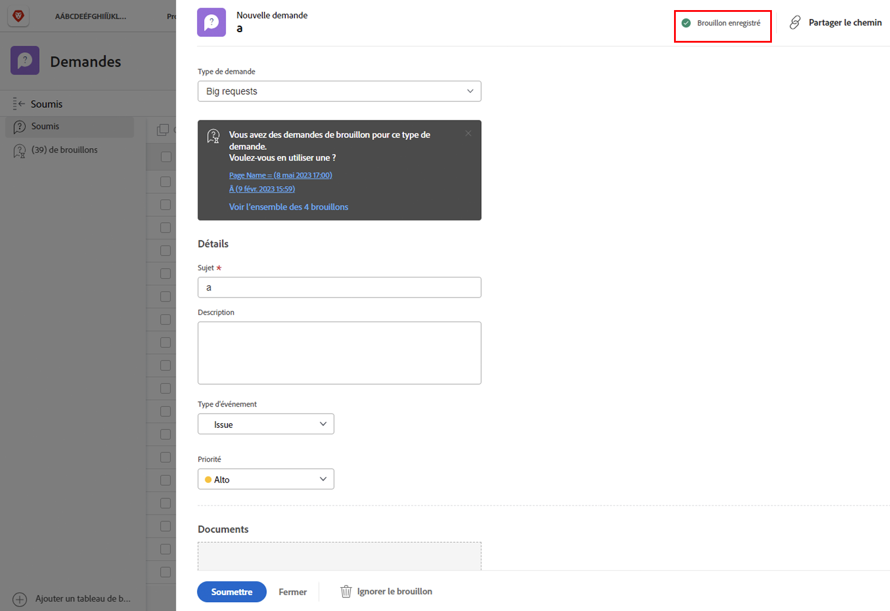
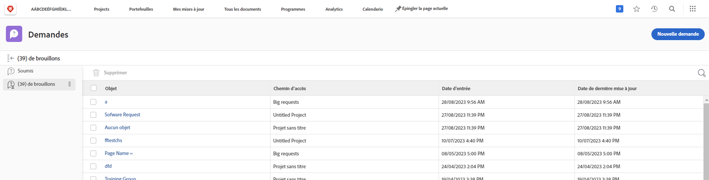

# Comprendre les files d’attente de demandes

Dans cette vidéo, vous apprendrez :

* Comment envoyer une requête via une [!DNL  Workfront] file d’attente de requête
* Comprendre la façon dont les files d’attente de demandes sont structurées

>[!VIDEO](https://video.tv.adobe.com/v/335220/?quality=12&learn=on)

## Les brouillons de demandes sont automatiquement enregistrés

Lorsque vous commencez à remplir un formulaire de demande, [!DNL Workfront] enregistre un brouillon automatiquement une fois que vous avez rempli le champ [!UICONTROL Objet]. Cela signifie que vous ne perdrez pas de données si vous devez quitter le [!UICONTROL Demandes] pour effectuer une autre action ou si vous devez vous arrêter au milieu de votre requête pour collecter plus d’informations.

Vous verrez une indication que le brouillon a été enregistré en haut de la fenêtre. [!DNL Workfront] enregistrera un brouillon de votre requête, même si les champs requis ne sont pas encore remplis.

Lorsque vous êtes prêt à envoyer la demande, recherchez-la dans la variable [!UICONTROL Brouillons] . Cliquez sur le nom pour l’ouvrir et terminer de remplir le formulaire. Cliquez ensuite sur [!UICONTROL Envoyer la requête] lorsque vous avez fini.

## À vous

Prenez quelques instants pour passer en revue les informations qui vous ont été présentées.

**Question :** Comment effectuer une demande dans Workfront ? Répertoriez les étapes dans l’ordre.

* Choisir le type de demande à effectuer
* Cliquer sur Envoyer la demande
* Renseigner les informations du formulaire
* Cliquer sur « Nouvelle demande »
* Accéder à la zone de demande

**Réponse :** Accéder à la zone de demande > Cliquer sur Nouvelle demande > Choisir le type de demande à effectuer > Renseigner les informations du formulaire > Cliquer sur Envoyer la demande.

**Question :** Une demande est concrètement un...

**Réponse :** Problème

<!---
You can also access request drafts from the [!UICONTROL Select a Request Type] menu at the top of the window. Select an option from the [!UICONTROL Recent Drafts] section, or start a new request by picking a queue from the [!UICONTROL New Requests] section. Fill everything out like normal, then submit the request.

<!---
image
--->

<!---
Let's take a minute to review the information you were just presented.

How do you make a request in Workfront? List the steps in order.
Choose the request type you need to make
Click Submit request
Fill out the information on the form
Click "New Request"
Navigate to the request area

Answer: Navigate to the request area>Click New Request>Choose the request type you need to make>Fill out the information on the form>Click Submit request

A request is really an......

Answer: Issue
--->
