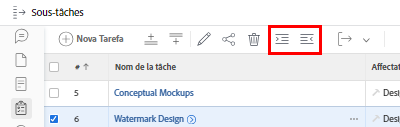
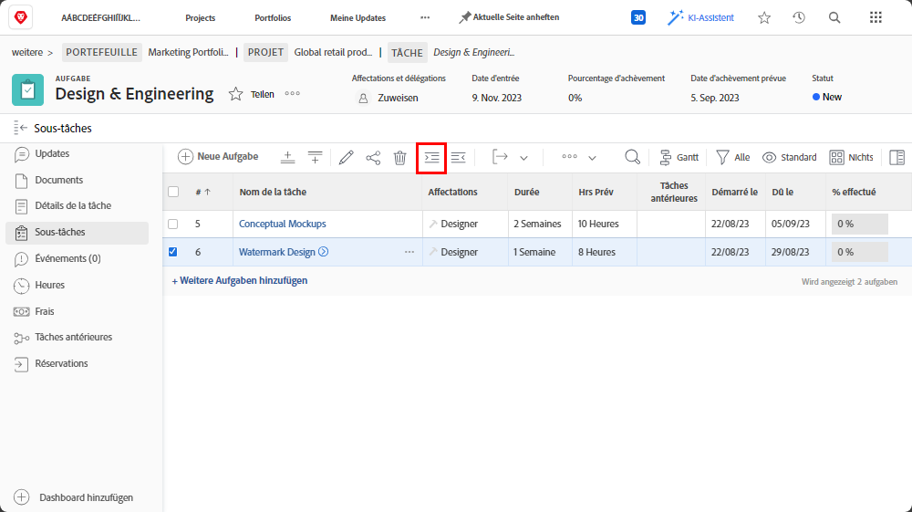
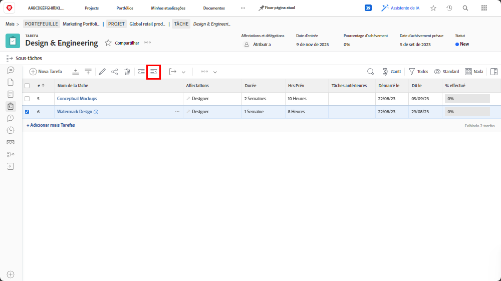

# Comprendre les tâches parent-enfant

Dans cette vidéo, vous apprendrez :

* Structuration des tâches dans un projet [!DNL Workfront]

>[!VIDEO](https://video.tv.adobe.com/v/335087/?quality=12&learn=on)

## Transformer une tâche en sous-tâche et inversement

Les boutons **indentation** et **retrait** permettent de transformer une tâche en sous-tâche ou de passer d’une sous-tâche à une tâche qui n’est pas une sous-tâche.

Sélectionnez « [!UICONTROL Conception de filigrane] » et cliquez sur le bouton **indentation**. « [!UICONTROL Conception de filigrane] » devient une sous-tâche de « [!UICONTROL Maquettes conceptuelles] », qui devient une tâche parent.

Sélectionnez « [!UICONTROL Conception de filigrane] » lorsqu’il s’agit d’une sous-tâche et cliquez sur le bouton **retrait**. « [!UICONTROL Conception de filigrane] » devient une tâche normale, au même niveau que « [!UICONTROL Maquettes conceptuelles] ».

