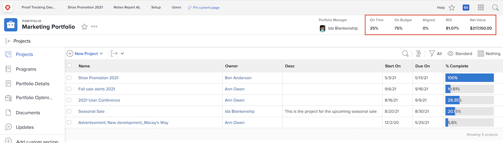
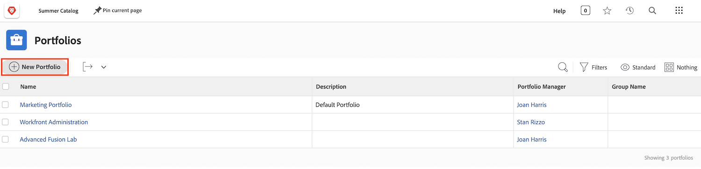

# Comprendre les portfolios

Les gestionnaires ont souvent la tâche délicate de déterminer quels projets aideraient le mieux leur entreprise à atteindre ses objectifs. Cela implique de juger un projet actuel ou potentiel sur la base de critères importants pour ces objectifs. Ces critères peuvent inclure des éléments tels que le nombre de ressources nécessaires, le coût du projet par rapport à ses bénéfices, et la compréhension des risques qu’il implique. Grâce à ces informations, les gestionnaires peuvent décider quels projets doivent être menés à bien et à quel moment.

Réfléchir à des projets et les planifier n’est pas une tâche excessivement difficile. Il s’agit d’un processus auquel la plupart des gestionnaires sont habitués. La véritable difficulté consiste à comparer les projets entre eux. Passer au crible une liste longue et détaillée de projets prend beaucoup de temps. C’est dans cette optique que les portefeuilles dans Workfront peuvent vous être utiles.

## En quoi consiste un portefeuille ?

Un portefeuille est un ensemble de projets qui se partagent les mêmes ressources, le même budget, le même calendrier et la même priorité. Par exemple, une agence marketing peut utiliser un portfolio pour regrouper tous les projets pour un client particulier.

Accédez à la section **[!UICONTROL Portfolios]** du [!UICONTROL Menu Principal], puis cliquez sur le nom d’un portfolio pour l’ouvrir.

Vous pouvez utiliser le bouton **[!UICONTROL Nouveau projet]** pour ajouter facilement un projet existant au portfolio. Vous pouvez également créer un projet directement dans le portfolio.

![Image du bouton [!UICONTROL Nouveau projet] dans le menu déroulant ](assets/01-portfolio-management3.png)

Une fois les projets ajoutés au portfolio, vous pouvez utiliser les informations récapitulatives dans l’en-tête de la page pour obtenir une vue d’ensemble de la manière dont cet ensemble de projets contribue, de manière positive ou négative, aux objectifs globaux du portfolio.

Vous pouvez utiliser l’outil d’optimisation du portfolio ( [!UICONTROL Optimisateur de portfolio]) pour hiérarchiser les projets en fonction de la valeur nette, de l’alignement, du coût, du risque et du retour sur investissement.

## Accès aux portfolios

Pour travailler avec des portfolios, vous devez disposer d’une licence Plan dans Workfront et d’un niveau d’accès vous permettant de travailler avec des portfolios.

Lorsqu’un portfolio est créé, seul le créateur du portfolio ou le gestionnaire y a accès. Vous pouvez octroyer l’accès au portfolio à d’autres personnes en le partageant. Cela octroie également l’accès à tous les programmes et projets contenus dans le portfolio.

Ouvrez le portfolio et cliquez sur le menu à trois points, puis sélectionnez **[!UICONTROL Partage]**. Ajoutez les personnes, les équipes, les fonctions, les groupes ou les entreprises qui doivent y avoir accès. Déterminez ensuite le type d’accès que chaque utilisateur ou utilisatrice doit posséder : gérer ou afficher.

![Image de l’option [!UICONTROL Partage] dans un portfolio [!DNL Workfront]](assets/04-portfolio-management11.png)

## Créer un portfolio

Pour créer un portfolio, cliquez sur **[!UICONTROL Portfolios]** dans le menu principal.

Dans la zone Portfolios, cliquez sur **[!UICONTROL Nouveau portfolio]**.

Nommez le portfolio, puis cliquez sur **[!UICONTROL Nouveau projet]** pour ajouter un projet au portfolio. Vous pouvez créer un projet de différentes manières, de la même façon que vous procédez à partir de la zone **[!UICONTROL Projets]**. Tous les nouveaux projets que vous créerez à partir d’ici appartiendront à ce portfolio. Vous pouvez également cliquer sur **[!UICONTROL Projet existant]** pour sélectionner un ou plusieurs projets existants dans une liste.

## Créer un programme dans un portfolio

Sélectionnez l’onglet **[!UICONTROL Programmes]**, puis cliquez sur **[!UICONTROL Nouveau programme]** pour créer un programme dans ce portfolio, ou cliquez sur **[!UICONTROL Programme existant]** pour « voler » un ou plusieurs programmes existants d’autres portfolios.

<!--
Pro-tips graphic
If a user can't access a specific portfolio, make sure it's shared with them. The Workfront access level determines that a user can access portfolios in general, but sharing makes sure they can see specific portfolios. 
-->

<!--
Learn more graphic and links to documentation articles
* Portfolio overview   
* Create a portfolio 
* Create and manage portfolios 
* Navigate within a portfolio 
* Share a portfolio   
-->
