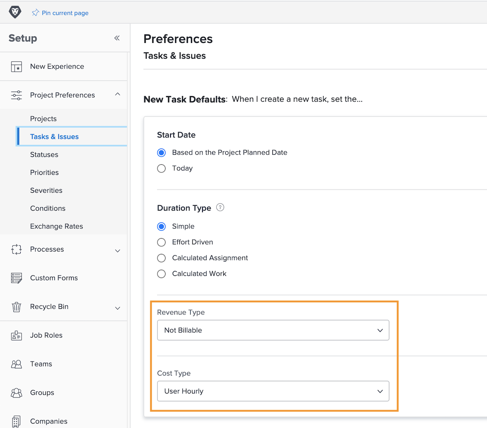

# Configurer des valeurs par défaut des revenus et des coûts d’une tâche

Le type de revenu et le type de coût servent à calculer les informations financières prévues et réelles d’une tâche. Les informations par défaut pour chacune de ces catégories peuvent être définies à l’échelle du système, de sorte qu’elles s’appliquent à chaque nouvelle tâche créée. Les informations peuvent être modifiées sur des projets individuels ou définies sur des modèles de projet.

**Cinq types de revenus par défaut sont disponibles :**

* Non facturable
* Utilisateur, par heure
* Rôle par heure
* Fixe par heure
* Revenus fixes

**Quatre types de coûts par défaut sont également disponibles :**

* Aucun coût
* Fixe par heure
* Utilisateur, par heure
* Rôle par heure

>[!NOTE]
>
>Lorsque les types de revenus ou de coûts sont définis sur Non facturable ou Pas de coût, les estimations de revenus et de coûts ne sont pas générées pour la tâche. Par conséquent, le travail sur la tâche ne participe pas aux revenus ou aux coûts du projet.

## Définir les valeurs par défaut des revenus et des coûts

Sélectionnez **[!UICONTROL Configuration]** dans le menu principal.

1. Cliquez sur **[!UICONTROL Préférences du projet]** dans le menu du panneau de gauche.
1. Cliquez ensuite sur **[!UICONTROL Tâches et problèmes]**.
1. Dans la section [!UICONTROL Nouvelle tâche par défaut], sélectionnez le [!UICONTROL Type de revenu] et le [!UICONTROL Type de coût] souhaités.
1. Lorsque vous avez terminé, cliquez sur Enregistrer.

