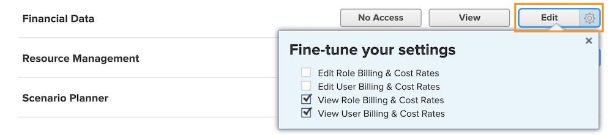

# Comprendre l’accès financier

Si votre entreprise capture des données financières avec [!DNL Workfront], en tant qu’administrateur ou administratrice système, il vous incombe de protéger et de gérer les personnes ayant accès à la consultation et à la modification de ces informations.

Deux éléments sont nécessaires pour qu’un utilisateur ou une utilisatrice puisse afficher ou modifier des informations financières :

1. Les droits d’accès doivent être activés dans le [!UICONTROL Niveau d’accès].
2. L’autorisation d’utiliser ces droits d’accès doit être accordée objet par objet.

Par exemple, un utilisateur ou une utilisatrice peut se voir accorder des droits pour afficher les données financières à son niveau d’accès, mais peut uniquement afficher les données financières sur une tâche qui est à la fois partagée avec lui ou elle et pour laquelle l’affichage financier est activé dans le partage de cette tâche.

Il est donc possible qu’un utilisateur ou une utilisatrice ayant des droits, à son [!UICONTROL niveau d’accès], pour afficher les données financières puisse consulter les données financières de certains objets et pas d’autres, en fonction des options de partage individuelles de ces objets. Cependant, personne ne peut afficher les données financières d’un objet à moins d’avoir reçu le droit de le faire dans son [!UICONTROL niveau d’accès].

## Paramètres du [!UICONTROL niveau d’accès]

L’accès global aux données financières est accordé en premier lieu en fonction du type de licence [!DNL Workfront].

**[!UICONTROL Planifier] les licences peut permettre de :**

* Gérer des enregistrements de facturation
* Gérer et afficher les taux de facturation et de coûts du rôle
* Gérer et afficher les taux de facturation et de coûts des utilisateurs et utilisatrices
* Gérer les dépenses
* Afficher et modifier les finances

Les licences de **[!UICONTROL travail] permettent les opérations suivantes :**

* Gérer les dépenses
* Afficher les finances

Les licences de **[!UICONTROL révision] permettent de :**

* Afficher les finances

**Les autorisations peuvent être modifiées par le [!UICONTROL niveau d’accès]. Les trois options d’accès aux données financières sont les suivantes :**

* [!UICONTROL Pas d’accès] - La personne ne peut pas consulter les informations financières.
* [!UICONTROL Afficher] - La personne peut consulter et partager les informations.
* [!UICONTROL Modifier] - La personne peut créer, modifier, supprimer et partager les informations. (Disponible uniquement pour une licence Plan.)

Il est important de noter que les options [!UICONTROL View] et [!UICONTROL Edit] ont des paramètres supplémentaires pour une licence [!UICONTROL Plan]. Cliquez sur l’engrenage du bouton [!UICONTROL Afficher] pour ces options :

**[!UICONTROL Afficher]**

* Afficher les taux de facturation et de coûts du rôle
* Afficher les taux de facturation et de coûts de l&#39;utilisateur

**[!UICONTROL Modifier]**

Ces deux options sont disponibles sous [!UICONTROL Modifier], ainsi que :

* Modifier les taux de facturation et de coûts du rôle
* Modifier les taux de facturation et de coûts de l&#39;utilisateur

>[!NOTE]
>
>Une personne ayant un accès permettant d’ajouter des dépenses peut également afficher les dépenses qu’elle ajoute, ainsi que les dépenses ajoutées par ses subordonnés directs.
