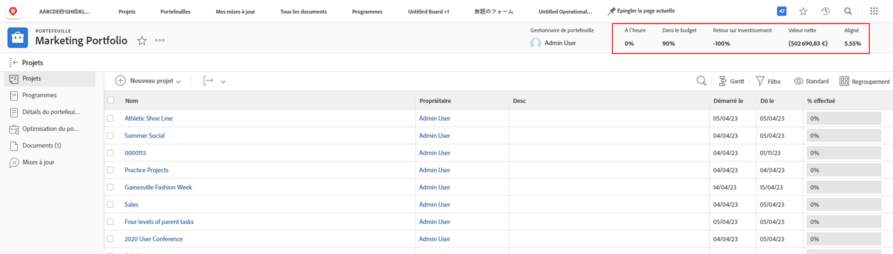
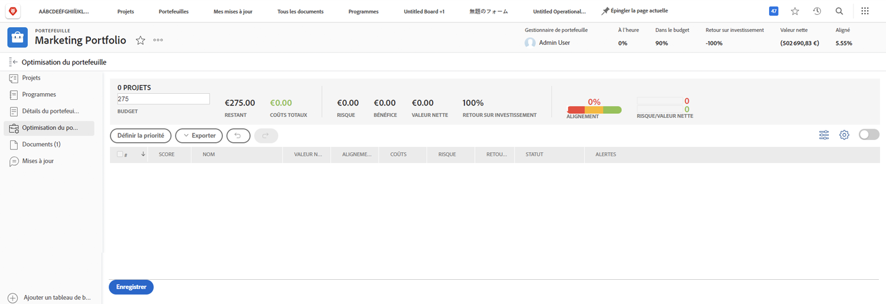

# Présentation des portefeuilles

Les gestionnaires ont souvent la tâche délicate de déterminer quels projets aideraient le mieux leur entreprise à atteindre ses objectifs. Cela implique de juger un projet actuel ou potentiel en fonction de critères importants pour ces objectifs. Ce critère peut inclure des éléments comme le nombre de ressources nécessaires, le coût du projet par rapport à ce qu’il implique, et/ou le nombre de risques impliqués. Grâce à ces informations, les gestionnaires peuvent décider quels projets doivent être réalisés en premier et lesquels peuvent être mis en second plan.

Penser et planifier des projets n’est pas une tâche trop difficile, c’est un processus auquel la plupart des gestionnaires sont habitués. La véritable difficulté réside dans la comparaison des projets les uns par rapport aux autres. Trouver une liste longue et détaillée de projets prend du temps. C’est là que les portefeuilles se trouvent dans [!DNL  Workfront] peut vous aider.

## Qu’est-ce qu’un portefeuille ?

Un portfolio est un ensemble de projets qui se terminent pour les mêmes ressources, budget, planification et priorité. Par exemple, une agence marketing peut utiliser un portefeuille pour regrouper tous les projets pour un client particulier.

Accédez au **[!UICONTROL Portfolios]** de la section [!UICONTROL Menu Principal], puis cliquez sur le nom d’un portfolio pour l’ouvrir.

Vous pouvez utiliser la variable **[!UICONTROL Nouveau projet]** pour ajouter facilement un projet existant au portfolio. Vous pouvez également créer un projet directement dans le portfolio.

![Image du menu déroulant pour la [!UICONTROL Nouveau projet] button](assets/01-portfolio-management3.png)

Une fois les projets ajoutés au portfolio, vous pouvez utiliser les informations de résumé dans l’en-tête de la page pour obtenir une vue générale de la manière dont la collection de projets contribue, positivement ou négativement, aux objectifs globaux.

Vous pouvez également utiliser l’outil d’optimisation de portefeuille pour hiérarchiser les projets qui prendront en charge les objectifs stratégiques globaux.

## Accès aux portefeuilles

Pour utiliser des portefeuilles, vous devez disposer d’une licence Plan dans [!DNL Workfront] et un niveau d’accès qui vous permet de travailler avec des portefeuilles.

Lorsqu’un portfolio est créé, seul le créateur ou le responsable du portfolio y a accès. Vous pouvez donner accès au portfolio en le partageant. Cela donne également accès aux programmes et projets créés dans le portefeuille.

Ouvrez le portfolio, cliquez sur le menu à trois points, puis sélectionnez **[!UICONTROL Partage]**. Ajoutez les individus, les équipes, les rôles de travail, les groupes ou les entreprises qui doivent y avoir accès. Déterminez ensuite le type d’accès que chaque utilisateur doit avoir : gérer ou afficher.

![Une image de la fonction [!UICONTROL Partage] dans une [!DNL Workfront] portfolio](assets/04-portfolio-management11.png)

<!--
Pro-tips graphic
If a user can’t access a specific portfolio, make sure it’s shared with them. The Workfront access level determines that a user can access portfolios in general, but sharing makes sure they can see specific portfolios. 
-->

<!--
Learn more graphic and links to documentation articles
* Portfolio overview   
* Create a portfolio 
* Create and manage portfolios 
* Navigate within a portfolio 
* Share a portfolio   
-->
