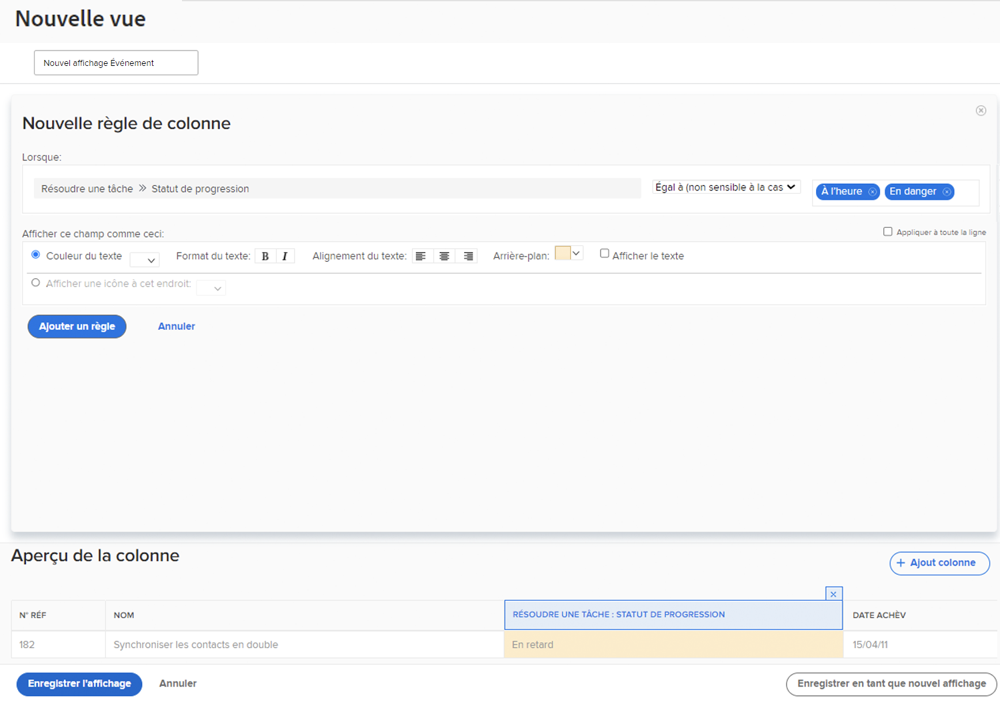

# Ajouter une mise en forme conditionnelle de base aux activités d’affichage

Entraînez-vous à ajouter une mise en forme conditionnelle de base aux vues, avec des instructions étape par étape.

## Résumé

Pour créer une mise en forme conditionnelle :

1. Choisissez la colonne dans laquelle vous souhaitez que la mise en forme apparaisse.
1. Déterminez les conditions dans lesquelles vous souhaitez que la mise en forme soit modifiée.
1. Décidez quel type de changement de format est le plus approprié :

   * Couleur d’arrière-plan
   * Couleur du texte
   * Texte de remplacement
   * Afficher une icône

## Activité 1 : Ajouter une mise en forme conditionnelle à une vue

Créez une vue de tâches nommée « Standard + Progression » en utilisant la vue Standard existante et en ajoutant cette mise en forme conditionnelle sur la colonne [!UICONTROL Nom].

1. Ajoutez une règle de colonne qui changera l’arrière-plan du champ en rouge lorsque le statut de progression de la tâche sera Urgent.
1. Ajoutez une règle de colonne qui changera l’arrière-plan du champ en jaune lorsque le statut de progression sera En retard ou À risque.

Cela vous aidera à repérer les tâches en difficulté sans avoir à inclure la colonne du statut de progression dans votre vue.

## Réponse 1

1. Dans un rapport de liste de tâches, allez dans le menu déroulant **[!UICONTROL Vue]** et sélectionnez **[!UICONTROL Nouvelle vue]**.
1. Nommez votre vue « Standard + Progression ».
1. Utilisez les colonnes par défaut fournies.
1. Sélectionnez la colonne [!UICONTROL Nom de tâche]. Il s’agit de la colonne à laquelle vous souhaitez appliquer la mise en forme conditionnelle, afin que cette colonne apparaisse en rouge ou en jaune si le statut de progression de la tâche n’est pas Dans les temps.
1. Cliquez sur **[!UICONTROL Options avancées]** dans le coin supérieur droit de la fenêtre du générateur de rapports.
1. Cliquez sur **[!UICONTROL Ajouter une règle à cette colonne]**.
1. Commencez la règle de la colonne en remplaçant [!UICONTROL Tâche] > [!UICONTROL Nom] en haut de la fenêtre par [!UICONTROL Tâche] > [!UICONTROL Statut de progression]. Il suffit de cliquer sur l’icône **[!UICONTROL X]** à côté de [!UICONTROL Tâche] > [!UICONTROL Nom] pour le supprimer du champ.
1. Saisissez « progression » dans le champ, puis sélectionnez [!UICONTROL Statut de progression] comme source du champ [!UICONTROL Tâche].
1. Sélectionnez **[!UICONTROL Urgent]** dans le champ situé à droite du qualificatif [!UICONTROL Égal].
1. Choisissez un arrière-plan rouge dans la ligne [!UICONTROL Couleur du texte].
1. Cliquez sur **[!UICONTROL Ajouter une règle]** pour enregistrer la règle de colonne.
1. Cliquez à nouveau sur **[!UICONTROL Ajouter une règle de colonne]** pour ajouter une autre règle.
1. De la même manière que précédemment, supprimez [!UICONTROL Tâche] > [!UICONTROL Nom] du champ des critères. Remplacez-le par [!UICONTROL Statut de la progression] comme source du champ [!UICONTROL Tâche].
1. Sélectionnez à la fois [!UICONTROL À risque] et [!UICONTROL En retard] dans le champ situé à droite du qualificatif Égal.
1. Choisissez un arrière-plan jaune dans la ligne [!UICONTROL Couleur du texte].
1. Cliquez sur **[!UICONTROL Ajouter une règle]** pour enregistrer la règle de colonne.
1. Cliquez sur **[!UICONTROL Enregistrer la vue]** pour enregistrer la vue.
