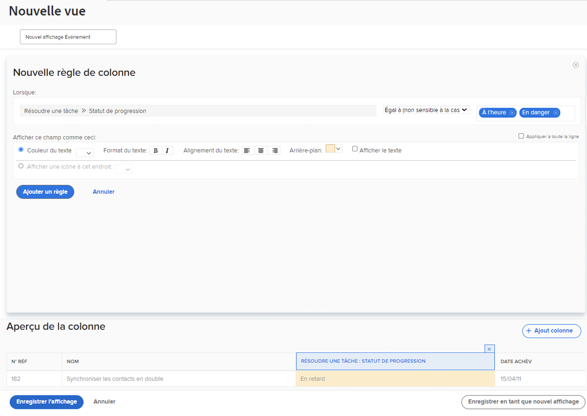

# Ajout d’une mise en forme conditionnelle de base à une vue

La mise en forme conditionnelle s’effectue en créant des règles de colonne. Les règles de colonne vous permettent de mettre en forme une colonne d’une manière spécifique en fonction des critères que vous avez définis.

Dans cette vidéo, vous apprendrez :

* Mise en forme conditionnelle dans une vue
* Création et modification d’une mise en forme conditionnelle

>[!VIDEO](https://video.tv.adobe.com/v/335149/?quality=12)

## Activité : Ajout d’une mise en forme conditionnelle à une vue

Créez une vue de tâche nommée &quot;Standard + Progression&quot; à l’aide de la vue Standard existante et ajoutez cette mise en forme conditionnelle sur la page [!UICONTROL Nom] colonne .

1. Ajoutez une règle de colonne qui affichera l’arrière-plan du champ en rouge lorsque l’état de progression de la tâche est En retard.
1. Ajoutez une règle de colonne qui affichera l’arrière-plan du champ en jaune lorsque l’état de progression est En arrière ou En danger.

Cela vous aidera à repérer les tâches en problème sans inclure la colonne pour l’état d’avancement dans votre vue.

## Réponse

1. Dans un rapport de liste de tâches, accédez au **[!UICONTROL Affichage]** menu déroulant, puis sélectionnez **[!UICONTROL Nouvelle vue]**.
1. Nommez votre vue &quot;Standard + Progression&quot;.
1. Utilisez les colonnes par défaut fournies.
1. Sélectionnez la [!UICONTROL Nom de la tâche] colonne . Il s’agit de la colonne à laquelle vous souhaitez appliquer la mise en forme conditionnelle. Elle apparaît donc en rouge ou en jaune si l’état d’avancement de la tâche n’est pas Activé.
1. Cliquez sur **[!UICONTROL Options avancées]** dans le coin supérieur droit de la fenêtre du créateur de rapports.
1. Cliquez sur **[!UICONTROL Ajouter une règle pour cette colonne]**.
1. Commencez la règle de colonne en modifiant les [!UICONTROL Tâche] > [!UICONTROL Nom] dans la partie supérieure de la fenêtre. [!UICONTROL Tâche] > [!UICONTROL État de progression]. Cliquez simplement sur le bouton **[!UICONTROL X]** en regard de [!UICONTROL Tâche] > [!UICONTROL Nom] pour la supprimer du champ.
1. Saisissez &quot;progress&quot; dans le champ, puis sélectionnez [!UICONTROL État de progression] sous le [!UICONTROL Tâche] source du champ.
1. Sélectionner **[!UICONTROL Tard]** dans le champ situé à droite du champ [!UICONTROL Égal] qualificateur.
1. Sélectionnez une arrière-plan rouge dans la [!UICONTROL Couleur du texte] ligne.
1. Cliquez sur **[!UICONTROL Ajouter une règle]** pour enregistrer la règle de colonne.
1. Cliquez maintenant sur **[!UICONTROL Ajouter une règle de colonne]** pour ajouter une autre règle.
1. Comme avant, supprimez [!UICONTROL Tâche] > [!UICONTROL Nom] dans le champ critères . Remplacez-le par [!UICONTROL État de progression] sous le [!UICONTROL Tâche] source du champ.
1. Sélectionnez les deux [!UICONTROL À risque] et [!UICONTROL Derrière] dans le champ situé à droite du qualificateur Egal .
1. Sélectionnez une couleur jaune dans la [!UICONTROL Couleur du texte] ligne.
1. Cliquez sur **[!UICONTROL Ajouter une règle]** pour enregistrer la règle de colonne.
1. Cliquez sur **[!UICONTROL Enregistrer la vue]** pour enregistrer la vue.
