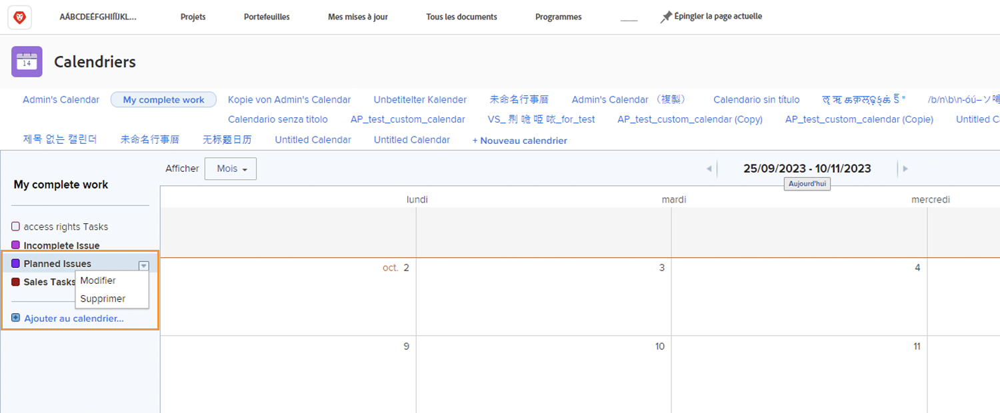

# Présentation des options de calendrier supplémentaires

Dans cette section, vous apprendrez à :

* Modification d’un groupement de calendrier
* Suppression d’un regroupement de calendrier
* Partage d’un calendrier

## Modification d’un groupement de calendrier

Pour modifier un groupement, survolez son nom avec la souris. Cliquez sur la flèche vers le bas qui s’affiche à droite et sélectionnez **[!UICONTROL Modifier]**.

## Suppression d’un regroupement de calendrier

Pour supprimer un regroupement, pointez sur son nom dans le calendrier. Cliquez sur la flèche vers le bas qui s’affiche à droite et sélectionnez **[!UICONTROL Supprimer]**.

## Partager un calendrier

En tant que chef de projet, vous pouvez créer un calendrier que vous souhaitez partager avec d’autres personnes, comme les chefs de projet, les membres de l’équipe, etc.

1. Dans la **[!UICONTROL Menu Principal]**, sélectionnez une **[!UICONTROL Calendriers]** zone.
1. Sélectionnez le calendrier que vous souhaitez partager.
1. Sélectionner **[!UICONTROL Partage]** de la **[!UICONTROL Actions du calendrier]** menu déroulant.
1. Saisissez le ou les noms des utilisateurs, rôles, équipes, groupes ou sociétés avec lesquels vous souhaitez partager le calendrier.
1. Sélectionnez si les utilisateurs obtiennent [!UICONTROL Affichage] ou [!UICONTROL Gérer] accès au rapport calendrier.
1. Cliquer sur **[!UICONTROL Enregistrer]**.

Lorsque vous partagez des calendriers, voici quelques éléments à noter :

* Cliquez sur le bouton **[!UICONTROL icône d’engrenage]** dans le coin supérieur droit de la fenêtre Partage pour rendre le calendrier visible à l&#39;échelle du système ou pour le rendre public aux utilisateurs externes.
* [!UICONTROL Affichage] access permet aux utilisateurs de consulter le calendrier sans modifier les filtres qui contrôlent les regroupements.
* [!UICONTROL Gérer] access permet aux utilisateurs de consulter le calendrier et de modifier les filtres qui contrôlent les regroupements.

## Lien partageable

Vous pouvez partager un calendrier avec d’autres [!DNL Workfront] par le biais d’un lien privé. Elles sont alors directement ajoutées au calendrier de la section [!DNL Workfront].

Vous pouvez le faire à partir de la **[!UICONTROL Actions du calendrier]** en sélectionnant **[!UICONTROL Obtenir le lien partageable]**. À partir de là, cliquez sur le **[!UICONTROL Copier le lien]** et collez l’URL dans un email ou un message instantané avec quelqu’un d’autre.

![Une image d’une [!UICONTROL Obtenir le lien partageable] écran](assets/calendar-3-1.png)
