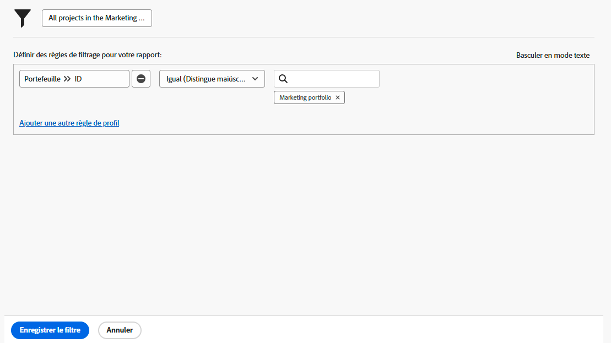

# Créer des activités de filtre de base

## Activité 1 - Tous les projets du portfolio marketing

Dans cette activité, vous allez créer un filtre de projet nommé « Tous les projets du portfolio marketing » dans l’expérience [!UICONTROL Filtre hérité]. Vous verrez alors tous les projets du portfolio nommé « Portfolio marketing », quel que soit leur statut.

Vous trouverez ci-dessous des instructions détaillées.

## Réponse à l’activité 1

1. Accédez à la zone [!UICONTROL Projets] à partir du [!UICONTROL Menu principal]. Vous affichez ainsi la liste des projets.
1. Cliquez sur le menu **[!UICONTROL Filtre]** et sélectionnez [!UICONTROL Filtres hérités].
1. Sélectionnez **[!UICONTROL Nouveau filtre]**.
1. Nommez votre filtre « Tous les projets du portfolio marketing ».
1. Cliquez sur **[!UICONTROL Ajouter une règle de filtre]**.
1. Dans le champ [!UICONTROL Saisir un nom de champ], saisissez le « [!UICONTROL nom de portfolio] ». Sélectionnez ensuite [!UICONTROL Nom] dans la source du champ [!UICONTROL Portfolio].
1. Laissez l’opérateur [!UICONTROL Égal] en l’état.
1. Saisissez « [!UICONTROL marketing] » dans le champ [!UICONTROL Saisir un nom de champ].
1. Sélectionnez [!UICONTROL Portfolio marketing] en supposant que vous ayez un portfolio portant ce nom que vous souhaitez filtrer. Si ce n’est pas le cas, utilisez simplement la fonctionnalité de suggestion automatique pour trouver le portfolio que vous souhaitez.
1. Cliquez sur **[!UICONTROL Enregistrer le filtre]**.

## Activité 2 - Mes projets se terminant ce mois-ci

Dans cette vidéo, vous allez créer un filtre de projet nommé « Mes projets se terminant ce mois-ci » dans l’expérience [!UICONTROL Filtre hérité]. Si vous gardez un œil sur de nombreux projets, ce filtre peut vous aider à vous focaliser sur ceux qui doivent bientôt se terminer.

Vous trouverez ci-dessous des instructions détaillées.

>[!VIDEO](https://video.tv.adobe.com/v/336807/?quality=12&learn=on&enablevpops)

## Réponse à l’activité 2

1. Accédez à la zone [!UICONTROL Projets] à partir du [!UICONTROL Menu principal]. Vous affichez ainsi la liste des projets.
1. Cliquez sur le menu **[!UICONTROL Filtre]** et sélectionnez [!UICONTROL Filtres hérités].
1. Sélectionnez **[!UICONTROL Nouveau filtre]**.
1. Nommez votre filtre « Mes projets se terminant ce mois-ci ».
1. Cliquez sur **[!UICONTROL Ajouter une règle de filtre]**.
1. Dans le champ [!UICONTROL Saisir un nom de champ], saisissez « personne propriétaire ». Sélectionnez [!UICONTROL Identifiant du propriétaire] dans la source du champ [!UICONTROL Projet].
1. Laissez l’opérateur [!UICONTROL Égal] en l’état.
1. Saisissez « $$ » dans le champ [!UICONTROL Saisir un nom].
1. Sélectionnez [!UICONTROL $$USER.ID]. Il s’agit du caractère générique pour un utilisateur ou une utilisatrice connecté.
1. Cliquez sur [!UICONTROL Ajouter une règle de filtre] à nouveau.
1. Dans le champ [!UICONTROL Saisir un nom de champ], saisissez « Est terminé ». Sélectionnez ensuite [!UICONTROL Est terminé] dans la source du champ Projet.
1. Laissez l’opérateur [!UICONTROL Égal] en l’état.
1. Sélectionnez « Faux ».
1. Cliquez sur [!UICONTROL Ajouter une règle de filtre] à nouveau.
1. Dans le champ [!UICONTROL Saisir un nom de champ], saisissez « planifié », puis sélectionnez [!UICONTROL Date d’achèvement prévue] dans la source du champ [!UICONTROL Projet].
1. Définissez l’opérateur [!UICONTROL Égal] sur [!UICONTROL Ce mois-ci].
1. Cliquez sur **[!UICONTROL Enregistrer le filtre]**.
