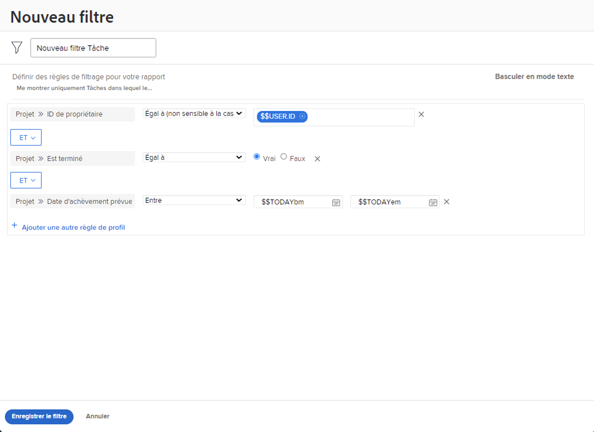

# Créer une activité de filtre de base

Dans cette vidéo, vous allez créer un filtre de projet nommé &quot;Projets dont je suis propriétaire et qui se terminent ce mois-ci&quot;. Si vous gardez un oeil sur de nombreux projets, ce filtre peut vous aider à zoomer sur ceux qui doivent bientôt se fermer.

Vous trouverez ci-dessous des instructions détaillées.

>[!VIDEO](https://video.tv.adobe.com/v/336807/?quality=12)

## Réponse

1. Accédez au [!UICONTROL Projets] de la zone [!UICONTROL Menu Principal]. Vous affichez ainsi la liste des projets.
1. Cliquez sur le bouton **[!UICONTROL Filtrer]** et sélectionnez **[!UICONTROL Nouveau filtre]**.
1. Nommez votre filtre &quot;Projets que je possède clôturant ce mois-ci&quot;.
1. Cliquez sur **[!UICONTROL Ajouter une règle de filtre]**.
1. Dans le [!UICONTROL Commencer à saisir le nom du champ] , saisissez &quot;propriétaire&quot;. Sélectionnez [!UICONTROL Identifiant du propriétaire] sous le [!UICONTROL Projet] source du champ.
1. Laissez le champ [!UICONTROL Égal] en l’état.
1. Saisissez &quot;$$&quot; dans le champ Nom de la saisie.
1. Sélectionner [!UICONTROL $$USER.ID]. Il s’agit du caractère générique de l’utilisateur connecté.
1. Cliquez sur [!UICONTROL Ajouter une règle de filtre] encore une fois.
1. Dans le [!UICONTROL Commencer à saisir le nom du champ] , commencez à saisir &quot;Est terminé&quot;. Sélectionnez [!UICONTROL Est terminé] sous la source du champ Projet .
1. Laissez le champ [!UICONTROL Égal] en l’état.
1. Sélectionnez &quot;False&quot;.
1. Cliquez sur [!UICONTROL Ajouter une règle de filtre] encore une fois.
1. Dans le [!UICONTROL Commencer à saisir le nom du champ] type de champ &quot;planifié&quot;, puis sélectionnez [!UICONTROL Date d’achèvement prévue] sous le [!UICONTROL Projet] source du champ.
1. Modifiez la variable [!UICONTROL Égal] à [!UICONTROL Ce mois-ci].
1. Cliquez sur **[!UICONTROL Enregistrer le filtre]**
