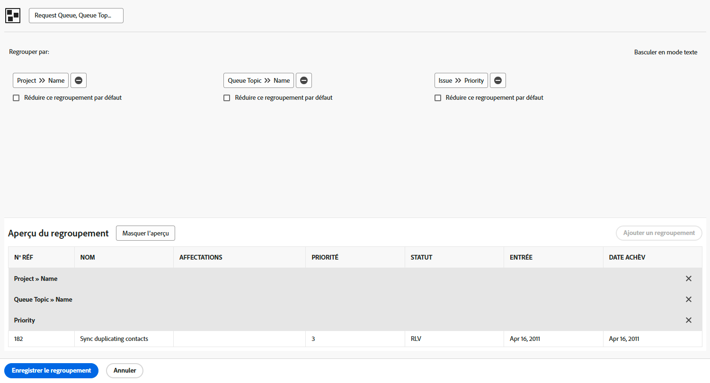

# Créer un regroupement de base

Cette vidéo explique comment créer et gérer des regroupements dans Workfront pour organiser efficacement les listes de projets. Les regroupements sont l’un des trois principaux éléments de création de rapports, avec les filtres et les vues. Ils permettent d’organiser les résultats en fonction des informations partagées.
Ce tutoriel décrit les étapes pratiques à suivre pour organiser les listes de projets afin de rationaliser le travail quotidien et la collaboration.

>[!VIDEO](https://video.tv.adobe.com/v/3449817/?captions=fre_fr&quality=12&learn=on&enablevpops=0)

## Points clés à retenir

* **Objectif des regroupements :** les regroupements constituent un élément clé des rapports dans Workfront. Ils organisent des listes de projets en fonction d’informations partagées, telles que des dates d’achèvement, des portfolios ou des programmes.
* **Création de regroupements :** vous pouvez créer des regroupements personnalisés avec trois niveaux de critères au maximum. Par exemple, les projets peuvent être regroupés d’abord par portfolio, puis par programme pour une meilleure organisation.
* **Modification et enregistrement des regroupements :** les regroupements intégrés ne peuvent pas être remplacés, mais vous pouvez enregistrer les modifications sous la forme d’un nouveau regroupement. Les regroupements personnalisés doivent avoir des noms clairs et descriptifs pour une identification facile.
* **Partage des regroupements** : les regroupements peuvent être partagés avec d’autres utilisateurs et utilisatrices, avec des autorisations d’« affichage » par défaut leur permettant d’utiliser et de partager le regroupement sans le modifier. Les autorisations de « gestion » permettent la modification et la suppression.
* **Suppression des regroupements :** la suppression d’un regroupement que vous avez créé le supprime également des listes des personnes avec lesquelles vous l’avez partagé. Les regroupements partagés apparaissent sous la section « Partagé avec moi » pour d’autres utilisateurs et utilisatrices.

## Activités Créer un regroupement de base

### Activité 1 : créer un regroupement de base

Créez un regroupement de problèmes qui sera utilisé dans un rapport pour suivre les demandes passant par une file d’attente des demandes. Ce regroupement permet de visualiser facilement les types de problèmes/demandes similaires regroupés par priorité. Nommez le regroupement « File d’attente des demandes, Rubrique de file d’attente, Priorité ».

Regroupez le rapport des problèmes en fonction des éléments suivants :

1. Nom de la file d’attente des demandes (il s’agira du nom du projet).
1. Rubrique de la file d’attente
1. Priorité de la demande

### Réponse 1

1. Dans un rapport de liste de problèmes, allez dans le menu **[!UICONTROL Regroupement]** et sélectionnez **[!UICONTROL Nouveau regroupement]**.
1. Nommez votre regroupement « File d’attente des demandes, Rubrique de file d’attente, Priorité ».
1. Cliquez sur **[!UICONTROL Ajouter un regroupement]**.
1. Dans le champ [!UICONTROL Regrouper par], saisissez « nom du projet », puis sélectionnez **[!UICONTROL Nom]** dans la source du champ Projet.
1. Cliquez sur **[!UICONTROL Ajouter un autre regroupement]**, puis saisissez « file d’attente » et sélectionnez **[!UICONTROL Nom]** sous la source du champ [!UICONTROL Rubrique de file d’attente].
1. Cliquez sur **[!UICONTROL Ajouter un autre regroupement]**, puis saisissez « priorité » et sélectionnez **[!UICONTROL Priorité]** sous la source du champ [!UICONTROL Problème].
1. Cliquez sur **[!UICONTROL Enregistrer le regroupement]**.
