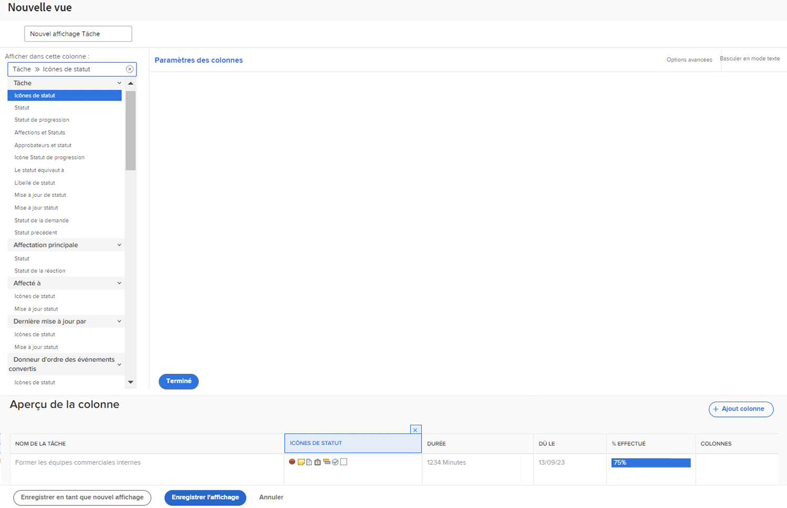
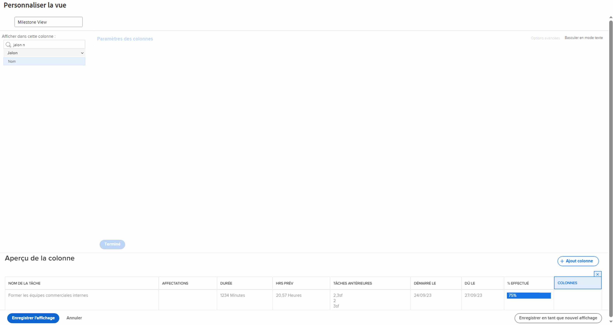
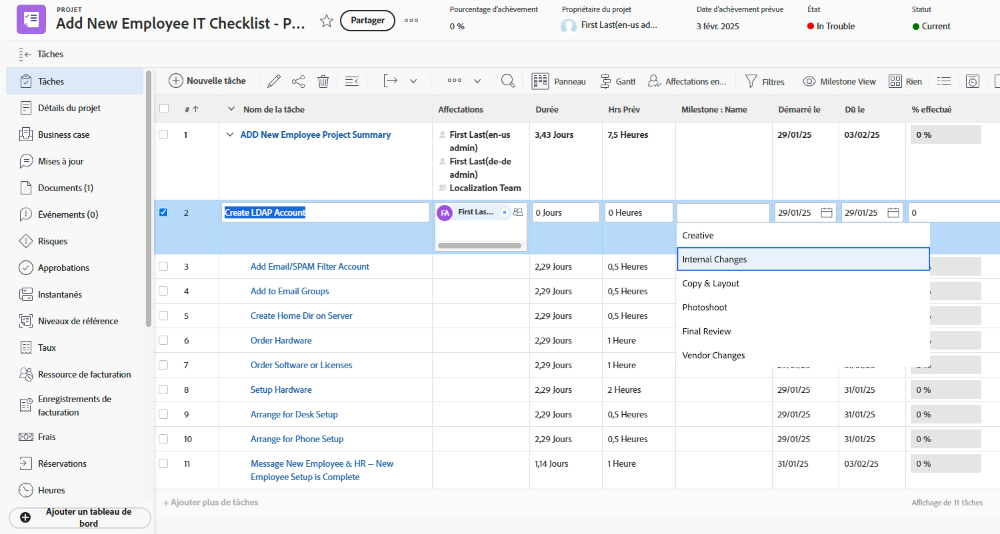
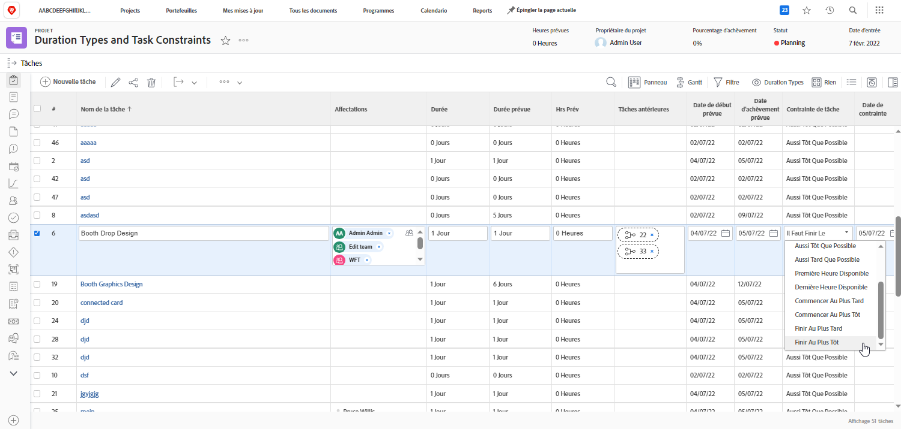
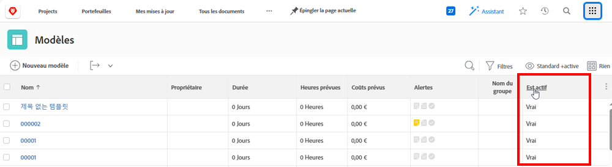

# Créer une vue de base

La vidéo explique comment créer et personnaliser des affichages dans Workfront pour afficher des informations spécifiques sur les éléments d’une liste, tels que les projets, les tâches, les événements et les documents. Les vues &#x200B; permettent aux utilisateurs d’afficher des détails tels que le nom, la description, le statut et d’autres champs liés aux éléments. &#x200B;

La vidéo souligne la flexibilité des vues dans Workfront et fournit des instructions détaillées sur leur création, leur personnalisation et leur gestion.

>[!VIDEO](https://video.tv.adobe.com/v/335148/?quality=12&learn=on&enablevpops=0)

## Points essentiels à retenir

* **Personnalisation des vues** : les utilisateurs et utilisatrices peuvent modifier des vues existantes ou en créer de nouvelles en ajoutant, en supprimant ou en réagençant des colonnes pour afficher des informations spécifiques, telles que le statut du projet ou le budget.
* **Modification en ligne** : certains champs d’une vue Liste peuvent être mis à jour directement sans ouvrir d’éléments individuels, ce qui accélère la modification. &#x200B;
* **Création de vues à partir de zéro** : les utilisateurs peuvent concevoir des vues pour répondre à des besoins spécifiques, tels que le suivi de l&#39;intégrité du projet, en ajoutant des colonnes pertinentes telles que le budget, le coût réel et l&#39;état d&#39;avancement. &#x200B;
* **Partage et gestion des vues** : les vues personnalisées peuvent être partagées avec les membres de l’équipe à des fins de collaboration ou être supprimées lorsqu’elles ne sont plus nécessaires.

## Activités Créer une vue de base

### Activité 1 : créer une vue de statut de tâche

En tant que responsable de projet, d’équipe ou de ressources, vous souhaitez suivre l’évolution des tâches. Avec cette vue, vous obtenez plusieurs indicateurs de statut d’une tâche, sur une même ligne de la liste ou du rapport.

Créez une vue de tâche nommée « Vue du statut de la tâche » avec les colonnes suivantes :

* [!UICONTROL Nom de la tâche]
* [!UICONTROL Affectations]
* [!UICONTROL Durée]
* [!UICONTROL Pourcentage d&#39;achèvement]
* [!UICONTROL Statut]
* [!UICONTROL Statut de progression]
* [!UICONTROL Icônes de statut]

### Réponse 1

1. Dans un rapport de liste de tâches, allez dans le menu déroulant **[!UICONTROL Vue]** et sélectionnez **[!UICONTROL Nouvelle vue]**.
1. Nommez votre vue « Vue du statut de la tâche ».
1. Supprimez ces colonnes : [!UICONTROL Hrs Prév], [!UICONTROL Prédécesseurs], [!UICONTROL Début le], et [!UICONTROL Échéance le].
1. Cliquez sur **[!UICONTROL Ajouter une colonne]**.
1. Dans le champ [!UICONTROL Afficher dans cette colonne], saisissez « statut », puis sélectionnez « Statut » sous la source du champ [!UICONTROL Tâche].
1. Cliquez sur **[!UICONTROL Ajouter une colonne]** encore une fois.
1. Dans le champ [!UICONTROL Afficher dans cette colonne], saisissez « statut », puis sélectionnez « Statut de la progression » dans la source du champ [!UICONTROL Tâche].
1. Cliquez sur **[!UICONTROL Ajouter une colonne]** encore une fois.
1. Dans le champ [!UICONTROL Afficher dans cette colonne], saisissez « statut », puis sélectionnez « Icônes de statut » dans la source du champ Tâche.
1. Cliquer sur **[!UICONTROL Enregistrer]**.

Pointez sur chacune des icônes de la colonne [!UICONTROL Icônes de statut] pour voir ce qu’elles représentent. S’ils sont grisés, cela signifie que la tâche ne comporte pas de notes, de documents, de processus d’approbation, etc. Si une icône apparaît en couleur, au moins un de ces éléments est associé à la tâche. Vous pouvez cliquer sur les icônes de note ou de document pour accéder à cet élément.

### Activité 2 : créer une vue de jalon

Si vous utilisez des jalons, cette vue est la méthode la plus simple pour les afficher par nom dans la liste des tâches et les ajouter ou les modifier à l’aide de la modification en ligne.

Créez une vue de tâche nommée « Vue de jalon » avec les colonnes suivantes :

* [!UICONTROL Nom de la tâche]
* [!UICONTROL Affectations]
* [!UICONTROL Durée]
* [!UICONTROL Hrs Prév]
* [!UICONTROL Jalon : nom]
* [!UICONTROL Démarré le]
* [!UICONTROL Dû le]
* [!UICONTROL Pourcentage d&#39;achèvement]

### Réponse 2

1. Dans la liste des tâches d’un projet, accédez au menu déroulant **[!UICONTROL Vue]** et sélectionnez **[!UICONTROL Nouvelle vue]**.
1. Nommez votre vue « Vue de jalon ».
1. Cliquez sur la colonne [!UICONTROL Prédécesseurs] pour la sélectionner.
1. Dans le champ [!UICONTROL Afficher dans cette colonne], cliquez sur l’icône « moins » dans le champ [!UICONTROL Tâche >> Prédécesseurs], puis saisissez « [!UICONTROL nom du jalon] » et cliquez sur « [!UICONTROL Nom] » dans la liste.
1. Cliquer sur **[!UICONTROL Enregistrer]**.

### Activité 3 : créer une vue des types de durée et des contraintes de tâche

Cette vue vous permet d’examiner et de modifier tous les types de durée et les contraintes de tâche dans votre projet.

Créez une vue de tâche nommée « Vue des types de durée et des contraintes de tâche » avec les colonnes suivantes :

* [!UICONTROL Nom de la tâche]
* [!UICONTROL Affectations]
* [!UICONTROL Durée]
* [!UICONTROL Durée prévue]
* [!UICONTROL Hrs Prév]
* [!UICONTROL Tâches antérieures]
* [!UICONTROL Démarré le]
* [!UICONTROL Dû le]
* [!UICONTROL Type de durée]
* [!UICONTROL Contrainte de tâche]
* [!UICONTROL Date de contrainte]

Modifiez le [!UICONTROL Format du champ] des colonnes [!UICONTROL Début le] et [!UICONTROL Échéance le] pour afficher la date et l’heure.

### Réponse 3

1. Dans la liste des tâches d’un projet, accédez au menu déroulant **[!UICONTROL Vue]** et sélectionnez **[!UICONTROL Nouvelle vue]**.
1. Nommez votre vue « Vue des types de durée et des contraintes de tâche ».
1. Supprimez la colonne [!UICONTROL % terminé].
1. Cliquez sur **[!UICONTROL Ajouter une colonne]**.
1. Dans le champ [!UICONTROL Afficher dans cette colonne], saisissez [!UICONTROL « durée »], puis sélectionnez [!UICONTROL « Durée prévue »] sous la source du champ [!UICONTROL Tâche].
1. Déplacez cette colonne entre les colonnes [!UICONTROL Durée] et [!UICONTROL Hrs Prév].
1. Cliquez sur **[!UICONTROL Ajouter une colonne]** encore une fois.
1. Dans le champ [!UICONTROL Afficher dans cette colonne], saisissez [!UICONTROL « Type de durée »], puis sélectionnez [!UICONTROL « Type de durée »] dans la source du champ [!UICONTROL Tâche].
1. Cliquez sur **[!UICONTROL Ajouter une colonne]** encore une fois.
1. Dans le champ [!UICONTROL Afficher dans cette colonne], saisissez [!UICONTROL « Contrainte »], puis sélectionnez [!UICONTROL « Contrainte de tâche »] dans la source du champ Tâche.
1. Cliquez sur **[!UICONTROL Ajouter une colonne]** encore une fois.
1. Dans le champ [!UICONTROL Afficher dans cette colonne], saisissez [!UICONTROL « Contrainte »], puis sélectionnez [!UICONTROL « Date de contrainte »] dans la source du champ Tâche.
1. Sélectionnez la colonne [!UICONTROL Début le], puis cliquez sur [!UICONTROL Options avancées].
1. Sous la liste déroulante [!UICONTROL Format du champ], sélectionnez [!UICONTROL « 10/17/60 3:00 »].
1. Sélectionnez la colonne [!UICONTROL Échéance le], puis cliquez sur [!UICONTROL Options avancées].
1. Sous la liste déroulante [!UICONTROL Format du champ], sélectionnez [!UICONTROL « 10/17/60 3:00 »].
1. Cliquer sur **[!UICONTROL Enregistrer]**.

### Activité 4 : créer une vue de statut actif pour un modèle de projet

Quiconque gère des modèles de projet appréciera de voir le statut actif (Vrai ou Faux) de chaque modèle dans une liste. Mieux encore : le champ est modifiable en ligne.

Créez une vue de modèle de projet nommée « Standard + statut actif » avec les colonnes suivantes :

* [!UICONTROL Nom]
* [!UICONTROL Personne propriétaire]
* [!UICONTROL Durée]
* [!UICONTROL Nombre d’heures prévues]
* [!UICONTROL Coûts prévus]
* [!UICONTROL Indicateurs]
* [!UICONTROL Nom du groupe]
* [!UICONTROL Est actif]

### Réponse 4

1. Dans une liste de modèles de projets, allez dans le menu déroulant **[!UICONTROL Vue]** et sélectionnez **[!UICONTROL Nouvelle vue]**.
1. Nommez votre vue « Standard + Statut actif ».
1. Cliquez sur **[!UICONTROL Ajouter une colonne]**.
1. Dans le champ [!UICONTROL Afficher dans cette colonne], tapez « est », puis sélectionnez « Est actif » sous la source du champ [!UICONTROL Modèle].
1. Cliquez sur **[!UICONTROL Enregistrer la vue]**.
