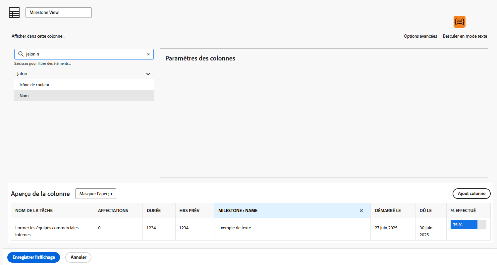
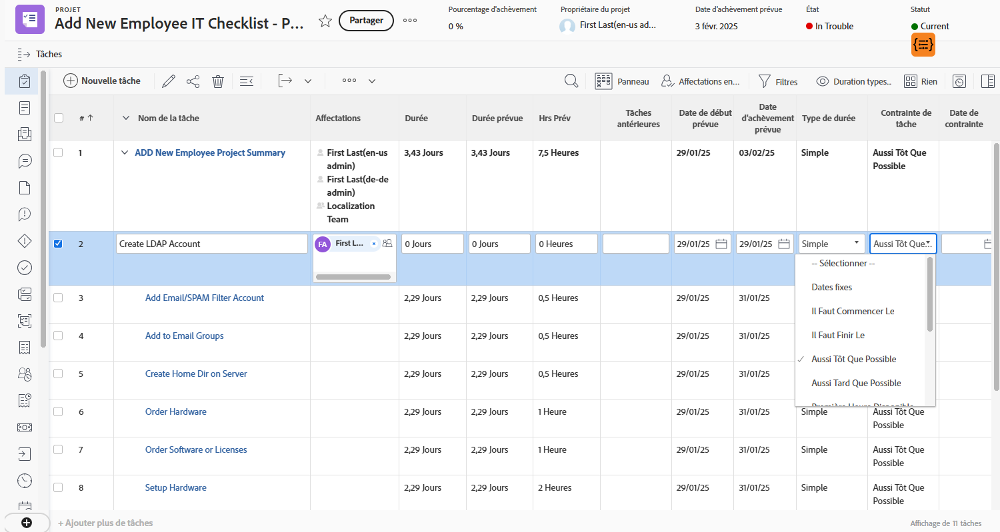
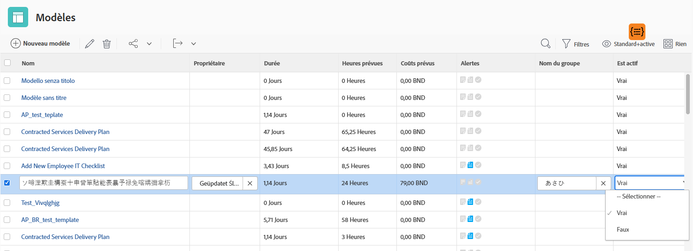

# Créer une vue de base

Dans cette vidéo, vous apprendrez :

* Présentation d’une vue dans Workfront
* Création et modification d’une vue
* Partage d’une vue avec d’autres utilisateurs et utilisatrices de Workfront

>[!VIDEO](https://video.tv.adobe.com/v/335148/?quality=12&learn=on)

## Créer des activités de visualisation de base

Pour télécharger un fichier PDF de cette page, [cliquez ici](/help/assets/create-basic-view-activities.pdf).

### Activité 1 : créer une vue de statut de tâche

En tant que responsable de projet, d’équipe ou de ressources, vous souhaitez suivre l’évolution des tâches. Avec cette vue, vous obtenez plusieurs indicateurs de statut d’une tâche, sur une même ligne de la liste ou du rapport.

Créez une vue de tâche nommée « Vue du statut de la tâche » avec les colonnes suivantes :

* [!UICONTROL Nom de la tâche]
* [!UICONTROL Affectations]
* [!UICONTROL Durée]
* [!UICONTROL Pourcentage d&#39;achèvement]
* [!UICONTROL Statut]
* [!UICONTROL Statut de progression]
* [!UICONTROL Icônes de statut]

### Réponse 1

1. Dans un rapport de liste de tâches, allez dans le menu déroulant **[!UICONTROL Vue]** et sélectionnez **[!UICONTROL Nouvelle vue]**.
1. Nommez votre vue « Vue du statut de la tâche ».
1. Supprimez ces colonnes : [!UICONTROL Hrs Prév], [!UICONTROL Prédécesseurs], [!UICONTROL Début le], et [!UICONTROL Échéance le].
1. Cliquez sur **[!UICONTROL Ajouter une colonne]**.
1. Dans le champ [!UICONTROL Afficher dans cette colonne], saisissez « statut », puis sélectionnez « Statut » sous la source du champ [!UICONTROL Tâche].
1. Cliquez sur **[!UICONTROL Ajouter une colonne]** encore une fois.
1. Dans le champ [!UICONTROL Afficher dans cette colonne], saisissez « statut », puis sélectionnez « Statut de la progression » dans la source du champ [!UICONTROL Tâche].
1. Cliquez sur **[!UICONTROL Ajouter une colonne]** encore une fois.
1. Dans le champ [!UICONTROL Afficher dans cette colonne], saisissez « statut », puis sélectionnez « Icônes de statut » dans la source du champ Tâche.
1. Cliquer sur **[!UICONTROL Enregistrer]**.

Pointez sur chacune des icônes de la colonne [!UICONTROL Icônes de statut] pour voir ce qu’elles représentent. Si elles sont grisées, cela signifie que la tâche ne possède pas de notes, de documents, de processus d’approbation, etc. Si une icône s’affiche en couleur, cela signifie qu’au moins un de ces éléments est associé à la tâche. Vous pouvez cliquer sur les icônes de note ou de document pour accéder à cet élément.

### Activité 2 : créer une vue de jalon

Si vous utilisez des jalons, cette vue est la méthode la plus simple pour les afficher par nom et les ajouter ou les modifier à l’aide de la modification en ligne.

Créez une vue de tâche nommée « Vue de jalon » avec les colonnes suivantes :

* [!UICONTROL Nom de la tâche]
* [!UICONTROL Affectations]
* [!UICONTROL Durée]
* [!UICONTROL Hrs Prév]
* [!UICONTROL Jalon : nom]
* [!UICONTROL Démarré le]
* [!UICONTROL Dû le]
* [!UICONTROL Pourcentage d&#39;achèvement]

### Réponse 2

1. Dans la liste des tâches d’un projet, accédez au menu déroulant **[!UICONTROL Vue]** et sélectionnez **[!UICONTROL Nouvelle vue]**.
1. Nommez votre vue « Vue de jalon ».
1. Cliquez sur la colonne [!UICONTROL Prédécesseurs] pour la sélectionner.
1. Dans le champ [!UICONTROL Afficher dans cette colonne], cliquez sur l’icône X dans le champ [!UICONTROL Tâche >> Prédécesseurs], puis saisissez « [!UICONTROL nom du jalon] » et cliquez sur « [!UICONTROL Nom] » dans la liste.
1. Cliquer sur **[!UICONTROL Enregistrer]**.

### Activité 3 : créer une vue des types de durée et des contraintes de tâche

Cette vue vous permet d’examiner et de modifier tous les types de durée et les contraintes de tâche dans votre projet.

Créez une vue de tâche nommée « Vue des types de durée et des contraintes de tâche » avec les colonnes suivantes :

* [!UICONTROL Nom de la tâche]
* [!UICONTROL Affectations]
* [!UICONTROL Durée]
* [!UICONTROL Durée prévue]
* [!UICONTROL Hrs Prév]
* [!UICONTROL Tâches antérieures]
* [!UICONTROL Démarré le]
* [!UICONTROL Dû le]
* [!UICONTROL Type de durée]
* [!UICONTROL Contrainte de tâche]
* [!UICONTROL Date de contrainte]

Modifiez le [!UICONTROL Format du champ] des colonnes [!UICONTROL Début le] et [!UICONTROL Échéance le] pour afficher la date et l’heure.

### Réponse 3

1. Dans la liste des tâches d’un projet, accédez au menu déroulant **[!UICONTROL Vue]** et sélectionnez **[!UICONTROL Nouvelle vue]**.
1. Nommez votre vue « Vue des types de durée et des contraintes de tâche ».
1. Supprimez la colonne [!UICONTROL % terminé].
1. Cliquez sur **[!UICONTROL Ajouter une colonne]**.
1. Dans le champ [!UICONTROL Afficher dans cette colonne], saisissez [!UICONTROL « durée »], puis sélectionnez [!UICONTROL « Durée prévue »] sous la source du champ [!UICONTROL Tâche].
1. Déplacez cette colonne entre les colonnes [!UICONTROL Durée] et [!UICONTROL Hrs Prév].
1. Cliquez sur **[!UICONTROL Ajouter une colonne]** encore une fois.
1. Dans le champ [!UICONTROL Afficher dans cette colonne], saisissez [!UICONTROL « Type de durée »], puis sélectionnez [!UICONTROL « Type de durée »] dans la source du champ [!UICONTROL Tâche].
1. Cliquez sur **[!UICONTROL Ajouter une colonne]** encore une fois.
1. Dans le champ [!UICONTROL Afficher dans cette colonne], saisissez [!UICONTROL « Contrainte »], puis sélectionnez [!UICONTROL « Contrainte de tâche »] dans la source du champ Tâche.
1. Cliquez sur **[!UICONTROL Ajouter une colonne]** encore une fois.
1. Dans le champ [!UICONTROL Afficher dans cette colonne], saisissez [!UICONTROL « Contrainte »], puis sélectionnez [!UICONTROL « Date de contrainte »] dans la source du champ Tâche.
1. Sélectionnez la colonne [!UICONTROL Début le], puis cliquez sur [!UICONTROL Options avancées].
1. Dans la liste déroulante [!UICONTROL Format du champ], sélectionnez [!UICONTROL « 10/17/60 3 h »].
1. Sélectionnez la colonne [!UICONTROL Échéance le], puis cliquez sur [!UICONTROL Options avancées].
1. Sous la liste déroulante [!UICONTROL Format du champ], sélectionnez [!UICONTROL « 10/17/60 3 h »].
1. Cliquer sur **[!UICONTROL Enregistrer]**.

### Activité 4 : créer une vue de statut actif pour un modèle de projet

Quiconque gère des modèles de projet appréciera de voir le statut actif (Vrai ou Faux) de chaque modèle dans une liste. Mieux encore : le champ est modifiable en ligne.

Créez une vue de modèle de projet nommée « Standard + statut actif » avec les colonnes suivantes :

* [!UICONTROL Nom]
* [!UICONTROL Personne propriétaire]
* [!UICONTROL Durée]
* [!UICONTROL Nombre d’heures prévues]
* [!UICONTROL Coûts prévus]
* [!UICONTROL Indicateurs]
* [!UICONTROL Nom du groupe]
* [!UICONTROL Est actif]

### Réponse 4

1. Dans une liste de modèles de projets, allez dans le menu déroulant **[!UICONTROL Vue]** et sélectionnez **[!UICONTROL Nouvelle vue]**.
1. Nommez votre vue « Standard + Statut actif ».
1. Cliquez sur **[!UICONTROL Ajouter une colonne]**.
1. Dans le champ [!UICONTROL Afficher dans cette colonne], tapez « est », puis sélectionnez « Est actif » sous la source du champ [!UICONTROL Modèle].
1. Cliquez sur **[!UICONTROL Enregistrer la vue]**.
