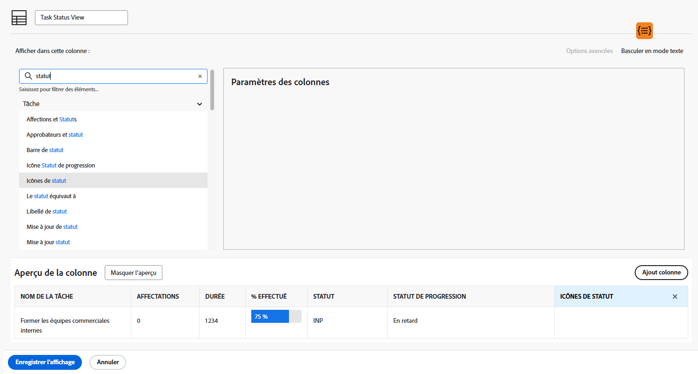

# Création d’une vue de base

Dans cette vidéo, vous apprendrez :

* Présentation d’une vue dans Workfront
* Création et modification d’une vue
* Comment partager une vue avec d’autres utilisateurs de Workfront

>[!VIDEO](https://video.tv.adobe.com/v/335148/?quality=12)

## Activité : Création d’une vue de base

En tant que chef de projet, chef d’équipe ou responsable des ressources, vous souhaitez suivre l’avancement des tâches. Avec cette vue, vous obtenez plusieurs indicateurs d’état d’une tâche tous sur une ligne de la liste ou du rapport.

Créez une vue de tâche nommée &quot;Vue d’état de la tâche&quot; avec les colonnes suivantes :

* [!UICONTROL Nom de la tâche]
* [!UICONTROL Affectations]
* [!UICONTROL Durée]
* [!UICONTROL Pourcentage d&#39;achèvement]
* [!UICONTROL Statut]
* [!UICONTROL Statut de progression]
* [!UICONTROL Icônes de statut]

## Réponse

1. Dans un rapport de liste de tâches, accédez au **[!UICONTROL Affichage]** menu déroulant, puis sélectionnez **[!UICONTROL Nouvelle vue]**.
1. Nommez votre vue &quot;Affichage de l’état de la tâche&quot;.
1. Supprimez ces colonnes : [!UICONTROL Heures de planification], [!UICONTROL Prédécesseurs], [!UICONTROL Démarrer le], et [!UICONTROL Échéance activée].
1. Cliquez sur **[!UICONTROL Ajouter une colonne]**.
1. Dans le [!UICONTROL Afficher dans cette colonne] , saisissez &quot;status&quot;, puis sélectionnez &quot;Status&quot; sous la propriété [!UICONTROL Tâche] source du champ.
1. Cliquez sur **[!UICONTROL Ajouter une colonne]** encore une fois.
1. Dans le [!UICONTROL Afficher dans cette colonne] , saisissez &quot;status&quot;, puis sélectionnez &quot;Etat d’avancement&quot; sous [!UICONTROL Tâche] source du champ.
1. Cliquez sur **[!UICONTROL Ajouter une colonne]** encore une fois.
1. Dans le [!UICONTROL Afficher dans cette colonne] , saisissez &quot;status&quot;, puis sélectionnez &quot;Status Icons&quot; sous la source du champ Tâche .
1. Cliquer sur **[!UICONTROL Enregistrer]**.

Passez la souris sur chacune des icônes du [!UICONTROL Icônes d’état] pour voir ce qu’ils représentent. Si elles sont grisées, cela signifie que la tâche n&#39;a pas de notes, de documents, de processus de validation, etc. Si une icône s’affiche en couleur, au moins un de ces éléments est associé à la tâche. Vous pouvez cliquer sur les icônes de note ou de document pour accéder à cet élément.
