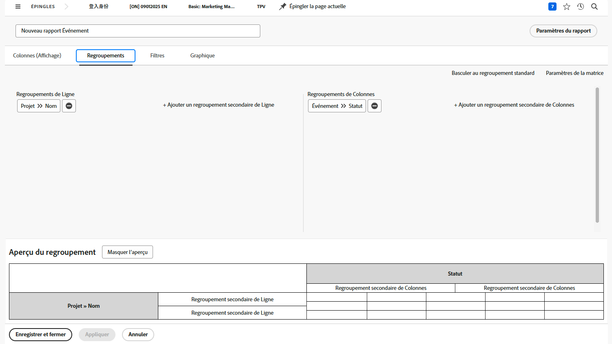
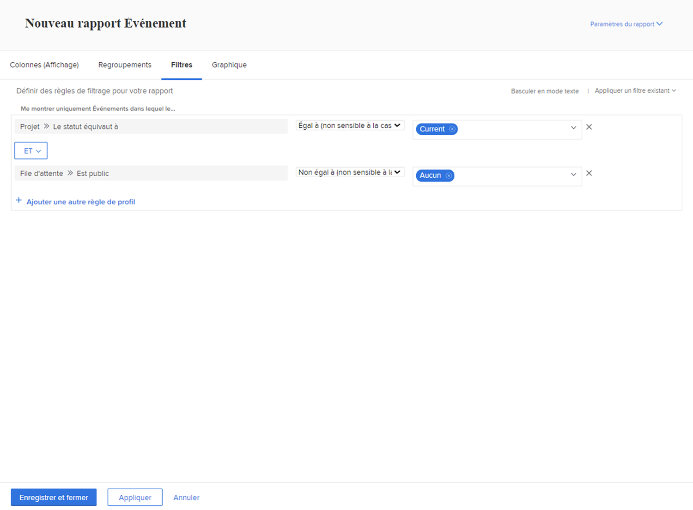

# Créer un rapport de matrice

Dans cette vidéo, vous apprendrez :

* Lorsqu’un rapport de matrice peut être utile
* Et comment créer un rapport de matrice

>[!VIDEO](https://video.tv.adobe.com/v/335156/?quality=12)

## Activité : Créer un rapport de matrice

Créez un rapport de matrice qui indique le nombre de requêtes présentes dans chaque état, triées par file d’attente de requêtes. Vous obtenez ainsi un aperçu rapide de la quantité de travail à accomplir et de la façon dont vous la respectez.

Vous souhaitez que les files d’attente de requête apparaissent sur les regroupements de lignes. Le statut apparaît comme regroupements de colonnes. Nommez votre rapport &quot;Demandes par état et file d’attente de demandes&quot;.

## Réponse

1. Sélectionner **[!UICONTROL Rapports]** de la **[!UICONTROL Menu Principal]**.
1. Cliquez sur le bouton **[!UICONTROL Nouveau rapport]** et sélectionnez **[!UICONTROL Problème]**.
1. Accédez au **[!UICONTROL Groupements]** et cliquez sur **[!UICONTROL Basculer vers le groupement matriciel]**.
1. Pour [!UICONTROL Regroupements de lignes], sélectionnez **[!UICONTROL Projet]** > **[!UICONTROL Nom]**.
1. Pour [!UICONTROL Regroupement de colonnes], sélectionnez **[!UICONTROL Problème]** > **[!UICONTROL État]**.

   

1. Accédez au **[!UICONTROL Filtres]** .
1. Pour vous assurer que seules les requêtes présentes dans les principales files d’attente des requêtes sont visibles, ajoutez les règles de filtrage suivantes :

   * [!UICONTROL Projet] > [!UICONTROL L’état correspond à] > [!UICONTROL Égal] > [!UICONTROL Actuel]
   * [!UICONTROL Définition de la file d&#39;attente] > [!UICONTROL Est public] > [!UICONTROL Différent de] > [!UICONTROL Aucun] (c’est ainsi que nous savons qu’un projet est en fait une file d’attente de demandes, par la définition de file d’attente affectée à l’une des options publiques.)

1. Cliquez sur **[!UICONTROL Enregistrer + Fermer]**. Lorsque vous êtes invité à saisir un nom de rapport, saisissez &quot;Requêtes par état et File d’attente des demandes&quot;.

   
