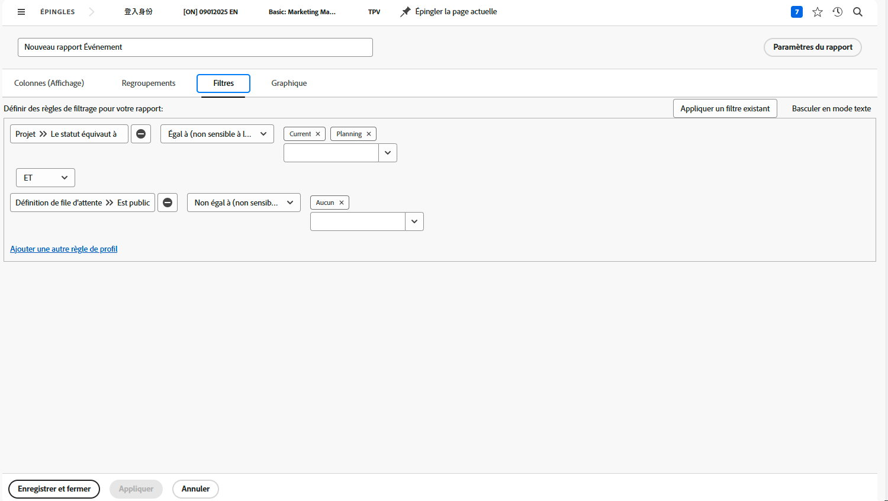

# Créer un rapport de matrice

Dans cette vidéo, vous apprendrez :

* Quand un rapport de matrice peut être utile
* et comment créer un rapport de matrice

>[!VIDEO](https://video.tv.adobe.com/v/335156/?quality=12&learn=on)

## Activité : créer un rapport de matrice

Créez un rapport de matrice indiquant le nombre de demandes dans chaque statut, triées par file d’attente. Vous obtenez ainsi un aperçu rapide de la quantité de travail à accomplir et de la façon dont vous la respectez.

Vous souhaitez que les files d’attente des demandes apparaissent dans les regroupements de lignes. Le statut apparaît dans les regroupements de colonnes. Nommez votre rapport « Demandes par statut et file d’attente des demandes ».

## Réponse

1. Sélectionnez **[!UICONTROL Rapports]** dans le **[!UICONTROL menu principal]**.
1. Cliquez sur l’option **[!UICONTROL Nouveau rapport]** et sélectionnez **[!UICONTROL Problème]**.
1. Accédez à l’onglet **[!UICONTROL Regroupements]** et cliquez sur **[!UICONTROL Basculer vers le regroupement de matrice]**.
1. Pour [!UICONTROL Regroupements de lignes], sélectionnez **[!UICONTROL Projet]** > **[!UICONTROL Nom]**.
1. Pour [!UICONTROL Regroupement de colonnes], sélectionnez **[!UICONTROL Problème]** > **[!UICONTROL Statut]**.

   

1. Accédez à l’onglet **[!UICONTROL Filtres]**.
1. Pour vous assurer que seules les demandes présentes dans les files d’attente des demandes actives sont visibles, ajoutez les règles de filtrage suivantes :

   * [!UICONTROL Projet] > [!UICONTROL Le statut correspond à] > [!UICONTROL Égal] > [!UICONTROL Actuel].
   * [!UICONTROL Définition de la file d’attente] > [!UICONTROL Est publique] > [!UICONTROL Différent de] > [!UICONTROL Aucun] (c’est ainsi que nous savons qu’un projet est en fait une file d’attente des demandes, par la définition de file d’attente affectée à l’une des options publiques).

1. Cliquez sur **[!UICONTROL Enregistrer + Fermer]**. Lorsque l’on vous invite à saisir un nom de rapport, saisissez « Demandes par Statut et File d’attente des demandes ».

   
