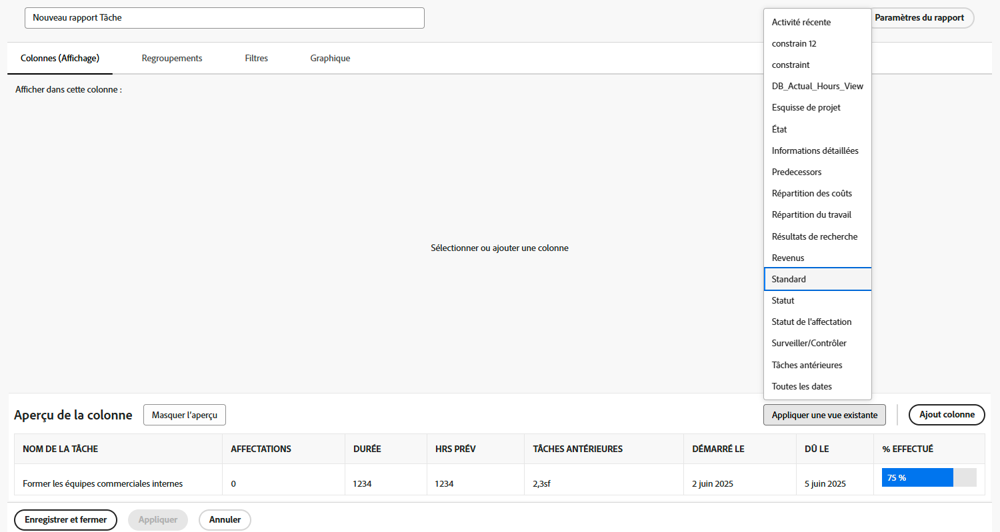
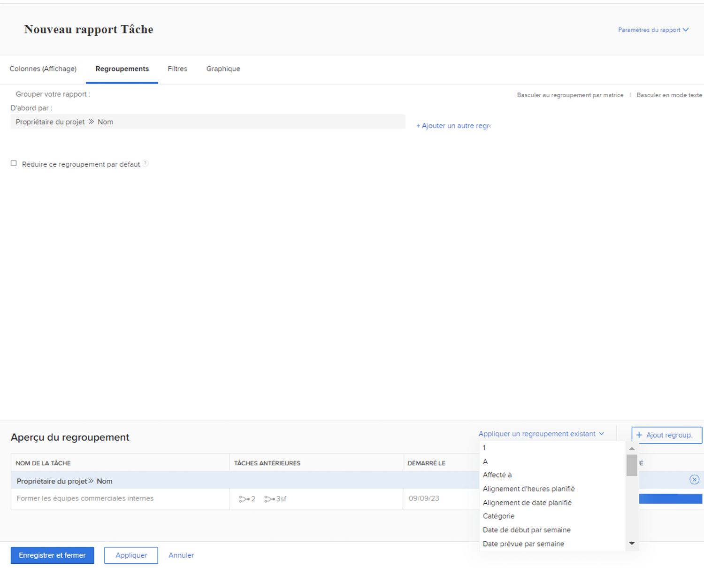
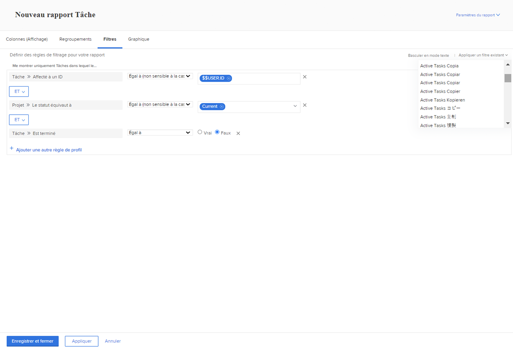
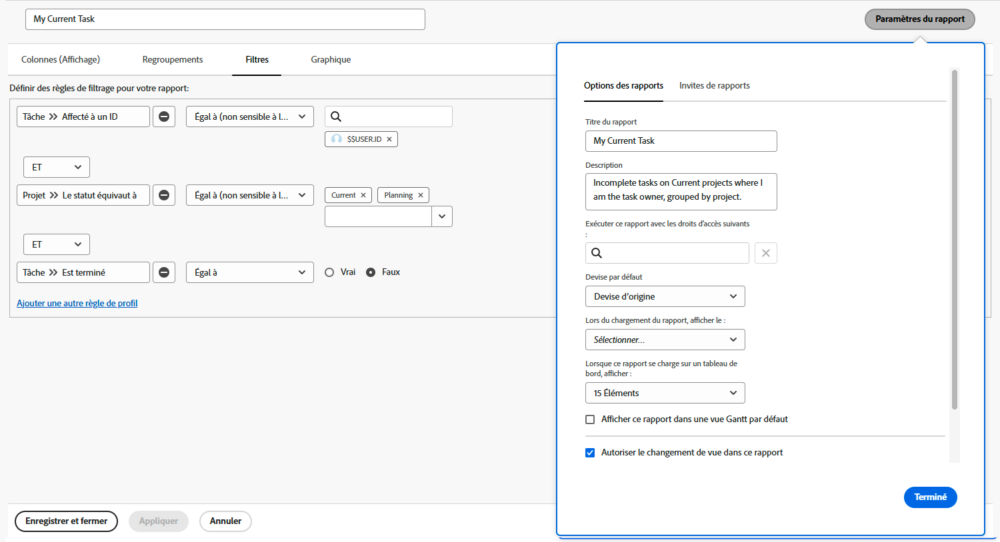

# Créer un rapport simple

Dans cette vidéo, vous apprendrez à :

* Créer un rapport simple à l’aide d’un filtre, d’une vue et d’un regroupement existants

>[!VIDEO](https://video.tv.adobe.com/v/335153/?quality=12&learn=on&enablevpops)

## Activité : création d’un rapport de tâche simple

Vous souhaitez suivre toutes vos tâches actives dans un seul rapport. Créez un rapport de tâche nommé « Mes tâches actives » à l’aide des éléments suivants :

* Colonnes (vues) = Standard
* Regroupements = Projet
* Filtre = Mes tâches actives
* Description = Tâches incomplètes sur les projets en cours où je suis propriétaire de la tâche, regroupées par projet.

## Réponse

1. Accédez au **[!UICONTROL Menu Principal]** et sélectionnez **[!UICONTROL Rapports]**.
1. Cliquez sur le menu déroulant **[!UICONTROL Nouveau rapport]** et sélectionnez **[!UICONTROL Rapport de tâches]**.
1. Dans [!UICONTROL Colonnes (vues)], cliquez sur le menu **[!UICONTROL Appliquer une vue existante]** et sélectionnez **[!UICONTROL Standard]**.

   

1. Dans l’onglet **[!UICONTROL Regroupements]**, cliquez sur le menu **[!UICONTROL Appliquer un regroupement existant]** et sélectionnez **[!UICONTROL Projet]**.

   

1. Dans l’onglet **[!UICONTROL Filtres]**, cliquez sur le menu **[!UICONTROL Appliquer un filtre existant]** et sélectionnez Mes tâches actives.

   

1. Ouvrez **[!UICONTROL Paramètres des rapports]** et nommez le rapport « Mes tâches actives ».
1. Dans le champ Description, saisissez « Tâches incomplètes
sur les projets en cours où je suis propriétaire de la tâche,
regroupées par projet ».

   

1. Enregistrez et fermez votre rapport.
