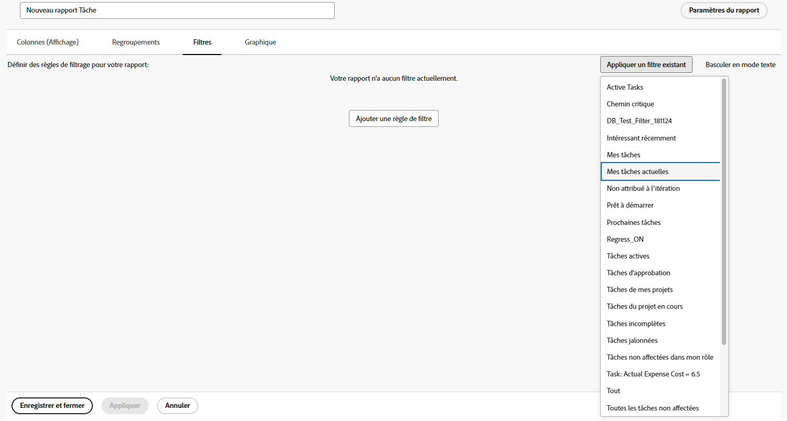

# Créer un rapport simple

Cette vidéo explique comment créer et personnaliser des rapports de projet pour analyser efficacement les données. &#x200B; Il commence par souligner l’importance des rapports pour le suivi de l’avancement du projet, l’achèvement des tâches, le respect du budget et l’identification des problèmes. La vidéo explique comment commencer avec un rapport de liste de projets, ajuster les filtres, les vues et les regroupements, et créer un rapport personnalisé pour plus de commodité. &#x200B; &#x200B;

La vidéo souligne que les rapports personnalisés conservent leurs paramètres par défaut, mais que des modifications temporaires peuvent être apportées lors de leur affichage. &#x200B; Les rapports sont stockés dans la section « Mes rapports », tandis que les rapports partagés apparaissent dans la &#x200B; « Partagés avec moi ». Les rapports fréquemment utilisés peuvent être épinglés ou marqués comme favoris pour en faciliter l’accès. &#x200B;

>[!VIDEO](https://video.tv.adobe.com/v/3413120/?quality=12&learn=on&captions=fre_fr)

## Points clés à retenir

* **Objectif des rapports :** rapports aident à suivre l’avancement du projet, l’achèvement des tâches, le respect du budget et à identifier les problèmes, ce qui les rend essentiels à une gestion de projet efficace.
* **Création de rapports personnalisés :** les rapports personnalisés vous permettent d’enregistrer des filtres, des vues et des regroupements spécifiques pour un accès facile, ce qui élimine la nécessité d’ajuster les paramètres à plusieurs reprises. &#x200B;
* **Étapes de création d’un rapport :** sélectionnez le type d’objet approprié, nommez le rapport, appliquez des filtres, des vues et des regroupements, personnalisez les colonnes et enregistrez le rapport. &#x200B;
* **Paramètres temporaires ou par défaut&#x200B; :** bien que les observateurs puissent temporairement modifier les filtres, les vues et les regroupements, le rapport revient toujours à ses paramètres par défaut lors de la réouverture. &#x200B;
* **Organisation des rapports :** rapports personnalisés sont stockés dans « Mes rapports », les rapports partagés dans « Partagés avec moi » et les rapports fréquemment utilisés peuvent être épinglés ou marqués comme favoris pour un accès rapide. &#x200B;

## Activités Créer un rapport simple

### Activité 1 : créer un rapport de tâche simple

Vous souhaitez suivre toutes vos tâches actives dans un seul rapport. Créez un rapport de tâche nommé « Mes tâches actives » à l’aide des éléments suivants :

* Colonnes (vues) = Standard
* Regroupements = Projet
* Filtre = Mes tâches actives
* Description = Tâches incomplètes sur les projets en cours où je suis propriétaire de la tâche, regroupées par projet.

### Réponse 1

1. Accédez au **[!UICONTROL Menu Principal]** et sélectionnez **[!UICONTROL Rapports]**.
1. Cliquez sur le menu déroulant **[!UICONTROL Nouveau rapport]** et sélectionnez **[!UICONTROL Rapport de tâches]**.
1. Dans [!UICONTROL Colonnes (vues)], cliquez sur le menu **[!UICONTROL Appliquer une vue existante]** et sélectionnez **[!UICONTROL Standard]**.

   

1. Dans l’onglet **[!UICONTROL Regroupements]**, cliquez sur le menu **[!UICONTROL Appliquer un regroupement existant]** et sélectionnez **[!UICONTROL Projet]**.

   

1. Dans l’onglet **[!UICONTROL Filtres]**, cliquez sur le menu **[!UICONTROL Appliquer un filtre existant]** et sélectionnez Mes tâches actives.

   

1. Ouvrez **[!UICONTROL Paramètres du rapport]** et nommez le rapport « Mes tâches actives ».
1. Dans le champ Description, saisissez « Tâches incomplètes sur les projets actifs où je suis propriétaire de la tâche, regroupées par projet ».

   

1. Enregistrez et fermez votre rapport.
