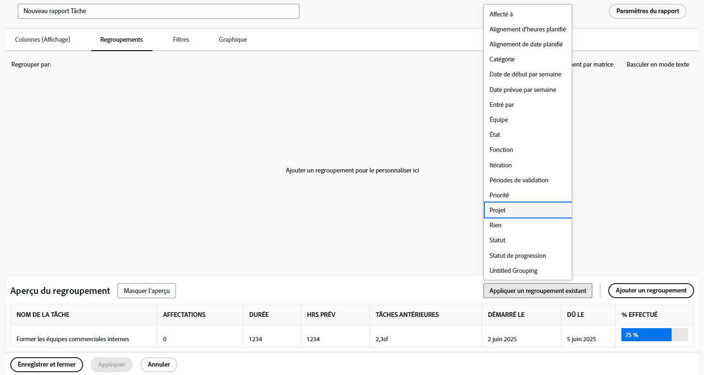

# Créer un rapport simple

Dans cette vidéo, vous apprendrez à :

* Créer un rapport simple à l’aide d’un filtre, d’une vue et d’un regroupement existants

>[!VIDEO](https://video.tv.adobe.com/v/335153/?quality=12)

## Activité : Créer un rapport de tâche simple

Vous souhaitez effectuer le suivi de toutes vos principales tâches dans un seul rapport. Créez un rapport Tâche nommé &quot;Mes tâches actuelles&quot; à l’aide des éléments suivants :

* Colonnes (vues) = Standard
* Regroupements = Projet
* Filtrer = Mes tâches actives
* Description = Tâches incomplètes sur les projets en cours où je suis le propriétaire de la tâche, regroupées par projet.

## Réponse

1. Accédez au **[!UICONTROL Menu Principal]** et sélectionnez **[!UICONTROL Rapports]**.
1. Cliquez sur le bouton **[!UICONTROL Nouveau rapport]** menu déroulant, puis sélectionnez **[!UICONTROL Rapport de tâches]**.
1. Dans [!UICONTROL Colonnes (affichage)], cliquez sur le bouton **[!UICONTROL Appliquer une vue existante]** et sélectionnez **[!UICONTROL Standard]**.

   

1. Dans le **[!UICONTROL Groupements]** , cliquez sur l’onglet **[!UICONTROL Appliquer un groupement existant]** et sélectionnez **[!UICONTROL Projet]**.

   

1. Dans le **[!UICONTROL Filtres]** , cliquez sur l’onglet **[!UICONTROL Appliquer un filtre existant]** et sélectionnez Mes tâches actives.

   

1. Ouvrir **[!UICONTROL Paramètres des rapports]** et nommez le rapport &quot;Mes tâches actuelles&quot;.
1. Dans le champ Description , saisissez &quot;Tâches incomplètes sur les projets en cours dont je suis le propriétaire de la tâche, regroupées par projet&quot;.

   

1. Enregistrez et fermez votre rapport.
