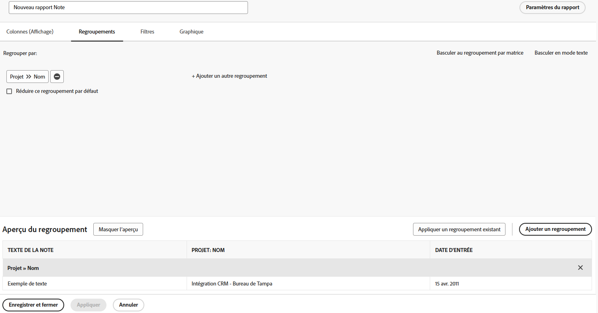
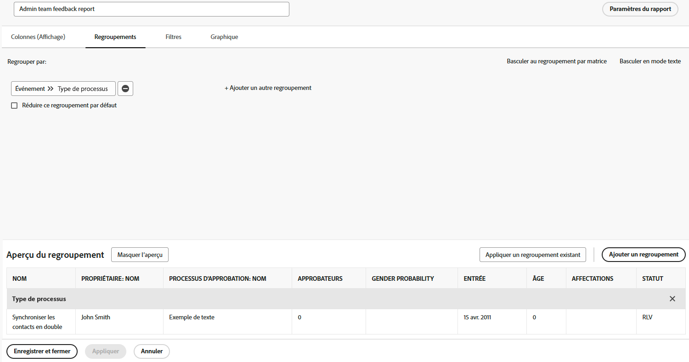

# Créer un rapport de tâches

La vidéo propose un guide détaillé sur la création d’un rapport personnalisé pour effectuer le suivi des tâches en retard affectées à l’utilisateur ou l’utilisatrice connecté. Elle commence par expliquer la nécessité de produire des rapports personnalisés lorsque les filtres, les vues ou les rapports intégrés existants ne répondent pas à des exigences spécifiques. Le rapport est nommé « Tâches en retard qui me sont affectées », et contient une description explicative.

Le rapport qui en résulte permet aux utilisateurs et utilisatrices de se concentrer sur les tâches en retard, fournit des informations sur les dépendances et simplifie la navigation vers les projets hôtes.

>[!VIDEO](https://video.tv.adobe.com/v/335154/?quality=12&amp;learn=on&amp;enablevpops=0

## Points clés à retenir

* **Création d’un rapport personnalisé :** lorsque les filtres existants et les rapports intégrés ne répondent pas à vos besoins, vous pouvez créer un rapport personnalisé en intégralité pour vous concentrer sur des données spécifiques, telles que les tâches en retard qui vous ont été affectées.
* **Configuration des filtres :** utilisez les filtres pour définir des critères de rapport, notamment les tâches en retard, les tâches incomplètes, les projets en cours et les tâches affectées à l’utilisateur ou l’utilisatrice connecté.
* **Colonnes pour le contexte :** ajoutez des colonnes telles que « Peut démarrer » pour identifier les problèmes de dépendance et « Nom du projet » avec des liens hypertexte pour accéder facilement aux projets associés.
* **Tri par priorité :** triez les tâches à partir de la colonne « Échéance » par ordre croissant pour placer en priorité les tâches les plus en retard en haut du rapport.
* **Accessibilité :** enregistrez le rapport, épinglez-le ou marquez-le comme favori pour un accès rapide, afin d’assurer un suivi et une gestion efficaces des tâches en retard.

## Activités Créer un rapport de tâche

>[!TIP]
>
>Consultez nos recommandations dans notre [Guide d’utilisation des rapports client Adobe Workfront](/help/assets/workfront-customer-reporting-cookbook.pdf). Vous y trouverez des instructions détaillées pour 10 rapports, prêts à être créés dès aujourd’hui dans votre environnement.
>>Nous avons rassemblé les rapports préférés des clientes et clients et les avons rassemblés dans un guide concis et facile à utiliser, pour que vous puissiez les créer et les tester dans Workfront.
>>Ces 10 rapports proviennent de clientes et clients qui vous ressemblent. Nous remercions grandement les clientes et clients incroyables qui ont partagé l’un de leurs rapports préférés, et ce dans différents secteurs, services, équipes, postes et entreprises. Certains rapports sont simples (mais incroyablement utiles) et d’autres sont plus complexes pour passer au niveau supérieur.

### Activité 1 : créer un rapport de notes avec des invites

Créez un rapport de notes que vous pouvez utiliser pour rechercher les notes des utilisateurs et utilisatrices (c’est-à-dire les commentaires ou les mises à jour) ou les notes du système en fonction du contenu de la note, de l’auteur ou de l’autrice, de la date d’entrée, du nom du projet ou du type d’audit. Nommez le rapport « Recherche de notes ».

Lorsque vous utilisez l’invite Texte de la note, ce rapport effectue une recherche dans les threads de mise à jour afin d’extraire rapidement ceux qui répondent aux critères spécifiés dans les invites. Lorsque vous exécutez le rapport, il n’est pas nécessaire de remplir toutes les invites, uniquement celles qui vous intéressent. Les champs vierges sont automatiquement ignorés.

La vue doit inclure des colonnes pour :

* Texte de la note
* Texte d&#39;audit
* Date d’entrée
* Propriétaire : nom
* Type d&#39;audit
* Nom de la tâche
* Nom de l&#39;événement

Laissez l’onglet Filtre vide.

Regroupez en fonction du Nom du projet.

Insérez des invites pour les éléments suivants :

* Texte d&#39;audit
* Texte de la note
* Nom du propriétaire
* Date d’entrée
* Nom du projet
* Type d&#39;audit

### Réponse 1

1. Sélectionnez **[!UICONTROL Rapports]** dans le **[!UICONTROL menu principal]**.
1. Cliquez sur le bouton **[!UICONTROL Nouveau rapport]** et sélectionnez **[!UICONTROL Note]**.
1. Dans **[!UICONTROL Colonnes (vue)]**, configurez vos colonnes pour y inclure :

   

   * [!UICONTROL Note] > [!UICONTROL Texte de la note]
   * [!UICONTROL Note] > [!UICONTROL Texte de l’audit]
   * [!UICONTROL Note] > [!UICONTROL Date d’entrée]
   * [!UICONTROL Propriétaire] > [!UICONTROL Nom]
   * [!UICONTROL Note] > [!UICONTROL Type d’audit]
   * [!UICONTROL Tâche] > [!UICONTROL Nom]
   * [!UICONTROL Problème] > [!UICONTROL Nom]

1. Sélectionnez la colonne **[!UICONTROL Date d’entrée]** et modifiez la variable **[!UICONTROL Tri décroissant]**.
1. Dans l’onglet **[!UICONTROL Regroupements]**, définissez le rapport sur le groupe en utilisant [!UICONTROL Projet] > [!UICONTROL Nom].

   

1. Laissez la section [!UICONTROL Filtres] vide.
1. Ouvrez **[!UICONTROL Paramètres du rapport]** et nommez le rapport « Recherche de notes ».
1. Dans le champ [!UICONTROL Description], utilisez une mention du type « Rechercher des notes du système ou de la personne en fonction du type d’audit sélectionné et d’autres invites. Les notes système apparaissent dans la colonne Texte de l’audit et les notes de personne dans la colonne Texte de la note. »

   

1. Sélectionnez l’**[!UICONTROL Onglet Détails]** afin qu’il s’affiche lors du chargement du rapport.
1. Définissez le rapport pour qu’il affiche 200 éléments lorsqu’il est inclus dans un tableau de bord.
1. Cliquez sur **[!UICONTROL Invites de rapport]** et ajoutez :

   

   * [!UICONTROL Note] > [!UICONTROL Texte de l’audit]
   * [!UICONTROL Note] > [!UICONTROL Texte de la note]
   * [!UICONTROL Propriétaire] > [!UICONTROL Nom]
   * [!UICONTROL Note] > [!UICONTROL Date d’entrée]
   * [!UICONTROL Projet] > [!UICONTROL Nom]
   * [!UICONTROL Note] > [!UICONTROL Type d’audit]

1. Cochez la case pour **[!UICONTROL Afficher les invites dans les tableaux de bord]**.
1. Enregistrez et fermez votre rapport.

### Activité 2 : créer un rapport de commentaires de l’équipe d’administration

Il s’agit d’un rapport des problèmes qui affiche tous les problèmes d’une file d’attente des demandes de commentaires créée pour les administrateurs et administratrices système. Découvrez comment créer cette file d’attente des demandes dans le tutoriel [Créer une file d’attente des demandes de commentaires de l’équipe d’administration système](https://experienceleague.adobe.com/docs/workfront-learn/tutorials-workfront/manage-work/request-queues/create-a-system-admin-feedback-request-queue.html?lang=fr).

Ce rapport utilise également un formulaire personnalisé. Pour savoir comment créer un formulaire personnalisé, reportez-vous au tutoriel [Créer et partager un formulaire personnalisé](https://experienceleague.adobe.com/docs/workfront-learn/tutorials-workfront/custom-data/custom-forms/custom-forms-creating-and-sharing-a-custom-form.html?lang=fr).

Ce formulaire personnalisé doit utiliser les types d&#39;objets Projet et Problème et doit être créé comme suit :

Nom : commentaires sur le processus d’administration

1. Type de processus (champ déroulant à sélection unique)
   * Niveaux d’accès
   * Processus d’approbation (global uniquement)
   * Notifications par e-mail
   * Modèle de mise en page
   * Chemin jalonné
   * Modèle de projet
   * Notifications de rappel
   * File d’attente des demandes
1. Nom du processus (champ de texte d’une seule ligne)
1. Évaluation des processus (champ déroulant à sélection unique)
   * 1 - Totalement inutile
   * 2 - Pas très utile
   * 3 - Bon mais pourrait être amélioré
   * 4 - Excellent
1. Problème ou bonnes nouvelles (champ de texte de paragraphe)

Créez un rapport sur les problèmes nommé **Rapport sur les commentaires de l’équipe d’administration**.

La vue doit contenir les colonnes suivantes :

* Problème : nom
* Contact principal : nom
* Problème : type de processus
* Problème : nom du processus
* Problème : évaluation du processus
* Problème : problème ou bonnes nouvelles
* Problème : date d’entrée
* Problème : âge
* Problème : affectations
* Problème : statut

Groupe sur le type de processus.

Filtrez sur l’identifiant du projet de file d’attente des demandes où se trouvent les problèmes contenus dans les commentaires.

### Réponse 2

1. Sélectionnez **[!UICONTROL Rapports]** dans le **[!UICONTROL menu principal]**.
1. Cliquez sur le menu **[!UICONTROL Nouveau rapport]** et sélectionnez **[!UICONTROL Problème]**.
1. Dans **[!UICONTROL Colonnes (vue)]**, configurez vos colonnes pour y inclure :

   

   * [!UICONTROL Problème] > [!UICONTROL Nom]
   * [!UICONTROL Contact principal] > [!UICONTROL Nom]
      * Remarque : elle s’affiche avec « Propriétaire :Name comme libellé de la colonne. Vous pouvez remplacer cette valeur par « Signalé par » en cliquant sur Options avancées et en saisissant « Signalé par » dans le champ **Libellé de colonne personnalisé**.
   * [!UICONTROL Problème] > [!UICONTROL Type de processus]
   * [!UICONTROL Problème] > [!UICONTROL Nom du processus]
   * [!UICONTROL Problème] > [!UICONTROL Évaluation du processus]
   * [!UICONTROL Problème] > [!UICONTROL Problème ou bonnes nouvelles]
   * [!UICONTROL Problème] > [!UICONTROL Date d’entrée]
   * [!UICONTROL Problème] > [!UICONTROL Âge]
   * [!UICONTROL Problème] > [!UICONTROL Affectations]
   * [!UICONTROL Problème] > [!UICONTROL Statut]

1. Sélectionnez la colonne **[!UICONTROL Date d’entrée]** et modifiez la variable **[!UICONTROL Tri décroissant]**.
1. Dans l’onglet **[!UICONTROL Regroupements]**, définissez le rapport pour qu’il soit groupé par **[!UICONTROL Problème] > [!UICONTROL Type de processus]**.

   

1. Dans l’onglet **[!UICONTROL Filtres]**, ajoutez un filtre pour **[!UICONTROL Problème] > [!UICONTROL Identifiant de projet]** pour correspondre au projet de file d’attente des demandes où se trouvent les problèmes contenus dans les commentaires.

   

1. Enregistrez et fermez votre rapport.
