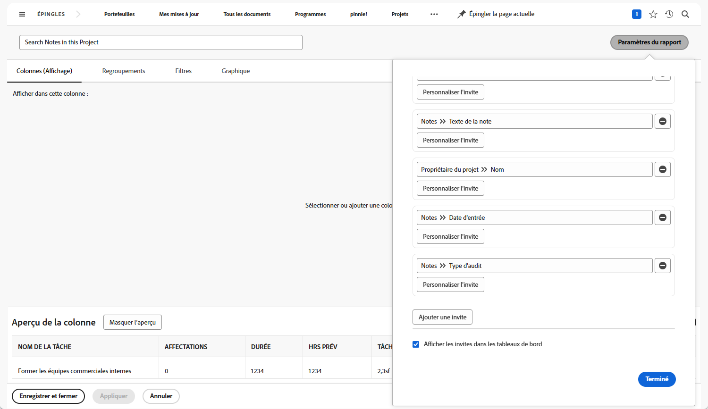
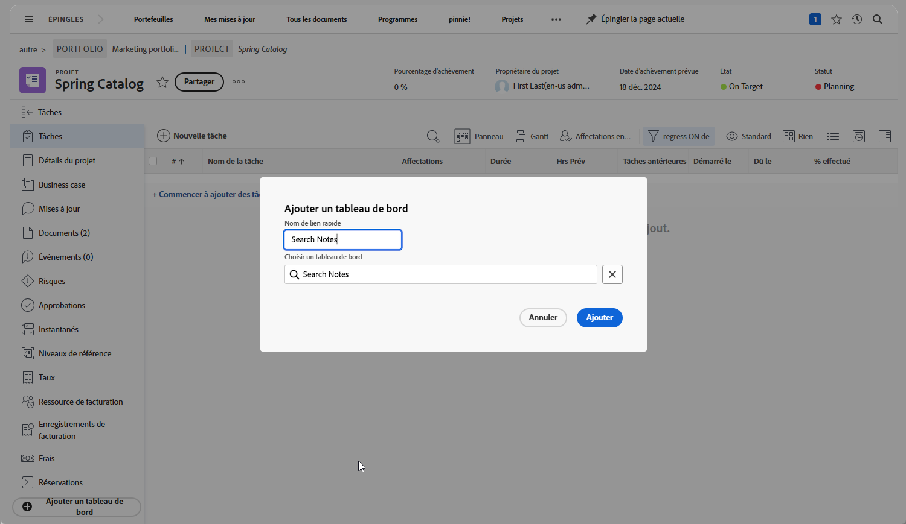

# Créer des activités de tableau de bord

Entraînez-vous à créer des tableaux de bord, avec des instructions étape par étape.

## Activité 1 : Créer un tableau de bord

Créez un [!UICONTROL tableau de bord] avec un seul rapport : « Rechercher des notes dans ce projet ». Cela est utile pour trouver rapidement toute mise à jour effectuée sur un projet, même s&#39;il y a des milliers de mises à jour à rechercher. Cela permet d’effectuer des recherches dans les threads de mise à jour afin d’extraire rapidement les mises à jour répondant aux critères spécifiés dans les invites.

Créez ce rapport en copiant le rapport « Rechercher des notes » que vous avez créé dans l&#39;activité « Créer un rapport de note » (ou utilisez un autre rapport si vous n&#39;avez pas effectué cette activité).

* Supprimez l’invite Nom du projet de la copie et renommez le rapport « Rechercher des notes dans ce projet ».
* Nommez le [!UICONTROL Tableau de bord] « Notes de recherche ».
* Accédez à une page de destination de projet et créez une section personnalisée pour un[!UICONTROL tableau de bord].
* Notez que lorsque vous recherchez des notes dans votre section personnalisée, seules les notes contenues dans le projet dans lequel vous vous trouvez actuellement s&#39;affichent.

## Réponse 1

1. Exécutez le rapport que vous avez créé dans l&#39;activité « Créer un rapport de note ».
1. Cliquez sur **[!UICONTROL Actions de rapport]** et sélectionnez **[!UICONTROL Copier]**. [!DNL Workfront] crée un rapport nommé « Recherche (copie) de notes ».
1. Accédez à **[!UICONTROL Actions de rapport]** et sélectionnez **[!UICONTROL Modifier]**. Cliquez sur **[!UICONTROL Paramètres des rapports]** et remplacez le nom par « Rechercher des notes dans ce projet ».
1. Cliquez sur [!UICONTROL Invites de rapport] et supprimez l’invite [!UICONTROL Projet] > [!UICONTROL Nom] de la liste.

   

1. Cochez la case **[!UICONTROL Afficher les invites dans le tableau de bord]**.
1. Cliquez sur **[!UICONTROL Terminé]**, puis sur **[!UICONTROL Enregistrer + Fermer]**. Vous voyez maintenant l’écran [!UICONTROL Invites] du rapport.

   Vous allez maintenant utiliser un raccourci pour créer un tableau de bord et y ajouter ce rapport.

1. Cliquez sur **[!UICONTROL Actions de rapport]** et sélectionnez **[!UICONTROL Ajouter au tableau de bord]** > **[!UICONTROL Nouveau tableau de bord]**.
1. Faites glisser le rapport « Rechercher des notes dans ce projet » vers le panneau **[!UICONTROL Disposition]**.
1. Remarquez que le nom du rapport devient le nom du tableau de bord. Modifiez le nom en « Rechercher des notes ».

   

1. Cliquez sur **[!UICONTROL Enregistrer + Fermer]**.

   Ajoutez maintenant le tableau de bord à une page de projet.

   

1. Accédez à n’importe quel projet. Dans le menu du panneau de gauche, cliquez sur l’icône **[!UICONTROL Ajouter une section personnalisée]**.
1. Dans le champ **[!UICONTROL Ajouter un tableau de bord]**, saisissez « Rechercher des notes » et sélectionnez le [!UICONTROL tableau de bord] dans la liste.
1. Dans le champ **[!UICONTROL Titre de section personnalisé]**, saisissez « Notes de recherche ».
1. Cliquez sur **[!UICONTROL Ajouter une nouvelle section]**.
1. Dans le menu du panneau de gauche, recherchez Rechercher des notes. Cliquez sur les points à gauche du nom de la section et faites-le glisser sous Mises à jour.
