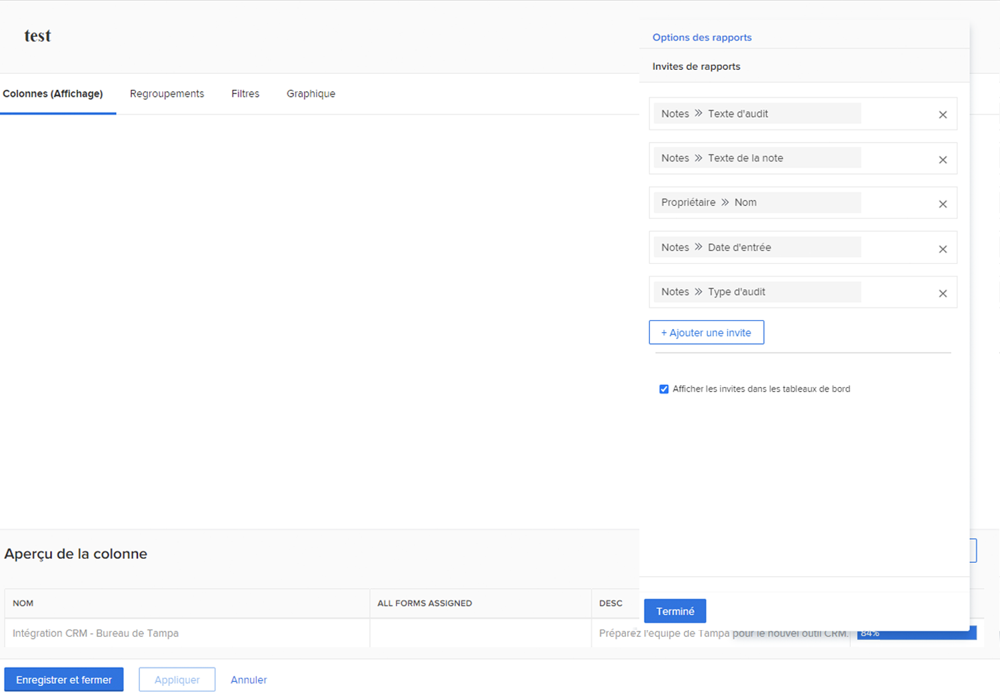
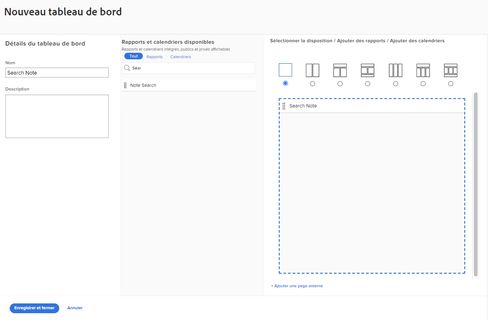
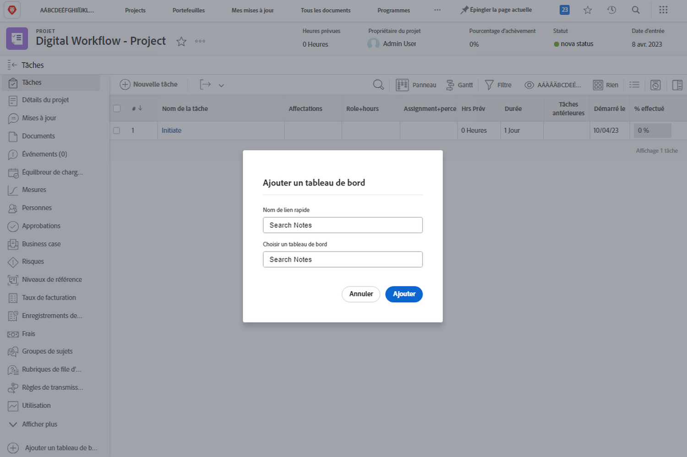

# Créer des tableaux de bord

Dans cette vidéo, vous apprendrez :

* Fonctionnement d’un tableau de bord dans Workfront
* Comment créer un tableau de bord
* Recherche et utilisation des tableaux de bord
* Comment partager un tableau de bord avec d’autres utilisateurs de Workfront
* Comment imprimer un tableau de bord

>[!VIDEO](https://video.tv.adobe.com/v/335157/?quality=12)

## Activité : Création d’un tableau de bord

Créez un [!UICONTROL tableau de bord] avec un seul rapport : &quot;Notes de recherche dans ce projet&quot;. Cela s’avère utile pour trouver rapidement toute mise à jour effectuée sur un projet, même s’il existe des milliers de mises à jour à rechercher. Cela permet d’effectuer des recherches dans les threads de mise à jour afin d’extraire rapidement les mises à jour répondant aux critères spécifiés dans les invites.

Créez ce rapport en effectuant une copie du rapport &quot;Notes de recherche&quot; que vous avez créé dans l’activité &quot;Créer un rapport Note&quot; (ou utilisez un autre rapport si vous n’avez pas effectué cette activité).

* Supprimez l’invite Nom du projet de la copie et renommez le rapport &quot;Notes de recherche dans ce projet&quot;.
* Attribuez un nom au [!UICONTROL Tableau de bord] &quot;Notes de recherche&quot;.
* Accédez à une page d’entrée de projet et créez une section personnalisée pour une [!UICONTROL tableau de bord].
* Notez que lorsque vous recherchez des notes dans votre section personnalisée, seules les notes contenues dans le projet dans lequel vous vous trouvez actuellement s’affichent.

## Réponse

1. Exécutez le rapport que vous avez créé dans l&#39;activité &quot;Créer un rapport de note&quot;.
1. Cliquez sur **[!UICONTROL Actions de rapport]** et sélectionnez **[!UICONTROL Copier]**. [!DNL Workfront] crée un nouveau rapport nommé &quot;Recherche de notes (copie)&quot;.
1. Accédez à **[!UICONTROL Actions de rapport]** et sélectionnez **[!UICONTROL Modifier]**. Cliquez sur **[!UICONTROL Paramètres des rapports]** et remplacez le nom par &quot;Notes de recherche dans ce projet&quot;.
1. Cliquez sur [!UICONTROL Invite de rapports] et supprimez la variable [!UICONTROL Projet] > [!UICONTROL Nom] à partir de la liste.

   

1. Vérifiez les **[!UICONTROL Afficher les invites dans le tableau de bord]** de la boîte.
1. Cliquez sur **[!UICONTROL Terminé]**, puis **[!UICONTROL Enregistrer + Fermer]**. Vous voyez maintenant le [!UICONTROL Invitations] écran du rapport.

   Vous allez ensuite utiliser un raccourci pour créer un tableau de bord et y ajouter ce rapport.

1. Cliquez sur **[!UICONTROL Actions de rapport]** et sélectionnez **[!UICONTROL Ajouter au tableau de bord]** > **[!UICONTROL Nouveau tableau de bord]**.
1. Faites glisser le rapport &quot;Notes de recherche dans ce projet&quot; vers le **[!UICONTROL Disposition]** du panneau.
1. Le nom du rapport devient le nom du tableau de bord. Modifiez le nom en &quot;Notes de recherche&quot;.

   

1. Cliquez sur **[!UICONTROL Enregistrer + Fermer]**.

   Ajoutez maintenant le tableau de bord à une page de projet.

   

1. Accédez à n’importe quel projet. Dans le menu du panneau de gauche, cliquez sur le **[!UICONTROL Ajout d’une section personnalisée]** icône .
1. Dans le **[!UICONTROL Ajout d’un tableau de bord]** , saisissez &quot;Notes de recherche&quot; et sélectionnez la variable [!UICONTROL tableau de bord] dans la liste.
1. Dans le **[!UICONTROL Titre de la section personnalisée]** , saisissez &quot;Notes de recherche&quot;.
1. Cliquez sur **[!UICONTROL Ajouter une nouvelle section]**.
1. Dans le menu du panneau de gauche, recherchez Notes de recherche. Cliquez sur les points à gauche du nom de la section et faites-le glisser juste sous Mises à jour.
