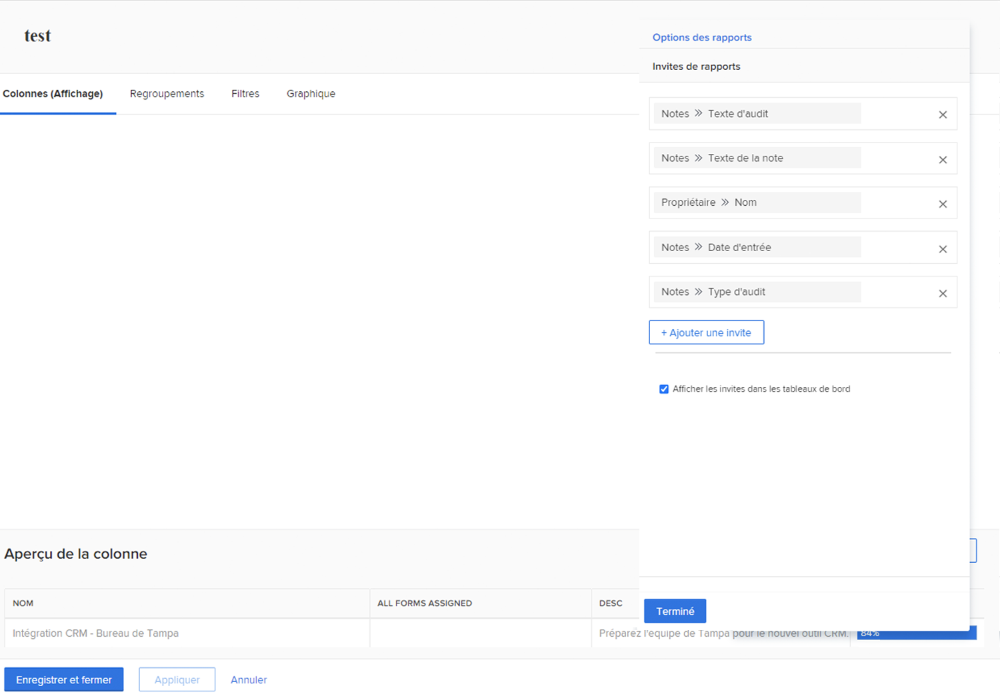
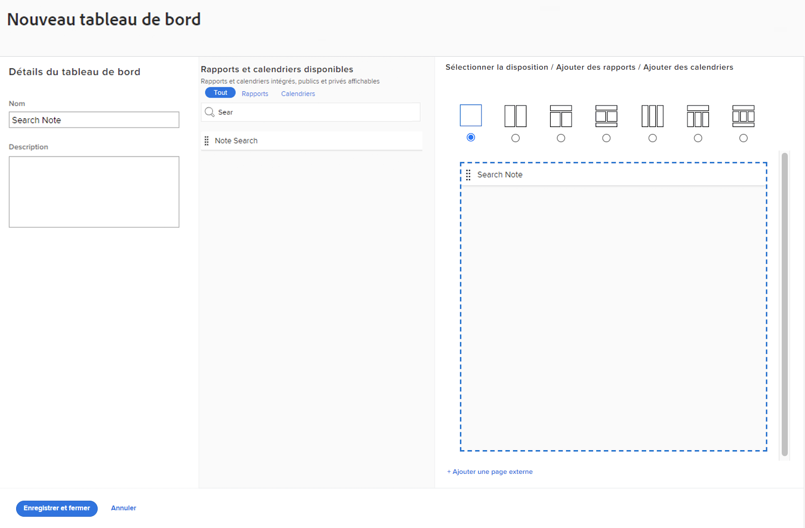
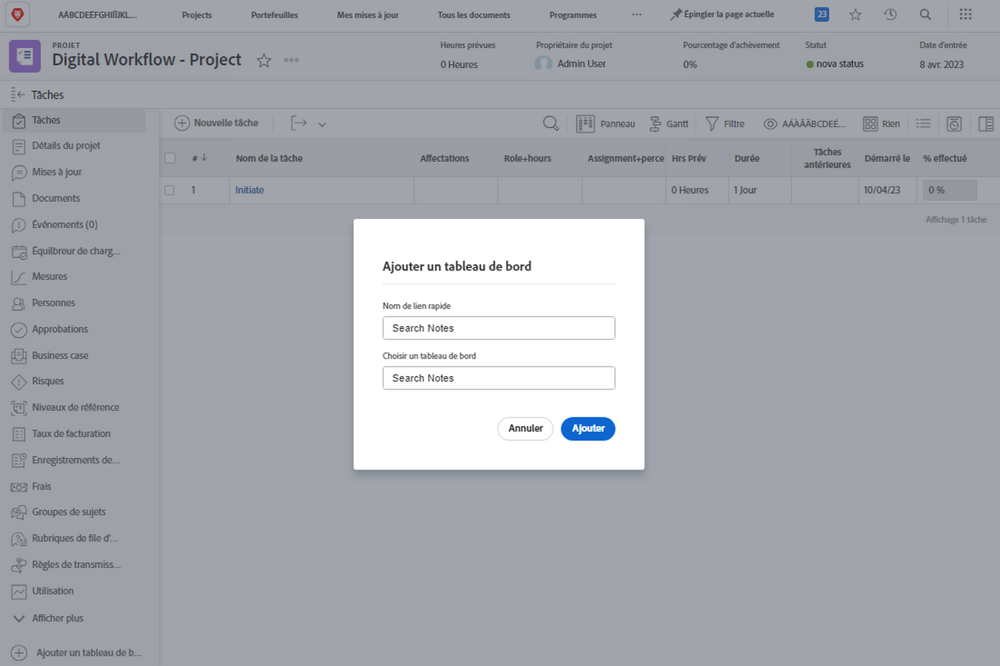
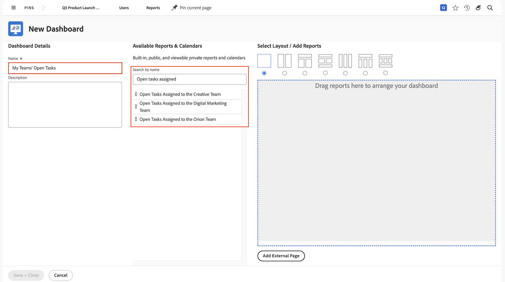

# Création de tableaux de bord dans Workfront

La vidéo fournit un guide complet sur la compréhension et l’utilisation des tableaux de bord dans Workfront.
&#x200B;Il explique qu’un tableau de bord est un ensemble de rapports qui permet aux utilisateurs et aux utilisatrices d’organiser et d’afficher les données associées au même endroit.

>[!VIDEO](https://video.tv.adobe.com/v/335157/?quality=12&learn=on&enablevpops=0)

## Points clés à retenir

* **Tableaux de bord dans Workfront :** un tableau de bord est un ensemble de rapports qui permet aux utilisateurs et aux utilisatrices d’organiser et d’afficher les données associées, telles que les projets, les tâches et les problèmes, dans une vue centralisée.
* **Création de tableaux de bord :** les tableaux de bord peuvent être personnalisés en sélectionnant une disposition, en ajoutant des rapports, des calendriers personnalisés ou des pages externes et en les organisant pour un affichage optimal. &#x200B; Les utilisateurs peuvent également personnaliser les colonnes qui apparaissent dans les rapports côte à côte dans le tableau de bord. &#x200B;
* **Accès aux tableaux de bord :** tableaux de bord se trouvent sous « Mes tableaux de bord », « Tableaux de bord partagés » ou « Tous les tableaux de bord » dans la zone Tableaux de bord. &#x200B; tableaux de bord fréquemment utilisés peuvent être épinglés ou ajoutés aux favoris pour un accès rapide. &#x200B;
* **Partage de tableaux de bord :** les tableaux de bord peuvent être partagés avec d’autres utilisateurs et utilisatrices de Workfront, y compris tous les rapports figurant dans le tableau de bord, via le menu « Actions du tableau de bord ».
* **Impression des tableaux de bord :** les tableaux de bord peuvent être imprimés directement à partir du menu « Actions du tableau de bord », ce qui facilite le partage de copies physiques des données.

## Activités Créer un tableau de bord

### Activité 1 : créer un tableau de bord

Créez un [!UICONTROL tableau de bord] qui ne contient qu’un seul rapport : « Rechercher des notes dans ce projet ». Cela est utile pour trouver rapidement toute mise à jour effectuée sur un projet, même s&#39;il y a des milliers de mises à jour à rechercher. Cela permet d’effectuer des recherches dans les threads de mise à jour afin d’extraire rapidement les mises à jour répondant aux critères spécifiés dans les invites.

Créez ce rapport en effectuant une copie du rapport « Rechercher des notes » que vous avez créé dans l’activité « Créer un rapport de note ». Vous ne l’avez pas encore créé ? Cliquez ici pour voir l’activité dans le tutoriel [Créer un rapport de tâche](https://experienceleague.adobe.com/fr/docs/workfront-learn/tutorials-workfront/reporting/basic-reporting/create-a-task-report#activity-1-create-a-note-report-with-prompts).

* Supprimez le prompt Nom du projet de la copie et renommez le rapport « Rechercher des notes dans ce projet ».
* Attribuez au [!UICONTROL Tableau de bord] le nom « Rechercher des notes ».
* Accédez à une page de destination de projet et créez une section personnalisée pour un [!UICONTROL tableau de bord].
* Notez que lorsque vous recherchez des notes dans votre section personnalisée, seules s’affichent les notes contenues dans le projet dans lequel vous vous trouvez actuellement.

### Réponse 1

1. Exécutez le rapport que vous avez créé dans l’activité « Créer un rapport de note ». Vous ne l’avez pas encore créé ? Cliquez ici pour voir l’activité dans le tutoriel [Créer un rapport de tâche](https://experienceleague.adobe.com/fr/docs/workfront-learn/tutorials-workfront/reporting/basic-reporting/create-a-task-report#activity-1-create-a-note-report-with-prompts).
1. Cliquez sur **[!UICONTROL Actions de rapport]** et sélectionnez **[!UICONTROL Copier]**. [!DNL Workfront] crée un rapport nommé « Recherche de notes (Copie) ».
1. Accédez à **[!UICONTROL Actions de rapport]** et sélectionnez **[!UICONTROL Modifier]**. Cliquez sur **[!UICONTROL Paramètres du rapport]** et remplacez le nom par « Rechercher des notes dans ce projet ».
1. Cliquez sur [!UICONTROL Invites de rapport] et supprimez l’invite [!UICONTROL Projet] > [!UICONTROL Nom] de la liste.

   

1. Cochez la case **[!UICONTROL Afficher les invites dans le tableau de bord]**.
1. Cliquez sur **[!UICONTROL Terminé]**, puis sur **[!UICONTROL Enregistrer + Fermer]**. Vous voyez maintenant l’écran [!UICONTROL Invites] du rapport.

   Vous allez ensuite utiliser un raccourci pour créer un tableau de bord et y ajouter ce rapport.

1. Cliquez sur **[!UICONTROL Actions du rapport]** et sélectionnez **[!UICONTROL Ajouter au tableau de bord classique]** > **[!UICONTROL Nouveau tableau de bord]**.
1. Faites glisser le rapport « Rechercher des notes dans ce projet » vers le panneau **[!UICONTROL Disposition]**.
1. Remarquez que le nom du rapport devient le nom du tableau de bord. Modifiez le nom en « Rechercher des notes ».

   

1. Cliquez sur **[!UICONTROL Enregistrer + Fermer]**.

   Ajoutez maintenant le tableau de bord à une page de projet.

   

1. Accédez à n’importe quel projet. Dans le menu du panneau de gauche, cliquez sur le bouton **[!UICONTROL Ajouter un tableau de bord]**.
1. Dans le champ **[!UICONTROL Choisir un tableau de bord]**, saisissez « Rechercher des notes » et sélectionnez le [!UICONTROL tableau de bord] dans la liste.
1. Dans le champ **[!UICONTROL Nom du lien rapide]**, saisissez « Rechercher des notes ».
1. Cliquez sur **[!UICONTROL Ajouter]**.
1. Dans le menu du panneau de gauche, retrouvez l’option Rechercher des notes, au bas de la liste. Cliquez sur les points à gauche du nom et faites-le glisser sous Mises à jour.

### Activité 2 : Tâches ouvertes de mes équipes

Créez un [!UICONTROL tableau de bord] avec 3 rapports de « tâches ouvertes », chacun filtré par une équipe différente affectée aux tâches.

Utilisez un rapport « tâche ouverte » existant, filtré par une équipe, si vous en avez un, ou créez-en un pour ce tableau de bord. Copiez et modifiez le rapport deux fois pour deux équipes supplémentaires, puis placez-les dans un seul tableau de bord nommé **« Tâches ouvertes de mes équipes »**

### Réponse 2

#### Partie 1 - Créer un rapport « tâches ouvertes » filtré par l’une de vos équipes

1. Sélectionnez **[!UICONTROL Rapports]** dans le **[!UICONTROL menu principal]**.
1. Cliquez sur le menu **[!UICONTROL Nouveau rapport]** et sélectionnez **[!UICONTROL Tâche]**.
1. Nommez votre rapport « Tâches ouvertes affectées à l’équipe Creative » (ou toute autre équipe).
1. Dans **[!UICONTROL Colonnes (vue)]**, configurez vos colonnes pour y inclure :

   

   * [!UICONTROL Projet] > [!UICONTROL Nom]
   * [!UICONTROL Tâche] > [!UICONTROL Nom]
   * [!UICONTROL Tâche] > [!UICONTROL Affectations]
   * [!UICONTROL Tâche] > [!UICONTROL Durée]
   * [!UICONTROL Tâche] > [!UICONTROL Heures prévues]
   * [!UICONTROL Tâche] > [!UICONTROL Date de début prévue]
   * [!UICONTROL Tâche] > [!UICONTROL Date d’achèvement prévue]
   * [!UICONTROL Tâche] > [!UICONTROL Pourcentage terminé]

1. Sélectionnez la colonne **[!UICONTROL Date d’achèvement prévue]** et définissez le tri sur **Croissant**.

1. Dans l’onglet **[!UICONTROL Filtres]**, ajoutez des règles de filtrage à inclure :

   

   * [!UICONTROL Projet] > [!UICONTROL Statut équivaut À] > [!UICONTROL Égal] > « Actuel »
   * [!UICONTROL Tâche] > [!UICONTROL Identifiant de l’équipe] > [!UICONTROL Égal] > « Creative »
   * [!UICONTROL Tâche] > [!UICONTROL Pourcentage Terminé] > [!UICONTROL Inférieur À] > « 100 »

1. Cliquez sur le bouton **[!UICONTROL Enregistrer+Fermer]** pour enregistrer et fermer votre rapport.

#### Partie 2 : copiez le rapport que vous venez de créer et créez-en un pour votre deuxième équipe.

1. En affichant le rapport que vous venez de créer, cliquez sur **[!UICONTROL Actions du rapport] > [!UICONTROL Copier]**.
1. Le nouveau rapport s’affiche avec le nom **»(Copier) »** ajouté dans le titre.
1. Cliquez sur **[!UICONTROL Actions du rapport &#x200B;] > [!UICONTROL Modifier]**. Ensuite, modifiez le filtre et le titre du rapport pour vous concentrer sur l’équipe Orion (ou toute autre équipe).
1. Cliquez sur l’onglet [!UICONTROL Filtres], puis modifiez la règle de filtrage
   **[!UICONTROL Tâche] > [!UICONTROL Identifiant de l’équipe] > [!UICONTROL Égal] > « Creative »** à
   **[!UICONTROL Tâche] > [!UICONTROL ID d’équipe] > [!UICONTROL Égal] > « Orion »**
1. Dans le champ Titre du rapport , remplacez le mot **[!UICONTROL « Creative«]** par **[!UICONTROL « Orion »]** et supprimez le mot **« (Copy)«**.
1. Cliquez sur le bouton **[!UICONTROL Enregistrer+Fermer]** pour enregistrer et fermer votre rapport.

#### Partie 3 : copiez à nouveau le rapport et créez-en un pour votre troisième équipe.

1. En affichant le rapport que vous venez de créer, cliquez de nouveau sur **[!UICONTROL Actions du rapport] > [!UICONTROL Copier]**. Cette fois, remplacez le nom de l’équipe dans le titre et le filtre par « Marketing numérique » (ou toute autre équipe).

#### Partie 4 - Créer un tableau de bord présentant les tâches ouvertes pour chacune de vos équipes

1. Dans le menu principal, cliquez sur **[!UICONTROL Tableaux de bord]**.
1. Cliquez ensuite sur **[!UICONTROL Nouveau tableau de bord]**.

   

1. Nommez le tableau de bord **« Tâches ouvertes de mes équipes »**.
1. Commencez à saisir le nom de vos rapports dans le champ **[!UICONTROL Rechercher par nom]**.
1. Étant donné que les noms de vos rapports commencent tous par les mêmes mots, il se peut qu’ils apparaissent tous comme suit :

   

1. Faites-les glisser jusqu’à la zone de disposition, puis cliquez sur Enregistrer + Fermer.

   

1. Voici le tableau de bord final :

   
