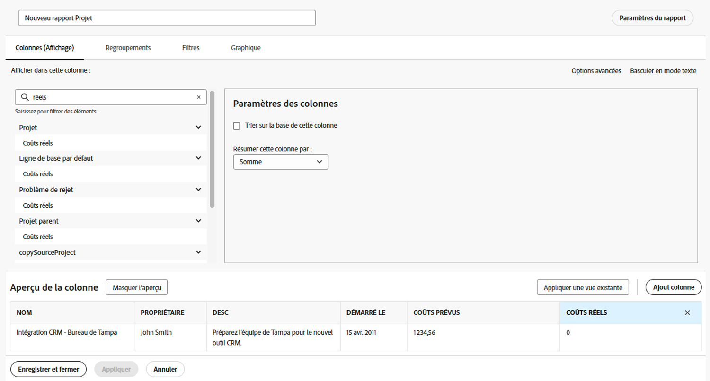
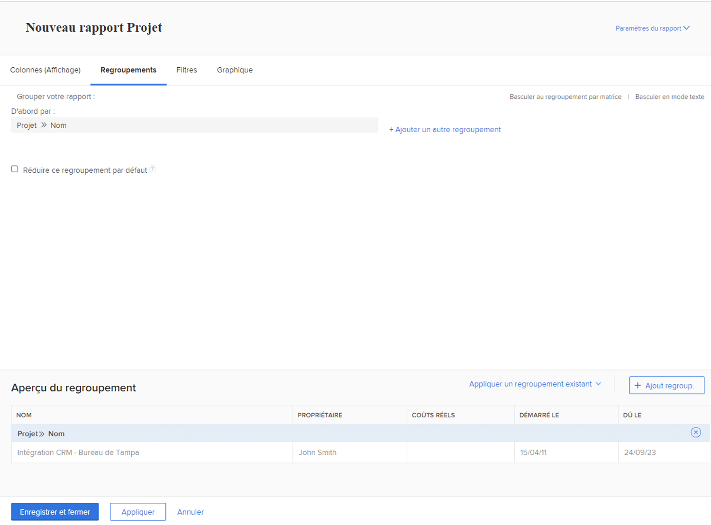
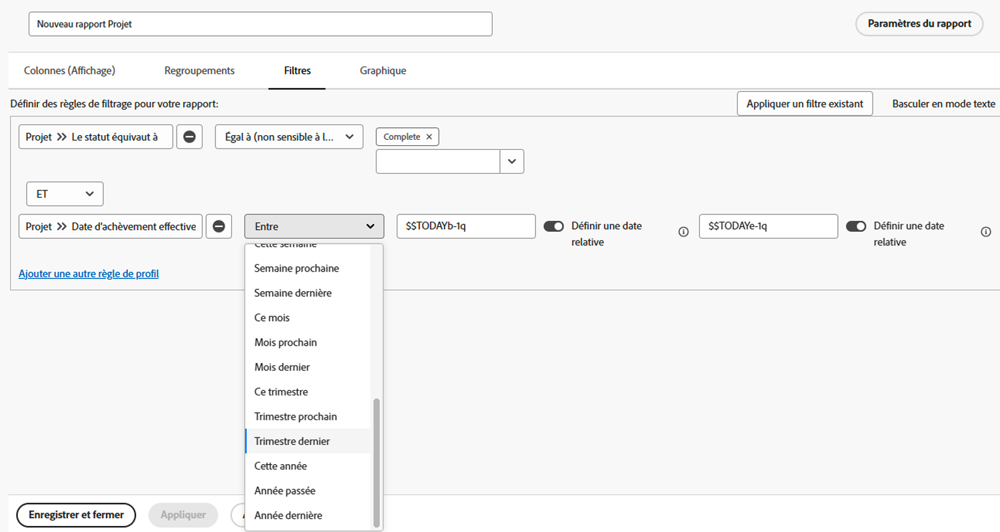
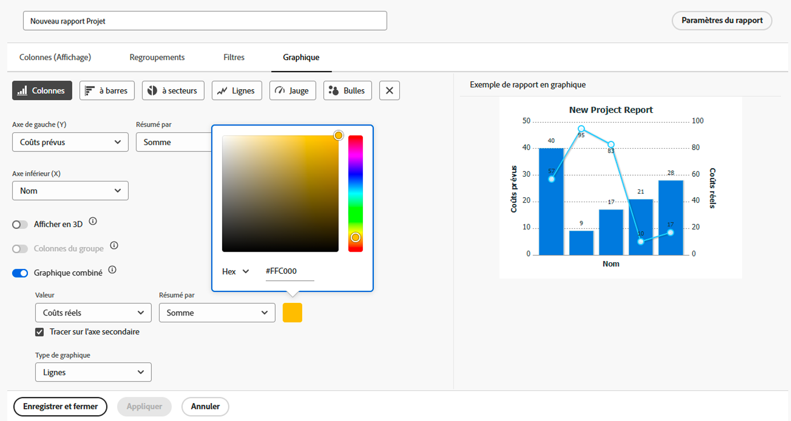

# Créer des rapports avec des graphiques

La vidéo explique comment utiliser des graphiques pour visualiser efficacement les données, en particulier pour effectuer le suivi des tâches du projet. &#x200B; Elle illustre la création de deux types de rapports dans Workfront :

**Rapport Tâches en retard par projet :**

* Commencez avec un rapport de liste et appliquez des filtres pour afficher uniquement les tâches incomplètes et en retard dans les projets actuels. &#x200B;
* Regroupez les tâches par nom de projet et créez un graphique en secteurs pour visualiser la répartition des tâches en retard entre les projets. &#x200B;
* Définissez le graphique comme onglet par défaut pour un accès plus facile. &#x200B;

**Rapport Tâches par projet et Statut d&#39;avancement :**

* Copiez le premier rapport et ajoutez un autre regroupement pour l&#39;état d&#39;avancement de la tâche.
* Supprimez les filtres pour inclure toutes les tâches et afficher leur progression pendant l’exécution du projet.
* Utilisez un graphique à colonnes empilées pour afficher le nombre total de tâches par projet, avec des piles représentant différents statuts d’avancement.
* Personnalisez les couleurs si nécessaire et enregistrez le rapport.

La vidéo montre comment des graphiques tels que les secteurs et les graphiques à colonnes empilés peuvent fournir des informations sur la distribution des tâches et les performances des projets, ce qui permet aux utilisateurs de comparer les projets et de comprendre visuellement la progression des tâches. &#x200B;

>[!VIDEO](https://video.tv.adobe.com/v/335155/?quality=12&learn=on)

## Points clés à retenir

* **Les graphiques améliorent la clarté des données** : la visualisation des données avec des graphiques, tels que les graphiques à secteurs ou à colonnes, facilite la compréhension de la répartition des tâches et de l’avancement du projet par rapport aux rapports de liste. &#x200B;
* **Filtrage pour obtenir des informations spécifiques** : l’application de filtres (par exemple, pour les tâches incomplètes ou en retard dans les projets actuels) permet de se concentrer sur les données pertinentes pour une analyse ciblée. &#x200B;
* **Regroupement pour une meilleure organisation** : le regroupement des tâches par nom de projet ou statut d’avancement organise les données de manière efficace, ce qui permet des comparaisons significatives entre les projets. &#x200B;
* **Options de personnalisation des graphiques** : les utilisateurs peuvent sélectionner des types de graphiques (par exemple, circulaire, à colonnes, à barres) et personnaliser les couleurs pour s’aligner sur les préférences ou l’identité graphique. &#x200B;
* **Graphiques à colonnes empilés pour des informations détaillées** : les graphiques à colonnes empilés fournissent une vue complète de l’avancement des tâches dans les projets, présentant à la fois le total des tâches et leurs états dans une seule visualisation.

## Activités Créer des rapports avec des graphiques

### Activité 1 : ajouter un graphique à un rapport

La fin du trimestre approche et vous souhaitez savoir si les projets récemment achevés ont respecté leur budget. Créez un rapport qui montre le coût prévu par rapport au coût réel pour les projets. Vous ne voulez afficher que les projets qui ont été achevés au cours du dernier trimestre. Ajoutez un graphique en colonnes combiné avec des couleurs personnalisées.

### Réponse 1

1. Sélectionnez **[!UICONTROL Rapports]** dans le **[!UICONTROL menu principal]**.
1. Cliquez sur le bouton **[!UICONTROL Nouveau rapport]** et sélectionnez **[!UICONTROL Projet]**.
1. Dans l’onglet **[!UICONTROL Colonnes (affichage)]**, cliquez sur **[!UICONTROL Ajouter une colonne]**.
1. Sélectionnez [!UICONTROL Projet] > [!UICONTROL Coût prévu] et résumez cette colonne par **[!UICONTROL Somme]**.
1. Cliquez sur **[!UICONTROL Ajouter une colonne]** encore une fois.
1. Sélectionnez [!UICONTROL Projet] > [!UICONTROL Coût réel] et résumez cette colonne par **[!UICONTROL Somme]**.

   

1. Dans l’onglet **[!UICONTROL Reroupements]**, définissez le rapport sur un regroupement par [!UICONTROL Projet] > [!UICONTROL Nom].

   

1. Dans l’onglet **[!UICONTROL Filtres]**, ajoutez deux règles de filtrage :

   * [!UICONTROL Projet] > [!UICONTROL Le statut correspond à] > [!UICONTROL Terminé].
   * [!UICONTROL Projet] >[!UICONTROL &#x200B; Date d’achèvement réelle] > [!UICONTROL Dernier trimestre].

   

1. Dans l’onglet **[!UICONTROL Graphique]**, choisissez **[!UICONTROL Colonne]** pour le type de graphique.
1. Pour l’[!UICONTROL axe gauche (Y)], choisissez [!UICONTROL Projet] > [!UICONTROL Coût prévu].
1. Pour l’[!UICONTROL axe inférieur (X)], choisissez [!UICONTROL Projet] > [!UICONTROL Nom].
1. Cliquez sur le bouton **[!UICONTROL Graphique combiné]** et sélectionnez [!UICONTROL Projet] > [!UICONTROL Coût réel] dans le champ **[!UICONTROL Valeur]**.
1. Cliquez sur la flèche à côté de la case de couleur pour modifier la couleur de [!UICONTROL Coût réel]. Sélectionnez l’une des couleurs qui s’affichent ou cliquez sur la case située dans le coin inférieur droit pour afficher la palette de couleurs.
1. Cliquez sur **[!UICONTROL Enregistrer + Fermer]**. Lorsque l’on vous invite à saisir un nom de rapport, appelez-le « Coût prévu par rapport au coût réel par projet terminé le dernier trimestre ».

   
