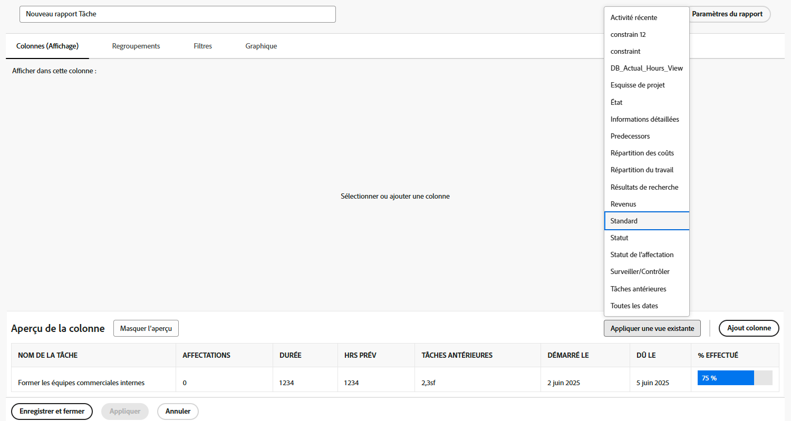

# Créer des activités de rapport simples

Exercez-vous à créer des rapports simples, avec des instructions étape par étape.

## Activité 1 : Créer un rapport de tâche simple

Vous souhaitez suivre toutes vos tâches actives dans un seul rapport. Créez un rapport de tâche nommé « Mes tâches actuelles » en procédant comme suit :

* Colonnes (vues) = Standard
* Regroupements = Projet
* Filtre = Mes tâches actives
* Description = Tâches incomplètes sur les projets en cours où je suis propriétaire de la tâche, regroupées par projet.

## Réponse 1

1. Accédez au **[!UICONTROL Menu Principal]** et sélectionnez **[!UICONTROL Rapports]**.
1. Cliquez sur le menu déroulant **[!UICONTROL Nouveau rapport]** et sélectionnez **[!UICONTROL Rapport de tâches]**.
1. Dans [!UICONTROL Colonnes (vues)], cliquez sur le menu **[!UICONTROL Appliquer une vue existante]** et sélectionnez **[!UICONTROL Standard]**.

   

1. Dans l’onglet **[!UICONTROL Regroupements]**, cliquez sur le menu **[!UICONTROL Appliquer un regroupement existant]** et sélectionnez **[!UICONTROL Projet]**.

   

1. Dans l’onglet **[!UICONTROL Filtres]**, cliquez sur le menu **[!UICONTROL Appliquer un filtre existant]** et sélectionnez Mes tâches actives.

   

1. Ouvrez **[!UICONTROL Paramètres des rapports]** et nommez le rapport « Mes tâches actuelles ».
1. Dans le champ Description , saisissez « Incomplet »
tâches sur les projets actuels dont je suis la tâche
propriétaire, regroupé par projet. »

   

1. Enregistrez et fermez votre rapport.
