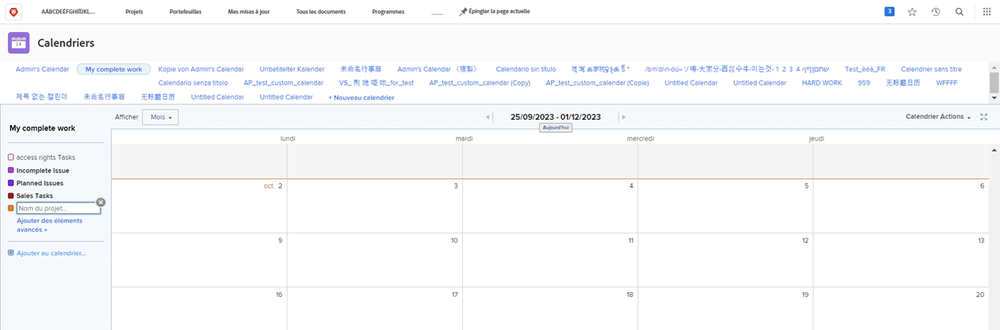
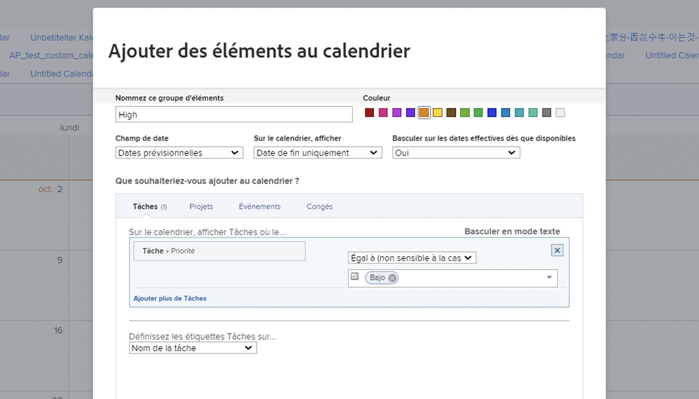
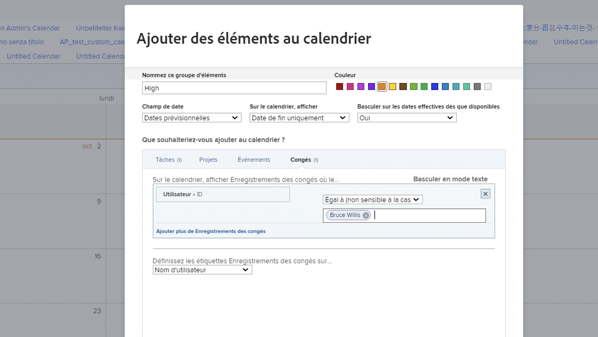

# Création d’un calendrier personnalisé

Dans cette section, vous apprendrez à :

* Créer un nouveau calendrier
* Création d’un groupement de calendrier
* Ajout d’éléments de travail au regroupement de calendrier
* Créer un calendrier de congés

Voici comment créer votre propre calendrier personnalisé.

## Tout d’abord, ajoutez un nouveau calendrier.

1. Dans la **[!UICONTROL Menu Principal]**, sélectionnez la variable **[!UICONTROL Calendriers]** zone.
1. Cliquez sur le bouton **[!UICONTROL Nouveau calendrier]** .
1. Saisissez un nom pour le calendrier, puis appuyez sur **[!UICONTROL Retour]**.

## Deuxièmement, ajoutez un groupement de calendrier

1. Pour afficher les éléments liés à un projet spécifique, saisissez le nom du projet dans la variable [!UICONTROL groupement] (affiche toutes les tâches liées à ce projet).
1. Ou cliquez sur le bouton **[!UICONTROL Ajout d’éléments avancés]** pour inclure des tâches issues de divers projets du système.

## Troisièmement, ajoutez des éléments de travail au regroupement de calendrier.

1. Nommez le groupement pour refléter ce qui s’affichera.
1. Sélectionnez une désignation de couleur pour le groupe.
1. Sélectionnez le type de date à utiliser...[!UICONTROL Dates prévues], [!UICONTROL Dates planifiées]ou [!UICONTROL Personnalisé]. ([!UICONTROL Personnalisé] les dates sont des champs de date inclus dans [!UICONTROL formulaires personnalisés].)
1. Sélectionnez les dates à afficher dans le calendrier.[!UICONTROL Date de fin uniquement], [!UICONTROL Date de début uniquement]ou [!UICONTROL Durée (du début à la fin)].
1. Si vous souhaitez afficher [!UICONTROL Dates réelles] lorsque ces informations sont disponibles, sélectionnez Oui dans le menu. Sélectionnez Non si vous souhaitez toujours sélectionner le type de date ([!UICONTROL Prévu], [!UICONTROL Planifié]ou [!UICONTROL Personnalisé]) à afficher.
1. Sélectionnez le type d’informations d’élément à afficher dans le calendrier.[!UICONTROL Tâches], [!UICONTROL Projets], [!UICONTROL Problèmes]ou [!UICONTROL Time Off].
1. Configurez les filtres pour afficher les informations souhaitées.
1. Cliquer sur **[!UICONTROL Enregistrer]**.

>[!NOTE]
>
>Vous pouvez ajouter d’autres regroupements à un calendrier existant à l’aide de l’option Ajouter au calendrier .

## Création d’un calendrier affichant le temps libre

[!DNL Workfront] vous permet de spécifier votre heure de congé avec la fonction de pause personnelle de votre profil utilisateur. Cela avertit les chefs de projet que vous n’êtes pas disponible et permet aux dates d’achèvement prévues de s’ajuster automatiquement ou manuellement, si nécessaire.

Dans la zone Calendrier , vous pouvez créer une vue Calendrier affichant ces entrées de temps libre.

Pour créer un calendrier pour une personne spécifique :

1. Cliquez sur **[!UICONTROL Ajouter au calendrier]** dans le panneau de gauche.
1. Cliquez sur **[!UICONTROL Ajout d’éléments avancés]**.
1. Nommez le groupement pour refléter ce qui s’affichera.
1. Sélectionnez la désignation d’une couleur pour le regroupement.
1. Définissez la variable [!UICONTROL Champ de date] to [!UICONTROL Dates planifiées].
1. Sélectionnez les dates à afficher dans le calendrier.[!UICONTROL Durée].
1. Ignorez le mode d’affichage des informations si les dates réelles ne sont pas disponibles. Cela ne s’applique pas.
1. Sélectionner [!UICONTROL Time Off] pour le type d’informations que vous souhaitez afficher.
1. Pour le filtre, définissez l’ID utilisateur sur le nom du membre de l’équipe.
1. Cliquer sur **[!UICONTROL Enregistrer]**.

