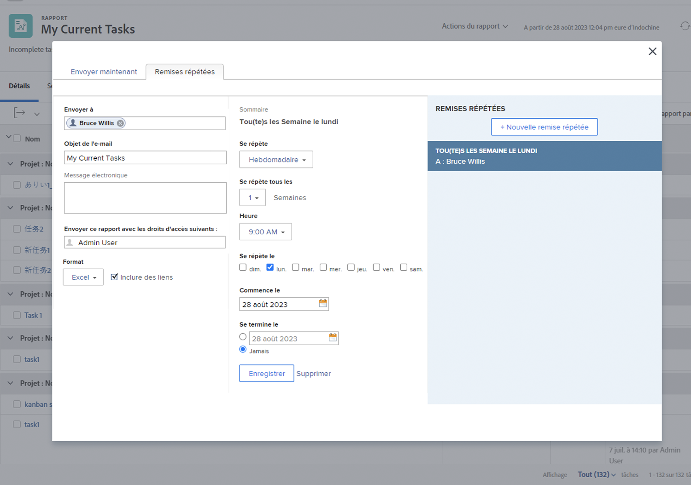

# Envoyer et partager des rapports

Dans cette vidéo, vous apprendrez :

* Envoyer des rapports aux utilisateurs, aux utilisatrices, aux équipes ou à toute adresse e-mail
* Partager des rapports avec n’importe qui
* Ce que les destinataires peuvenconsulter et faire avec un rapport Workfront

>[!VIDEO](https://video.tv.adobe.com/v/3447814/?quality=12&learn=on&captions=fre_fr)

## Points clés à retenir

* **Envoi de rapports à des personnes externes :** vous pouvez envoyer des rapports à des personnes externes à Workfront en saisissant leurs adresses e-mail, afin de faciliter le partage de données en dehors de votre organisation.
* **Visibilité du contrôle des droits d’accès :** l’affichage pour la personne destinataire du rapport dépend des droits d’accès que vous avez définis, garantissant ainsi la sécurité des données et la visibilité appropriée.
* **Diffusion répétée pour les instantanés :** les diffusions planifiées fournissent des instantanés figés des données à des moments spécifiques, ce qui est utile pour suivre les tendances et conserver un historique des données du projet.
* **Partage de rapports avec des équipes :** les rapports peuvent être partagés avec des personnes, des équipes ou des fonctions, avec l’obtention de droits d’affichage ou de gestion. Les rapports partagés apparaissent dans la section « Partagés avec moi » de la personne.
* **Partage public et à l’échelle du système :** les rapports peuvent être partagés par le biais de liens publics pour les personnes externes ou rendus visibles à l’échelle du système pour toutes les personnes utilisant Workfront, ce qui offre une certaine flexibilité dans le partage de données.

## Activités Envoyer et partager des rapports

### Activité 1 : envoyer un rapport

Envoyez-vous un rapport tous les lundis à 5 heures du matin dans une feuille de calcul Excel. Il s’agit d’un excellent moyen de collecter automatiquement les rapports hebdomadaires que vous pourrez ensuite utiliser pour déterminer les tendances.

### Réponse 1

1. Affichez le rapport que vous avez créé, puis choisissez **[!UICONTROL Envoyer le rapport]** dans le menu **[!UICONTROL Actions de rapport]**.
1. Cliquez sur l’onglet **[!UICONTROL Diffusions répétées]**.
1. Saisissez votre adresse e-mail dans le champ **[!UICONTROL Envoyer à]**.
1. Indiquez l’objet de l’e-mail.
1. Remplacez le format par Excel.
1. Définissez **[!UICONTROL Répéter]** sur [!UICONTROL Hebdomadaire].
1. Définissez [!UICONTROL Heure] sur 5 heures du matin.
1. Définissez [!UICONTROL Répéter le] sur lundi.
1. Cliquer sur **[!UICONTROL Enregistrer]**.

>[!NOTE]
>
>Vous verrez votre nouvelle diffusion répétée dans le panneau [!UICONTROL Diffusions répétées] à droite. Vous pouvez configurer plusieurs diffusions pour un rapport. Toutes les diffusions s’affichent ici.

**SUPPRIMER UNE DIFFUSION**

Sélectionnez la diffusion que vous venez de créer et cliquez sur Supprimer (en regard de l’option **[!UICONTROL Enregistrer]**).
