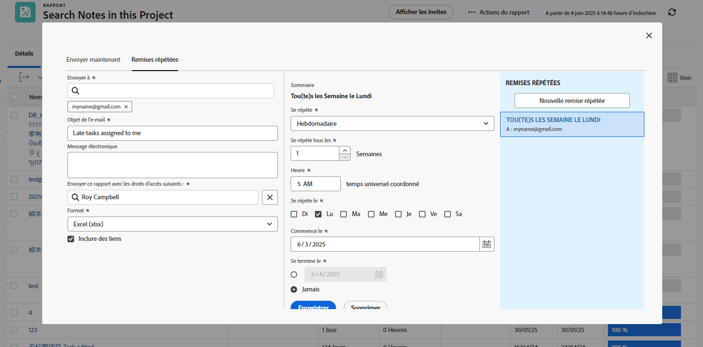

# Envoi et partage de rapports

Dans cette vidéo, vous apprendrez :

* Comment envoyer des rapports aux utilisateurs, aux équipes ou à toute adresse électronique ?
* Comment partager des rapports avec n’importe qui
* Ce que les destinataires peuvent voir et faire avec un rapport Workfront

>[!VIDEO](https://video.tv.adobe.com/v/335158/?quality=12&learn=on)

## Activité : Envoi d’un rapport

Envoyez-vous un rapport chaque lundi à 5h00 sous forme de feuille de calcul Excel. Il s’agit d’un excellent moyen de collecter automatiquement les rapports hebdomadaires que vous pourrez ensuite utiliser pour afficher les tendances.

## Réponse

1. Affichez le rapport que vous avez créé, puis choisissez **[!UICONTROL Envoyer le rapport]** de la **[!UICONTROL Actions de rapport]** .
1. Cliquez sur le bouton **[!UICONTROL Diffusions répétées]** .
1. Placez votre adresse électronique dans la variable **[!UICONTROL Envoyer à]** champ .
1. Indiquez un objet de courrier électronique.
1. Remplacez le format par Excel.
1. Définir **[!UICONTROL Répéter]** to [!UICONTROL Hebdomadaire].
1. Définissez la variable [!UICONTROL Heure] à 5 heures du matin.
1. Définir [!UICONTROL Répète activé] à lundi.
1. Cliquer sur **[!UICONTROL Enregistrer]**.

>[!NOTE]
>
>Remarquez votre nouvelle diffusion récurrente dans le [!UICONTROL Diffusions répétées] sur la droite. Vous pouvez configurer plusieurs diffusions pour un rapport ; elles s’affichent toutes ici.

**DELETE A DELIVERY**

Sélectionnez la diffusion que vous venez de créer et cliquez sur Supprimer (en regard de l’option **[!UICONTROL Enregistrer]** ).
