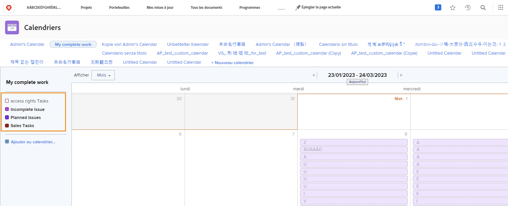
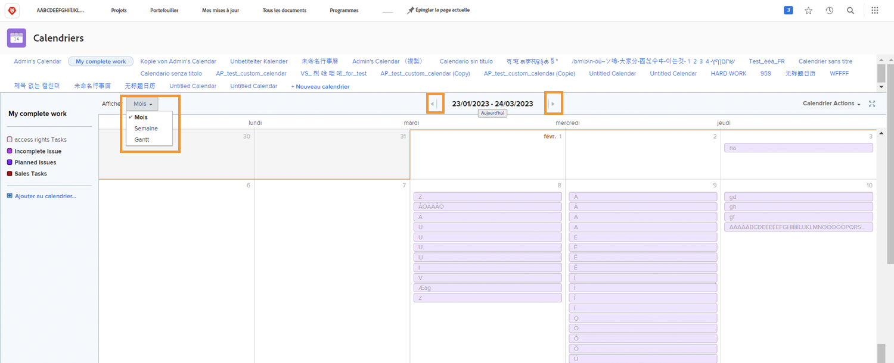
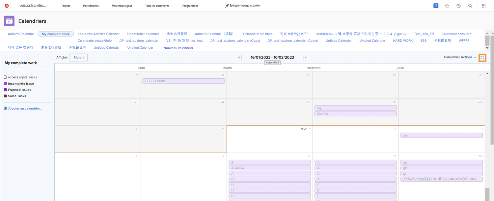
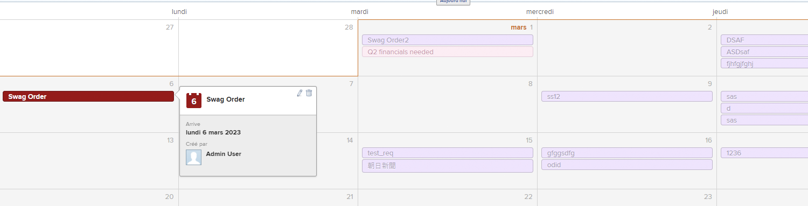
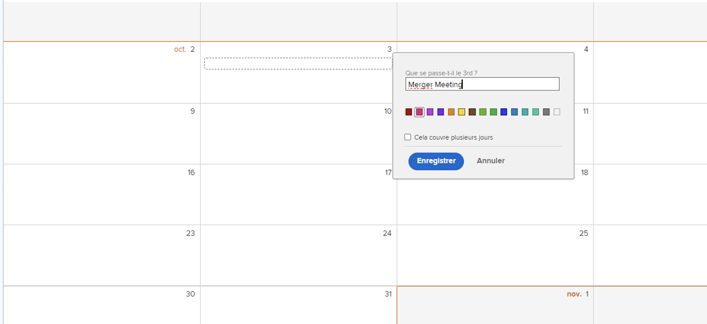

# Présentation de l’interface Calendrier

Dans cette section, vous découvrirez :

* Regroupements de calendriers
* Vues du calendrier
* Menu Actions du calendrier
* Comment créer un élément de calendrier ad hoc

Avant de créer vos propres calendriers personnalisés, nous vous invitons à découvrir les fonctionnalités de base disponibles sur les calendriers personnalisés.

## Regroupements de calendriers

Un seul calendrier peut être organisé en groupes d’éléments de travail distincts. Chaque regroupement peut être activé et désactivé, ce qui permet aux utilisateurs de se concentrer sur les tâches qui comptent le plus à tout moment.

## Vues du calendrier

Le calendrier peut s’afficher par mois, semaine ou [!UICONTROL Gantt] format. Utilisez la barre de défilement sur le côté ou les flèches en haut pour parcourir le calendrier. Le [!UICONTROL Gantt] vous permet de voir votre travail d’un point de vue différent. Trouvez la vue qui vous convient le mieux.

![Image de l’écran du calendrier dans la [!UICONTROL Gantt] view](assets/calendar-1-1bb.png)

## [!UICONTROL Actions du calendrier] menu

Comme les autres tâches, les calendriers ont une [!UICONTROL Actions] pour afficher les week-ends sur un calendrier ; supprimer ou copier un calendrier ; partager un calendrier avec des utilisateurs Workfront individuels, à l’échelle du système ou avec des utilisateurs externes ; et ajoutez le calendrier à votre [!UICONTROL Favoris] .

![Une image de la fonction [!UICONTROL Actions du calendrier] écran](assets/calendar-1-1c.png)

## Mode Plein écran

Pour afficher le calendrier en mode plein écran, cliquez sur l’icône Plein écran . Cliquez de nouveau pour revenir à la taille d’origine.

## Informations récapitulatives

Sélectionnez un élément du calendrier pour afficher un résumé des détails de cet élément, y compris le nom, le projet d’origine, le statut, l’affectation, l’état d’avancement et la date d’échéance.

## Événements ad hoc

Double-cliquez pour créer des événements ad hoc sur un calendrier afin de représenter votre planning ou d’autres tâches.

>[!NOTE]
>
>La création d’un événement ad hoc NE crée PAS de tâche dans Workfront.

