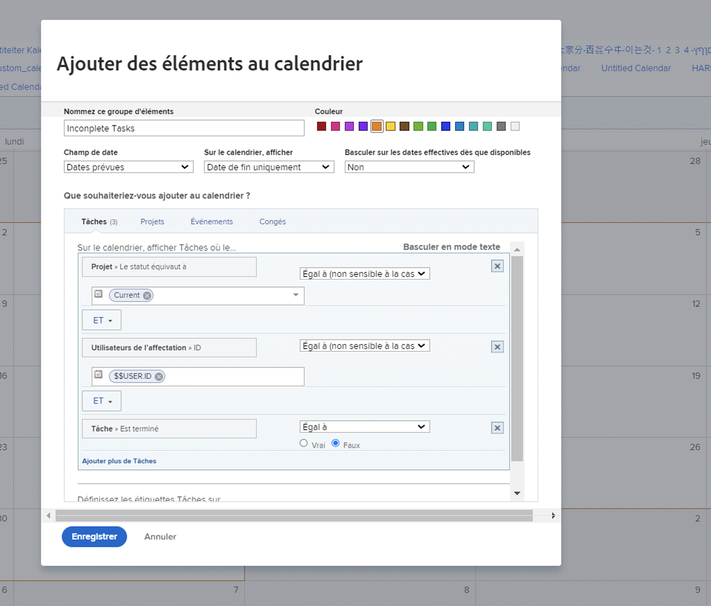
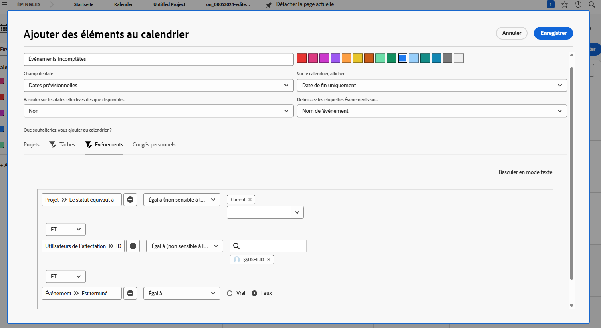
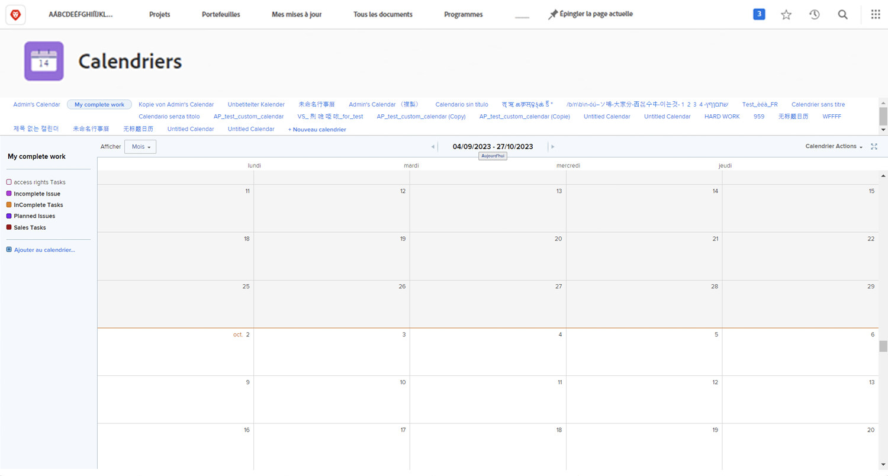

# À votre tour de créer un rapport de calendrier.

Cette activité vous permettra de pratiquer la création de votre propre calendrier.

## Activité : Créer un calendrier

Créez un calendrier client intitulé « Mon travail inachevé ».

Incluez un groupe de calendriers nommé « Tâches inachevées » montrant toutes les tâches inachevées qui vous ont été assignées sur les projets en cours.

Sélectionnez le rouge comme couleur pour ces éléments.

Incluez un autre groupe de calendriers nommé « Problèmes non résolus » montrant tous les problèmes non résolus qui vous ont été assignés sur les projets en cours. Sélectionnez le bleu comme couleur pour ces éléments.

## Réponse

1. Naviguez vers la zone Calendriers à partir du menu principal.
1. Cliquez sur le bouton Nouveau calendrier et nommez le calendrier « Mon travail inachevé ».
1. Sous le premier groupe, cliquez sur Ajouter des éléments avancés.
1. Dans la fenêtre Ajouter des éléments au calendrier qui s’affiche, nommez le groupe « Tâches inachevées ».
1. Sélectionnez le rouge comme couleur.
1. Remplacez le champ Date par Dates planifiées.
1. Définissez le champ Sur le calendrier, afficher sur Date de fin uniquement.
1. Définissez le champ Passer aux dates réelles lorsque le champ est disponible sur Non.

   

1. Dans la section Que souhaitez-vous ajouter au calendrier ? sélectionnez Tâches.
1. Ajoutez trois règles de filtrage :

   * Projet > Statut est égal à > Égal à > Actuel
   * Utilisateurs/utilisatrices de l’affectation > ID > Égal à > $$USER.ID
   * Tâche > Est terminée > Égal à > Faux

1. Cliquer sur Enregistrer.

   

1. Créez un deuxième groupe en cliquant sur Ajouter au calendrier.
1. Dans ce groupe, cliquez sur Ajouter des éléments avancés.
1. Dans la fenêtre Ajouter des éléments au calendrier qui s’affiche, nommez le groupe « Problèmes non résolus ».
1. Sélectionnez le bleu comme couleur.
1. Remplacez le champ Date par Dates planifiées.
1. Définissez le champ Sur le calendrier, afficher sur Date de fin uniquement.
1. Définissez le champ Passer aux dates réelles lorsque le champ est disponible sur Non.
1. Dans la section Que souhaitez-vous ajouter au calendrier ? sélectionnez Problèmes.
1. Ajoutez les trois règles de filtrage suivantes :

   * Projet > Statut est égal à > Égal à > Actuel
   * Utilisateurs/utilisatrices de l’affectation > ID > Égal à > $$USER.ID
   * Problème > Est résolu > Égal à > Faux

1. Cliquer sur Enregistrer.

   

Comme vous avez utilisé $$USER.ID dans les filtres, vous pouvez partager ce calendrier avec d’autres personnes qui verront leurs propres tâches inachevées et problèmes non résolus.
