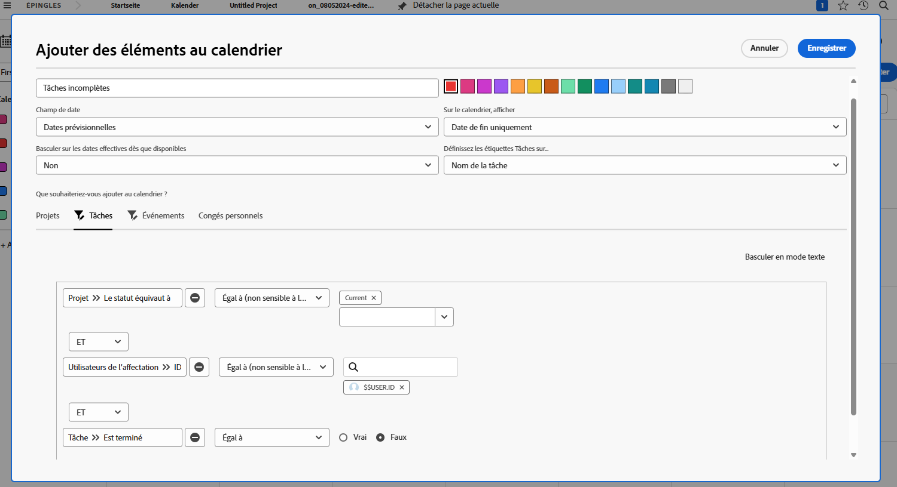

# Votre tour de créer un calendrier

Dans cette activité, vous bénéficiez d’une expérience pratique pour créer votre propre calendrier.

## Activité : Créer un calendrier

Créez un calendrier client nommé &quot;Mon travail incomplet&quot;.

Insérez un groupe de calendrier nommé &quot;Tâches incomplètes&quot; affichant toutes les tâches incomplètes qui vous sont affectées sur les projets en cours.

Sélectionnez le rouge comme couleur de ces éléments.

Insérez un autre groupe de calendrier nommé &quot;Problèmes incomplets&quot; qui affiche tous les problèmes incomplets qui vous sont affectés sur les projets en cours. Sélectionnez le bleu comme couleur pour ces éléments.

## Réponse

1. Accédez à la zone Calendriers dans le menu Principal .
1. Cliquez sur le bouton Nouveau calendrier et nommez le calendrier &quot;Mon travail inachevé&quot;.
1. Sous le premier groupement, cliquez sur Ajouter des éléments avancés.
1. Dans la fenêtre Ajouter des éléments au calendrier qui s’affiche, nommez le groupe &quot;Tâches incomplètes&quot;.
1. Sélectionnez rouge comme couleur.
1. Remplacez le champ Date par Dates planifiées.
1. Définissez le champ Sur le calendrier sur Date de fin uniquement.
1. Définissez le champ Passer aux dates réelles lorsque disponible sur Non.

   

1. Dans la section Que souhaitez-vous ajouter au calendrier ? , sélectionnez Tâches.
1. Ajoutez trois règles de filtrage :

   * Projet > État Égal À > Égal > Actuel
   * Utilisateurs d’affectation > ID > Egal > $$USER.ID
   * Tâche > Terminée > Égal > Faux

1. Cliquez sur Enregistrer.

   

1. Créez un second groupe en cliquant sur Ajouter au calendrier.
1. Sous ce groupement, cliquez sur Ajouter des éléments avancés.
1. Dans la fenêtre Ajouter des éléments au calendrier qui s’affiche, nommez le groupe &quot;Problèmes incomplets&quot;.
1. Sélectionnez le bleu comme couleur.
1. Remplacez le champ Date par Dates planifiées.
1. Définissez le champ Sur le calendrier sur Date de fin uniquement.
1. Définissez le champ Passer aux dates réelles lorsque disponible sur Non.
1. Dans la section Que souhaitez-vous ajouter au calendrier ? , sélectionnez Problèmes.
1. Ajoutez les trois règles de filtrage suivantes :

   * Projet > État Égal À > Égal > Actuel
   * Utilisateurs d’affectation > ID > Egal > $$USER.ID
   * Problème > Est Terminé > Égal > Faux

1. Cliquez sur Enregistrer.

   

Comme vous avez utilisé $$USER.ID dans les filtres, vous pouvez partager ce calendrier avec d’autres utilisateurs qui verront leurs propres tâches et problèmes incomplets.
