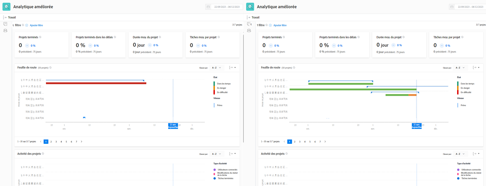

# Présentation des indicateurs de performance clés

Dans cette vidéo, vous apprendrez :

* Comment obtenir de la valeur à partir des données IPC

>[!VIDEO](https://video.tv.adobe.com/v/335046/?quality=12&learn=on)

## Comparaison des indicateurs de performance clés

Les IPC fournissent non seulement des informations précieuses sur ce qui se passe actuellement, mais ils donnent aux utilisateurs la possibilité de comparer les changements d’activité au fil du temps ou la différence entre les portefeuilles, les programmes, les propriétaires de projets ou tout autre filtre utilisé.

Par exemple, vous pouvez extraire les analyses dans deux onglets de navigateur pour comparer les indicateurs de performance clés.
