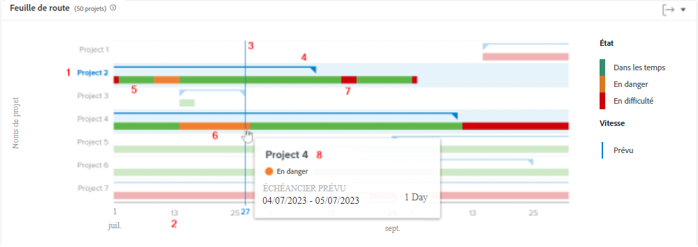
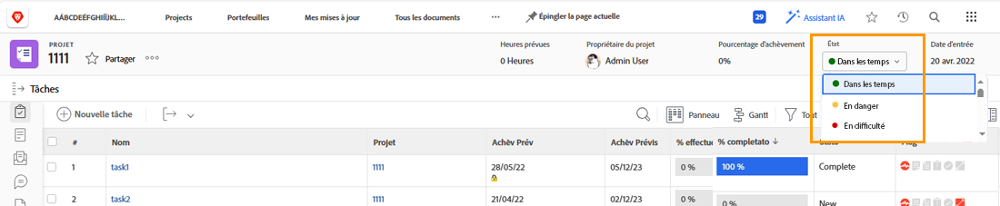
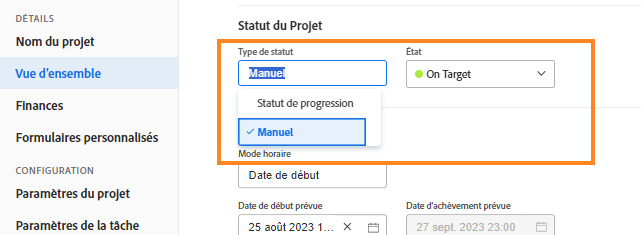

# Comprendre la navigation et la révision des projets

Dans cette vidéo, vous apprendrez :

* Comment lire le graphique du plan de vol

>[!VIDEO](https://video.tv.adobe.com/v/3439011/?quality=12&learn=on&enablevpops=1&captions=fre_fr)

## Graphique du plan de vol

Sur le graphique, vous voyez :

1. Les noms des projets à gauche.
1. Les dates dans la partie inférieure.
1. La ligne bleue verticale indique la date spécifique que votre souris survole.
1. Les lignes bleues horizontales indiquent les dates de début et de fin prévues du projet.
1. Les lignes vertes indiquent que le projet est Dans les temps.
1. Des lignes orange indiquent que le projet est À risque.
1. Les lignes rouges indiquent que le projet est En difficulté.

L’affichage de ces informations sur vos projets vous aide à déterminer les éléments suivants :

* Les événements qui prolongent un projet au-delà de la date d’achèvement prévue.
* Lorsqu’un projet commence à rencontrer des problèmes.
* Le nombre de projets ouverts au cours de la même période.
* Le nombre de projets actifs.
* Les projets qui nécessitent une attention ou un soutien supplémentaire.

## La condition est basée sur le statut de la progression

La condition du projet est une représentation visuelle de le la progression du projet. Workfront détermine la condition en fonction du statut de la progression des tâches dans le projet.

La condition d’un projet peut être définie :

* **Manuellement**, par les utilisateurs et utilisatrices ayant accès à la gestion du projet, lorsque le type de condition du projet est défini comme manuel. Vous pouvez ainsi définir la condition du projet indépendamment du chemin critique.
* **Automatiquement**, par Workfront, lorsque le type de condition du projet est défini sur Statut de la progression.

Workfront recommande de définir le type de condition sur Statut de la progression afin que vous ayez une indication claire de la progression réelle du projet en fonction de la progression de vos tâches.

Lorsqu’elle est définie sur Statut de la progression, la condition du projet peut être :

* **Dans les temps** : lorsque le statut de la progression de la dernière tâche sur le chemin critique est Dans les temps, la condition du projet est En bonne voie. Le projet est parti pour terminer dans les délais prévus.
* **À risque** : lorsque le statut de la progression de la dernière tâche du chemin critique est En retard ou À risque, la condition du projet est À risque. Le projet est parti pour terminer en retard mais n’est pas encore en retard.
* **En difficulté** : lorsque le statut de la progression de la dernière tâche du chemin critique est En retard, la condition du projet est En difficulté. La date butoir est passée et le projet est désormais en retard.

>[!NOTE]
>
>Les conditions peuvent être adaptées à votre environnement, il se peut donc que vous trouviez plus de trois options ou que les noms soient différents de ceux indiqués ci-dessus. Pour plus d’informations sur la personnalisation des conditions, voir l’article [Création ou modification d’une condition personnalisée](https://experienceleague.adobe.com/docs/workfront/using/administration-and-setup/customize/custom-conditions/create-edit-custom-conditions.html?lang=fr).
