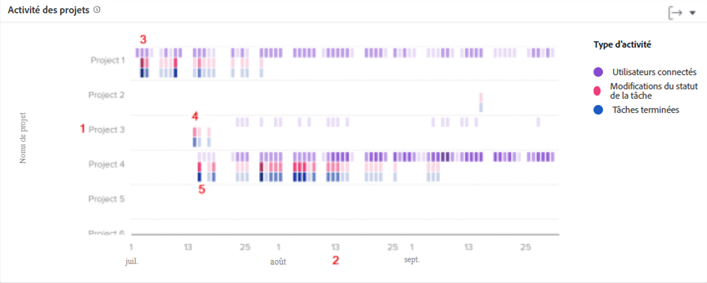

# Comprendre la navigation et la révision de l’activité de projet

Dans cette vidéo, vous apprendrez :

* Comment comparer des projets en fonction des personnes connectées, des modifications de statut des tâches et des tâches terminées

>[!VIDEO](https://video.tv.adobe.com/v/3437438/?quality=12&learn=on&enablevpops=1&captions=fre_fr)

## À comparer du travail dans le projet

Le diagramme d’activité du projet vous permet de comprendre et de comparer les activités du projet (les personnes connectées, les changements de statut des tâches et les tâches terminées) par rapport à d’autres projets dans Workfront. Les activités du projet s’affichent dans différentes couleurs pour résumer les activités sur une période donnée.

Ces informations vous aident à déterminer :

* L’activité sur un projet spécifique.
* L’activité d’un projet par rapport à d’autres projets.
* Quelles personnes travaillent sur un projet et à quelle fréquence.

Sur le graphique, vous pouvez voir :

1. Noms des projets sur la gauche.
1. Les dates dans la partie inférieure.
1. Les zones violettes indiquent que les personnes affectées au projet se sont connectées ce jour-là, une nuance plus sombre indiquant un nombre plus élevé de personnes se connectant.
1. Les zones roses montrent que les personnes ont modifié le statut d’une tâche pour le projet ce jour-là, avec une nuance plus foncée indiquant un nombre plus élevé de statuts de tâche changeant.
1. Les zones bleues indiquent que les personnes ont terminé une tâche pour le projet, une nuance plus foncée indiquant un nombre plus élevé de tâches en cours d’exécution.
