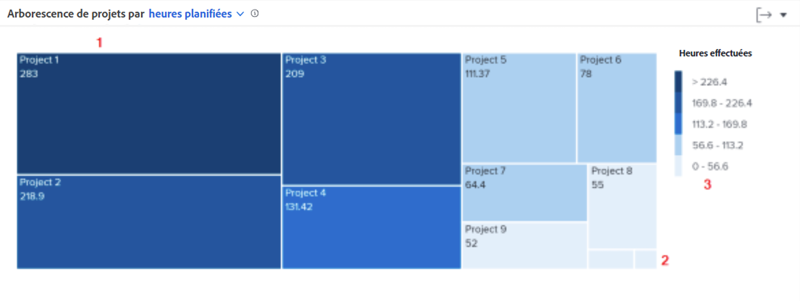

# Exploration approfondie de la navigation

Dans cette vidéo, vous apprendrez :

* Comment déterminer rapidement le temps que les personnes qui travaillent consacrent à chaque projet

>[!VIDEO](https://video.tv.adobe.com/v/335050/?quality=12&learn=on)

## La durée de consultation des projets

L’arborescence du projet vous permet de comprendre combien de temps les personnes ont consacré à un projet. Les zones représentent les projets. La taille de la zone indique le temps passé sur le projet par rapport à d’autres projets. Plus la zone est grande, plus le temps passé est important.

Ces informations vous aident à déterminer :

* La priorité des tâches en cours de traitement au cours de la période sélectionnée.
* Ce sur quoi les personnes passent du temps.
* Si les personnes se concentrent sur les bonnes choses.
* Le degré de changement d’un projet au cours de cette période lorsqu’un projet spécifique est sélectionné.

Sur le graphique, vous pouvez voir :

1. Les projets dont le temps filtré comporte plus d’heures sont représentés par des zones plus grandes et une couleur bleu foncé.
1. Les projets dans le temps filtré qui ont moins d’heures terminées sont représentés par des zones plus petites et une couleur bleu clair.
1. La légende à droite du graphique indique la plage d’heures terminées pour chaque nuance de bleu.
