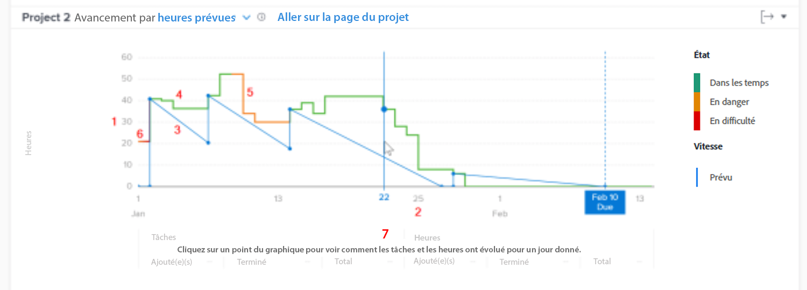

# Comprendre l’accès et la révision de l’avancement

Dans cette vidéo, vous apprendrez :

* Comment accéder au graphique d’avancement
* Comment comprendre la relation entre les heures restantes, l’état d’un projet et la vitesse d’un projet

>[!VIDEO](https://video.tv.adobe.com/v/335051/?quality=12&learn=on)

## Le suivi de la vitesse d’un projet

Le graphique d’avancement vous permet de comprendre la relation entre les heures restantes, l’état du projet et la vitesse. La ligne continue indique les heures passées sur le projet au fil du temps, ainsi que l&#39;état du projet chaque jour. La ligne pointillée (qui affiche la vitesse prévue entre la date de début et la date d’achèvement prévue) s’ajuste au fur et à mesure que les dates des tâches sont modifiées.

Ces informations vous aident à déterminer :

* Comment l’arrivée de problèmes (ou travail non planifié) a affecté le travail planifié.
* Les événements qui ont prolongé le projet au-delà de la date d’achèvement prévue.

Sur le graphique, vous pouvez voir :

1. Le nombre d’heures à gauche.
1. Les dates s’affichent en bas, y compris la date d’achèvement prévue du projet, si elle apparaît dans la période sélectionnée.
1. La ligne bleue continue indique la vitesse du projet (soit le nombre d’heures prévues, soit la durée sur la période), puis se transforme en ligne verticale pointillée lorsqu’elle atteint la date d’achèvement prévue du projet.
1. Les lignes vertes indiquent lorsque l’état du projet est En bonne voie.
1. Les lignes oranges indiquent lorsque l’état du projet est À risque.
1. Les lignes rouges indiquent lorsque l’état du projet est En difficulté.
1. Les informations sur les tâches et les heures (totaux, quantité ajoutée et quantité terminée) d’un jour spécifique s’affichent sous l’axe des X lorsque vous cliquez sur un point spécifique du graphique.
