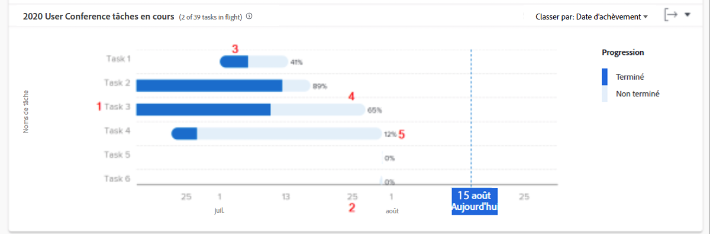

# Vérifier les tâches en cours

Dans cette vidéo, vous apprendrez :

* Comment accéder aux tâches dans le graphique des tâches en cours
* Comment déterminer rapidement quelles tâches n’ont pas été terminées dans un projet

>[!VIDEO](https://video.tv.adobe.com/v/3437002/?quality=12&learn=on&enablevpops&captions=fre_fr)

## Les données au niveau des tâches

Le graphique Tâches en cours vous permet d’examiner les tâches d’un projet spécifique pour voir la quantité de travail accomplie pour chaque tâche active et l’état d’avancement des tâches. Le graphique vous permet de déterminer quelles tâches dans un projet doivent encore être terminées et le pourcentage d’avancement de ces tâches.

Ces informations peuvent vous aider à déterminer :

* Sur quoi les personnes travaillent.
* Les tâches qui pourraient mettre un projet en danger.
* À quel point une tâche est près d’être terminée.
* À qui vous devez parler d’une tâche spécifique.

Sur le graphique, vous pouvez voir :

1. Le nom des tâches à gauche.
1. Les dates en bas.
1. La couleur bleue foncée dans une barre de tâche indique la quantité de travail déjà terminée pour une tâche.
1. La couleur bleue claire dans une barre de tâche indique la quantité de travail restante à effectuer pour une tâche.
1. Le nombre situé sur le côté droit d’une barre de tâche indique le pourcentage d’avancement de la tâche.
